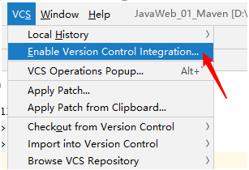
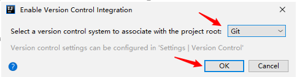
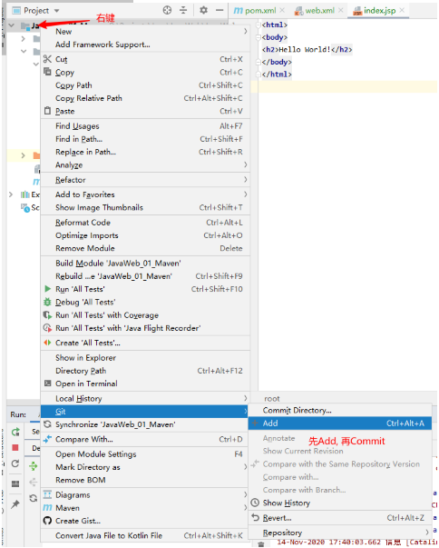
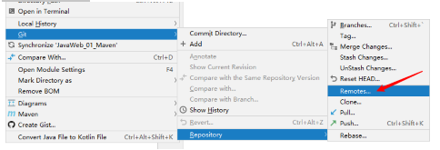
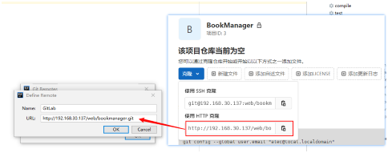
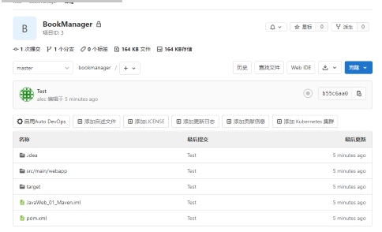

[toc]

# 环境说明

```
gitlab-ce-13.4.6 需要2c3
gitlab-ce-14.0.6 需要2c4g
```


# 安装

**安装依赖**

```shell
dnf install policyoreutils postfix policycoreutils-python-utils  
```

**启动 postfix, postfix能支持gitlab发信功能**

```shell
systemctl start postfix
systemctl enable postfix 
```

**安装gitlab**

```shell
# 下载安装包
wget --content-disposition https://packages.gitlab.com/gitlab/gitlab-ce/packages/el/8/gitlab-ce-13.4.6-ce.0.el8.x86_64.rpm/download.rpm

# 安装
rpm -ivh gitlab-ce-13.4.6-ce.0.el8.x86_64.rpm

# 修改配置
vim /etc/gitlab/gitlab.rb
    external_url 'http://192.168.30.137:80'
    # 监听端口
    # nginx['listen_port'] = nil
    # GitLab URL
    external_url 'http://192.168.30.137/'


# 重载配置, 重启gitlab
gitlab-ctl reconfigure
gitlab-ctl restart

# 自启动
systemctl enable gitlab-runsvdir
```

**访问gitlab**

```shell
浏览器访问 http://192.168.30.137/
会返回一个502页面

等待一会, 会出现修改密码页面
再使用root/修改后的密码, 登录gitlab
```

**修改中文**

```
点击右上角头像 --> Settings --> Preferences --> Language --> Save Changes
```

## Gitlab添加组

使用管理员root创建组, 一个组里可以有多个项目分支, 可以将开发添加到组里进行设置权限, 不同的组就是公司不同的开发项目或者服务模块, 不同的组添加不同的开发即可实现对开发设置权限的管理;

## 创建项目

略

## 创建用户

略

## 用户添加到组

略

## 权限管理

Gitlab里有5种不同的权限

| Guest              | 可以创建issue, 发表评论, 不能读写版本库；                    |
| ------------------ | ------------------------------------------------------------ |
| Reporter           | 可以克隆代码、不能提交, QA、PM可以赋予这个权限；             |
| Developer          | 可以克隆代码、开发、提交、push， 不同开发可以赋予这个权限；  |
| Maintainer  维护者 | 可以创建项目、添加tag、保护分支、添加项目成员、编辑项目， 核心开发可以赋予这个权限； |
| Owner              | 可以设置项目访问权限-Visiblity Level、删除项目、迁移项目、管理组成员， 开发组组长可以赋予这个权限； |

## 重设用户密码

```
gitlab-rails console -e production

user = User.where(id: 1).first
# 或者 根据邮箱查询
user = User.find_by(email: 'admin@example.com')

user.password = 'secret_pass'
user.password_confirmation = 'secret_pass'
user.save!
```

# IDAE对接GitLab

### 添加版本控制





### 提交代码到本地仓库



### 添加远程仓库





### 刷新GitLab 提交成功




