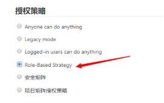
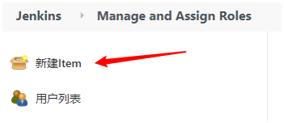
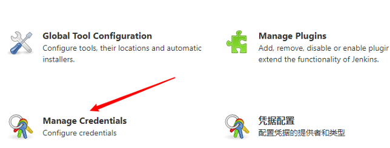
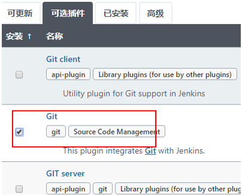
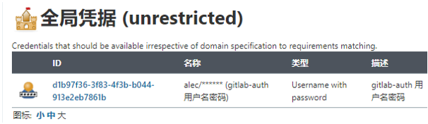

[toc]

# 安装Jenkins

## 安装依赖

```shell
dnf install -y java-1.8.0-openjdk
# jenkisn使用jdk11, gitlab hook插件安装时, ruby-runtime依赖会不兼容
```

## 安装Jenkins

```shell
wget -O /etc/yum.repos.d/jenkins.repo https://pkg.jenkins.io/redhat-stable/jenkins.repo
rpm --import https://pkg.jenkins.io/redhat-stable/jenkins.io.key

dnf install -y jenkins
```

### 修改Jenkins配置

```shell
vim /etc/sysconfig/jenkins
	JENKINS_PORT="8888"
```

### 启动Jenkins

```shell
[root@jenkins ~]# systemctl start jenkins
[root@jenkins ~]# systemctl enable jenkins
```

### 修改Jenkin插件地址

```shell
tail -100f /var/log/jenkins/jenkins.log
	Jenkins initial setup is required. An admin user has been created and a password generated.
	Please use the following password to proceed to installation:

	3abf3e37027045e8bf3aa65ada4a15b8
```

### 登录Jenkins，输入密码

```shell
http://192.168.30.139:8888
```

### 跳过插件安装


### 创建管理员账户


# 插件安装

## 修改Jenkins插件地址


**先点Available， 等页面加载完**


**加载完成后， 会下载插件配置文件， 修改配置文件**

```shell
[root@jenkins ~]# cd /var/lib/jenkins/updates

[root@jenkins updates]# sed -i 's/https:\/\/updates.jenkins.io\/download/https:\/\/mirrors.tuna.tsinghua.edu.cn\/jenkins/g' default.json

[root@jenkins updates]# sed -i 's/http:\/\/www.google.com/https:\/\/www.baidu.com/g' default.json
```

**最后在Advanced中把插件Update地址修改为国内地址**

https://mirrors.tuna.tsinghua.edu.cn/jenkins/updates/update-center.json


**修改完成后， 重启Jenkins**

```shell
浏览器输入 http://192.168.30.139:8888/restart
```


## 安装中文插件


# Jenkins管理

## 用户权限管理

### 安装插件

**安装Role-based Authorization Strategy插件**




### 配置角色管理


| Global roles | 全局角色 | 主要适用于管理员             |
| ------------ | -------- | ---------------------------- |
| Item roles   | 项目角色 | 主要适用于不同项目的使用人员 |
| Node roles   | 节点角色 | 主要适用于jenkins主从        |

### 添加角色


### 创建用户


### 分配角色


### 创建项目




bob用户登录, 就只能看到web01的项目


## 凭证管理

凭据可以用来存储需要密文保护的数据库密码, GitLab密码信息, Docker私有仓库密码等, 以便于Jenkins可以和这些第三方的应用进行交互;

### 安装插件

**安装Credentials Binding插件**

### 添加凭证




**凭证有5种:**

| **Username with password**        | 用户名和密码**(****常用****)**                               |
| --------------------------------- | ------------------------------------------------------------ |
| **SSH Username with private key** | 使用SSH用户和秘钥**(****常用****)**                          |
| Secret file                       | 需要保密的文本文件, 使用Jenkins会将文件复制到一个临时目录中, 再将文件路径设置到一个变量中, 等构建结束后, 所复制的Secret file就会被删除 |
| Secret text                       | 需要保存的一个加密的文本串, 如钉钉机器人或Github的api token  |
| Certificate                       | 通过上传证书文件的方式                                       |

## 安装git插件和git工具

为了让Jenkins支持从Gitlab拉源码, 需要安装Git插件, 并在操作系统安装Git工具;

### git插件




**Jenkins 项目 --> 配置 --> 源码管理 --> git**


### Git工具

```shell
[root@jenkins ~]# dnf install -y git
```


## 配置用户密码类型

### 创建用户名密码全局凭证

**Manage Jenkins --> Manage Credentials --> 全局 --> 添加凭据**




### Jenkins项目配置git

**gitlab准备:**

1. 在IDEA创建web_demo工程
2. 在Gitlab创建web_demo项目
3. 从IDEA中把项目上传到gitlab的web_demo工程

**Jenkins 项目 --> 配置 --> 源码管理 --> git**


## 配置SSH类型

**示意图**

**GitLab服务器(存放公钥:id_rsa.pub) <--- ssh免密登录--- Jenkins服务器(存放私钥:id_rsa)**

### Jenkins服务器生成公钥和私钥

```shell
[root@jenkins ~]# ssh-keygen

查看公钥
[root@jenkins ~]# cat .ssh/id_rsa.pub

查看私钥
[root@jenkins ~]# cat .ssh/id_rsa
```

### GitLab配置公钥

使用root/admin123456账户登录GitLab


### Jenkins配置私钥

**Manage Jenkins --> Manage Credentials --> 全局 --> 添加凭据**


### Jenkins创建web02工程

#### GitLab找到ssh链接


#### Jenkins配置git


