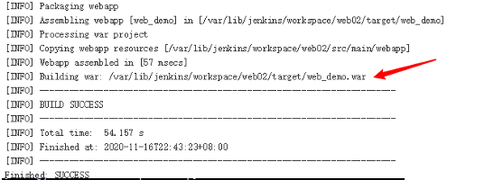

# 安装配置Maven

```shell
下载Maven
[root@jenkins ~]# wget https://mirrors.tuna.tsinghua.edu.cn/apache/maven/maven-3/3.6.3/binaries/apache-maven-3.6.3-bin.tar.gz

解压安装
[root@jenkins ~]# tar -xvf apache-maven-3.6.3-bin.tar.gz -C /usr/local/
```

```shell
cat <<EOF>> /etc/profile
export JAVA_HOME=/usr/lib/jvm/java-1.8.0-openjdk-1.8.0.252.b09-2.el8_1.x86_64/jre
export MAVEN_HOME=/usr/local/apache-maven-3.6.3
export PATH=$PATH:$JAVA_HOME/bin:$MAVEN_HOME/bin
EOF

# 加载环境变量
source /etc/profile

# 查看Maven版本
mvn -version
```

# JenKins全局工具配置关联JDK和Maven

**Jenkins --> Manage Jenkins --> Global Tool Configuration --> JDK --> 新增JDK**


**Jenkins --> Manage Jenkins --> Global Tool Configuration --> Maven --> 新增Maven**


**Jenkins内部Maven配置**


配置结束后 **保存**

# 添加Jenkins全局变量

**Manage Jenkins --> Configure System --> Global Properties**


# 修改Maven的settings.xml

**创建本地仓库路径**

```shell
[root@jenkins ~]# mkdir -pv /data/MavenRepository

[root@jenkins ~]# chown jenkins.jenkins /data/MavenRepository
```

**修改本地仓库路径和阿里云加速镜像**

```
[root@jenkins ~]# vim /usr/local/apache-maven-3.6.3/conf/settings.xml

  <localRepository>/data/MavenRepository</localRepository>

	<mirror>
      <id>aliyunmaven</id>
      <mirrorOf>*</mirrorOf>
      <name>阿里云公共仓库</name>
      <url>https://maven.aliyun.com/repository/public</url>
    </mirror>
```

# 测试Maven配置是否成功

**Jenkins --> web02 --> 配置 --> 构建 --> 增加构建步骤 --> Execute Shell**

 

**构建测试**


**构建成功**




# 配置构建后操作


**构建成功, 显示构建的war包**


