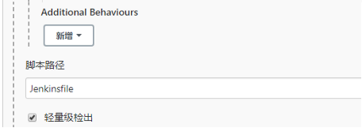
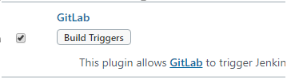
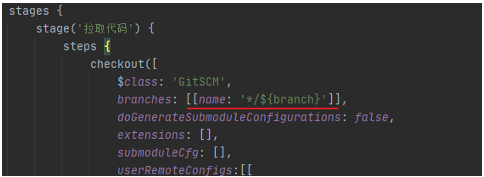
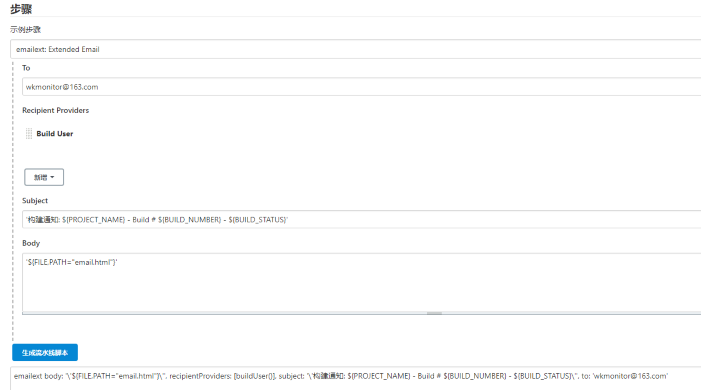

[toc]

# 构建项目

## 构建项目类型分类

Jenkins中自动侯建项目类型, 常用的有以下三种:

- 自由软件风格项目(FreeStyle Project)
- Maven项目(Maven Project)
- 流水线项目(Pipeline Project)

每种类型的构建其实都可以完成一样的构建过程与结果, 只是在操作方式, 灵活度方面有所区别;

## 自由风格项目构建

### 集成过程

**拉取代码 --> 编译 --> 打包 --> 部署**

#### 拉取代码

**创建项目**


**配置源码管理, 从gitlab拉取代码**


#### 编译打包

**构建 --> 添加构建步骤 --> Executor Shell**


**构建后操作 --> Archive the artifacts**


#### 部署

**把项目部署到远程的 Tomcat**

**安装 Deploy to container 插件**

Jenkins本身无法实现远程部署到Tomcat功能, 需要安装Deploy to container插件实现;


**添加 tomcat 用户凭证**


**添加构建后操作**


#### 构建

**配置结束后, 点击 Build Now**


**部署成功后, 访问项目: http://192.168.30.141:8080/web_demo/**


## Maven项目构建

### 安装Maven Integration插件


### 创建Maven项目


### 配置项目

**拉取代码和远程部署的过程和自由的风格项目, 只是"构建"部分不同;**


### 构建后, 从web页面查看发布结果


## Pipeline流水线项目构建

### Jenkins Pipeline说明

- Pipeline脚本由Groovy语言实现

- Pipeline支持两种语法: Declarative(声明式)和Scripted Pipeline(脚本式)语法

- Pipeline有两种创建方法: 可以直接在Jenkins的Web UI界面中输入脚本; 

  也可以通过创建一个JenkinsFile脚本文件放入项目源码库中(一般都是使用在Jenkins中直接从源代码控制(SCM)中直接载入JenkinsFile Pipeline这种方法)

### 安装Pipeline插件


### Pipeline语法快速入门

#### 1) Declarative声明式

**创建 Pipeline 风格项目**


**配置 --> 流水线 --> 输入pipeline脚本**


**简单编写一个声明式Pipeline:**

```groovy
pipeline {
    // 编写docker环境, mvn工具
    agent any

    stages {
        stage('拉取代码') {
            steps {
                echo '拉取代码'
            }
        }
        stage('编译构建') {
            steps {
                echo '编译构建'
            }
        }
        stage('项目部署') {
            steps {
                echo '项目部署'
            }
        }
    }
}
```

| **stages** | 代表整个流水线的所有执行阶段, 通常stages只有1个, 里面包含多个stage; |
| ---------- | ------------------------------------------------------------ |
| **stage**  | 代表流水线中的某个阶段, 可能出现n个; 一般分为拉取代码, 编译构建, 部署等阶段; |
| **steps**  | 代表一个阶段内需要执行的逻辑; steps里面是shell脚本, gie拉取代码, ssh远程发布等任意内容; |

在项目页面构建项目, 可以看到阶段视图:


#### 2) Scripted Pipeline脚本式


**编写一个脚本式Pipeline**

```python
node {
    def mvnHome
    stage('拉取代码') {
        echo '拉取代码'
    }
    stage('编译构建') {
        echo '编译构建'
    }
    stage('项目部署') {
        echo '项目部署'
    }
}
```

| **Node**  | 节点, 一个Node就是一个Jenkins节点, Master或者Agent, 是执行Step的具体运行环境, 后续讲到Jenkins的Master-Slave架构的时候用到; |
| --------- | ------------------------------------------------------------ |
| **Stage** | 阶段, 一个Pipeline可以划分为若干个Stage, 每个Stage代表一组操作, 比如: Build Test Deploy, Stage是一个逻辑分组的概念; |
| **Step**  | 步骤, Step是最基本的操作单元, 可以是打印一句话, 也可以是构建一个Docker镜像, 由各类Jenkins插件提供, 比如命令: sh 'make', 就相当于shell终端中执行make命令; |

**pipeline脚本demo**

```python
pipeline {
    agent any

    stages {
        stage('拉取代码') {
            steps {
                checkout([
                    $class: 'GitSCM',
                    branches: [[name: '*/master']],
                    doGenerateSubmoduleConfigurations: false,
                    extensions: [],
                    submoduleCfg: [],
                    userRemoteConfigs:[[
                    	credentialsId: 'b29dee5a-bb36-496e-9f14-105a71c86034',
                    	url: 'http://192.168.150.131/alec/web_demo.git'
                    ]]
                ])
            }
        }
        stage('编译构建') {
            steps {
                sh label: '',
                script: 'mvn clean package',
                archiveArtifacts artifacts: 'target/*.war',
                followSymlinks: false
            }
        }
        stage('项目部署') {
            steps {
                deploy adapters: [
                tomcat9(
                    credentialsId:'5693f6d6-f980-45bd-a4a3-a5003095fd1a',
                    path: '',
                    url: 'http://192.168.150.138:8080'
                )],
                contextPath: null,
                war: 'target/*.war'
            }
        }
    }
}
```

**Pipeline脚本生成器**


### Pipeline Script from SCM

为了方便维护, 可以把pipeline脚本放到项目中. 一起进行版本控制;

**1) 项目中建立Jenkinsfile文件, 把内容复制到文件中**


把Jenkinsfile上传到Gitlab

**2) 在Jenkins项目中引用该文件**




# 构建触发器

## 常用的构建触发器

Jenkins内置4种构建触发器

- 触发远程构建
- 其他工程构建后触发(Build after other     projects are build)
- 定时构建(Build periodically)
- 轮询SCM(Pool SCM)


## 触发远程构建


通过构建触发URL, 触发构建动作

URL: http://192.168.150.137:8080/jenkins/job/web_demo_pipeline/build?token=12345678

 

浏览器请求 构建触发URL, 就会在Jenkins中触发一次构建


## 其他工程构建后触发

**1) 创建pre_job流水线工程**

写一个简单的pipeline脚本


**2) 回到需要使用触发器的项目web_demo_pipeline, 配置构建后触发器**


**3) 对pre_job构建, 可以看到在pre_job构建结束后, web_demo_pipeline也开始构建**


## 定时构建


**触发器语法: **基本遵循crontab语法规则: 分 时 日 月 周


## 轮询SCM

轮询SCM, 是指定时扫描本地代码仓库的代码是否有变更, 如果代码有变更就触发项目构建;


**语法:** 同定时构建


## Git hook自动触发构建

在Jenkins的内置构建触发器中, 轮询SCM可以实现GitLab代码更新后项目自动构建, 但是该方案的性能不佳;

可以利用gitlab的webhook实现代码自动push到仓库立即触发项目自动构建;

#### 安装Gitlab Hook插件

**需要安装两个插件 Gitlab Hook 和 Gitlab**




**项目 --> 配置 --> 构建触发器**


**把生成的WebHook URL配置到Gitlab**

#### Gitlab配置webhook

**1) 开启WebHook**

使用root登录到后台, 配置外发请求


**2) 在项目添加WebHook**

填写在Jenkins构建触发器中获取到的URL


**配置成功**


**注意: Jenkins需要修改以下选项, 否则会报错**

Jenkins --> Manage Jenkins --> Gitlab


#### 验证

**在Gitlab中点击测试按钮, 可以把请求发送到Jenkins**


**也可以从Gitlab push一遍代码再观察**

## Jenkins的参数化构建

有时在项目构建过程中, 需要根据用户的输入动态传入一些参数, 从而影响整个构建结果, 这时可以使用参数化构建;


### 演示: 通过输入gitlab项目的分支名称来部署不同分支项目

**创建项目分支 v1**


**修改代码, 并提交到Gitlab**

**从Gitlab就能看到web_demo项目有两个分支: master和v1**


**在Jenkins添加字符串类型参数**


**修改pipeline流水线代码**



**修改好的代码推送Gitlab**

**点击Build with Parameters**


**注意:** 

如果配置了使用Gitlab中的Jenkinsfile, 需要注意, Jenkins只会使用配置中的master分支的Jenkinsfile;


# 配置邮箱服务器发送构建结果

## 安装Email Extension插件


## Jenkins设置邮箱相关参数

**Manage Jenkins --> Configure System** 

**设置收信人**


**设置邮箱服务器**


**设置Jenkins默认邮箱信息**


## 准备邮箱内容


```html
<!DOCTYPE html>
<html>
<head>
    <meta charset="UTF-8">
    <title>${ENV, var="JOB_NAME"}-第${BUILD_NUMBER}次构建日志</title>
</head>
<body leftmargin="8" marginwidth="0" topmargin="8" marginheight="4" offset="0">
<table width="95%" cellpadding="0" cellspacing="0" style="font-size: 11pt; font-family: Tahoma, Arial, Helvetica, sansserif">
    <tr>
        <td>(本邮件是程序自动下发的，请勿回复！)</td>
    </tr>
    <tr>
        <td><h2>
            <font color="#0000FF">构建结果 - ${BUILD_STATUS}</font>
        </h2></td>
    </tr>
    <tr>
        <td><br/>
            <b><font color="#0B610B">构建信息</font></b>
            <hr size="2" width="100%" align="center"/>
        </td>
    </tr>
    <tr>
        <td>
            <ul>
                <li>项目名称&nbsp;：&nbsp;${PROJECT_NAME}</li>
                <li>构建编号&nbsp;：&nbsp;第${BUILD_NUMBER}次构建</li>
                <li>触发原因：&nbsp;${CAUSE}</li>
                <li>构建日志：&nbsp;<a href="${BUILD_URL}console">${BUILD_URL}console</a></li>
                <li>构建&nbsp;&nbsp;Url&nbsp;：&nbsp;<a href="${BUILD_URL}">${BUILD_URL}</a></li>
                <li>工作目录&nbsp;：&nbsp;<a href="${PROJECT_URL}ws">${PROJECT_URL}ws</a></li>
                <li>项目&nbsp;&nbsp;Url&nbsp;：&nbsp;<a href="${PROJECT_URL}">${PROJECT_URL}</a></li>
            </ul>
        </td>
    </tr>
    <tr>
        <td><b><font color="#0B610B">Changes Since Last Successful Build:</font></b>
            <hr size="2" width="100%" align="center"/>
        </td>
    </tr>
    编写Jenkinsfile添加构建后发送邮件
    <tr>
        <td>
            <ul>
                <li>历史变更记录 : <a href="${PROJECT_URL}changes">${PROJECT_URL}changes</a></li>
            </ul>
            ${CHANGES_SINCE_LAST_SUCCESS,reverse=true,format="Changes for Build #%n:<br/>%c<br/>",showPaths=true,changesFormat="<pre>[%a]<br/>%m</pre>",pathFormat="&nbsp;&nbsp;&nbsp;&nbsp;%p"}
        </td>
    </tr>
    <tr>
        <td><b>Failed Test Results</b>
            <hr size="2" width="100%" align="center"/>
        </td>
    </tr>
    <tr>
        <td>
            <pre style="font-size: 11pt; font-family: Tahoma, Arial, Helvetica, sans-serif">$FAILED_TESTS</pre>
            <br/>
        </td>
    </tr>
    <tr>
        <td><b><font color="#0B610B">构建日志 (最后 100行):</font></b>
            <hr size="2" width="100%" align="center"/>
        </td>
    </tr>
    <tr>
        <td><textarea cols="80" rows="30" readonly="readonly"
                      style="font-family: Courier New">${BUILD_LOG,maxLines=100}</textarea>
        </td>
    </tr>
</table>
</body>
</html>
```

## Jenkinsfile添加构建后发送邮件动作

```python
post {
    always {
        emailext (
            body: '${FILE,path="email.html"}', 
            recipientProviders: [buildUser()], 
            subject: '构建通知: ${PROJECT_NAME} - Build # ${BUILD_NUMBER} - ${BUILD_STATUS}', 
            to: 'wkmonitor@163.com')
    }
}
```


**生成邮件发送代码**



## 测试验证

**在Jenkins发起一次构建**


