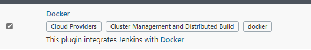
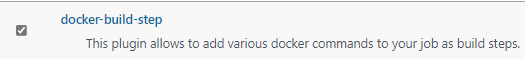
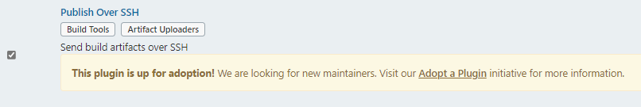
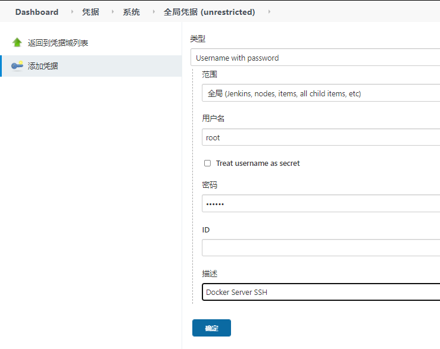
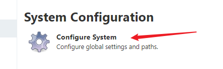
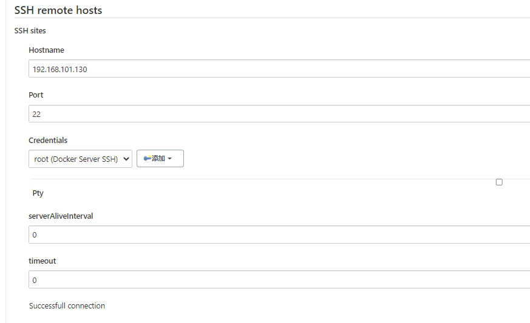
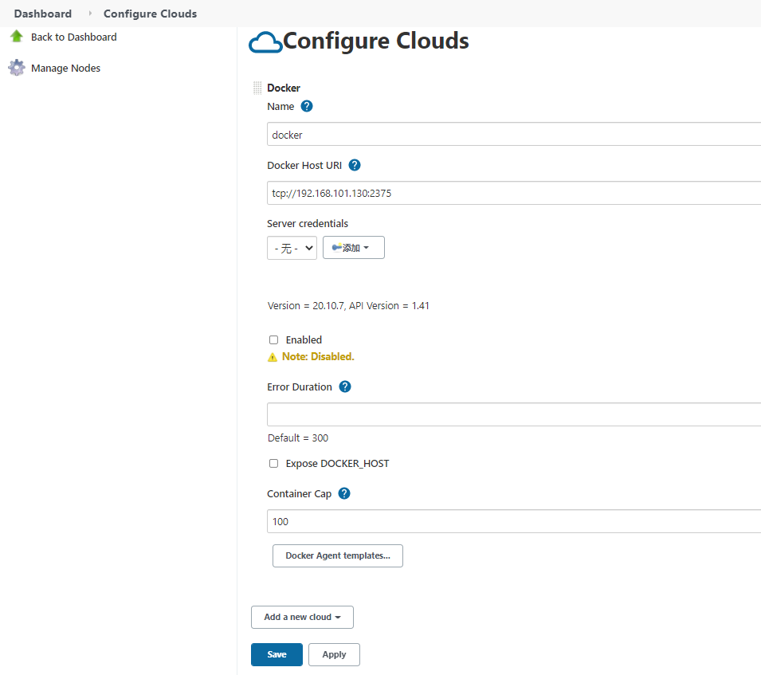

[toc]

大致流程说明： 

1）开发人员每天把代码提交到Gitlab代码仓库

2）Jenkins从Gitlab中拉取项目源码，编译并打成jar包，然后构建成Docker镜像，将镜像上传到 Harbor私有仓库。

3）Jenkins发送SSH远程命令，让生产部署服务器到Harbor私有仓库拉取镜像到本地，然后创建容器。

4）最后，用户可以访问到容器

## Jenkins配置Docker

### 安装插件

`SSH plugin`, `Docker plugin`, `docker-build-step`

SSH , 用于远程执行Docker命令








### 添加SSH远程主机

**创建SSH凭据**



**添加SSH远程主机**





**开启Docker Remote API**

```shell
vim /usr/lib/systemd/system/docker.service
ExecStart=/usr/bin/dockerd -H fd:// --containerd=/run/containerd/containerd.sock -H tcp://0.0.0.0:2375
# 添加 -H tcp://0.0.0.0:2375

systemctl daemon-reload
systemctl restart docker
```

**配置Docker**

Manage Jenkins -> Manage Nodes and Clouds -> Configure Clouds




