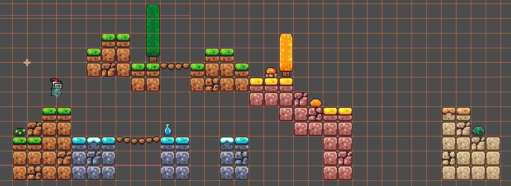
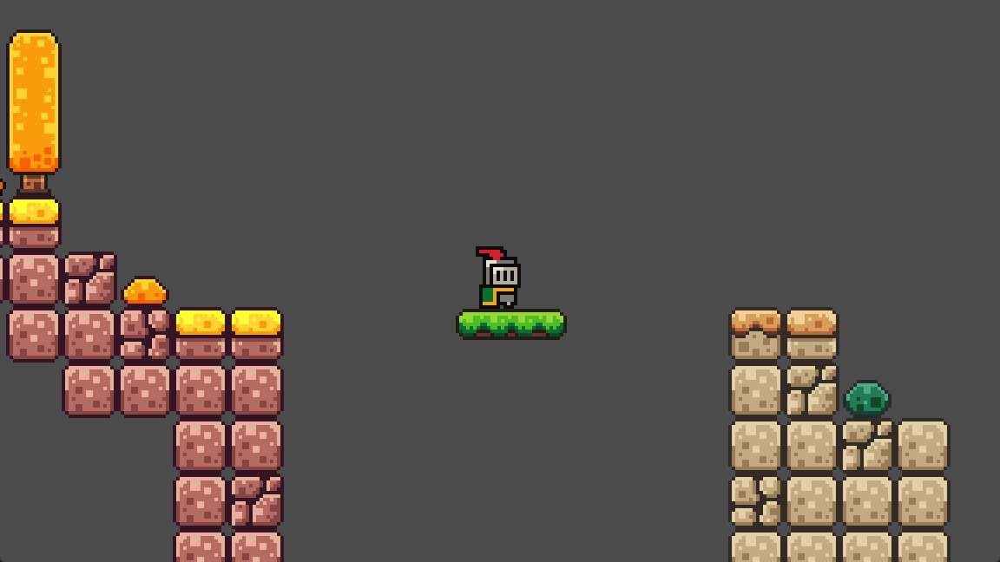
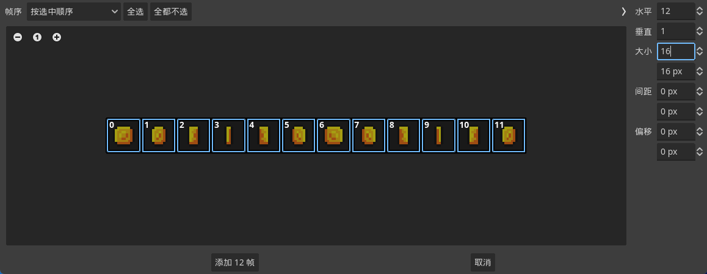
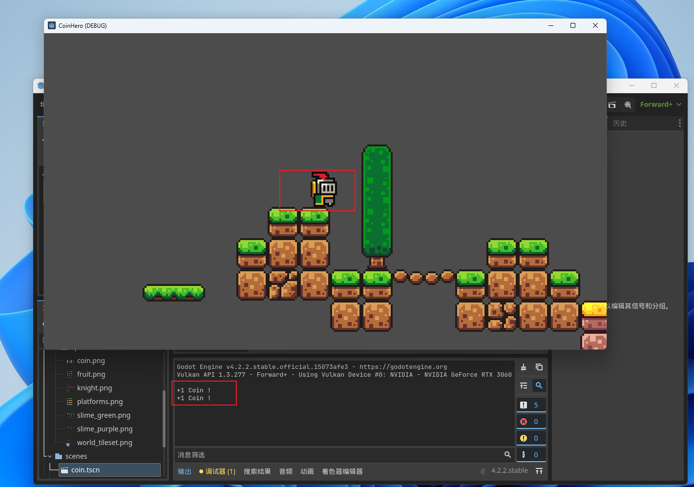
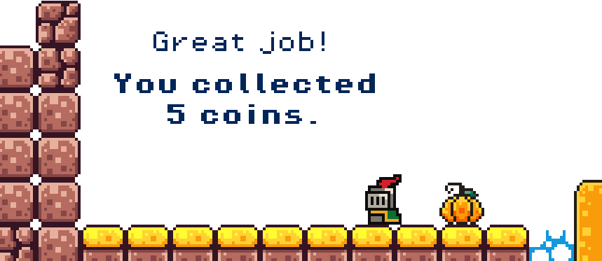

# Godot 新手教程

## 0 准备工作

### 0.1 下载, 安装, 创建工程

下载页面: https://godotengine.org/download/windows/

下载完成之后解压缩

新建一个项目

点击创建并编辑之后, 就会进入Godot的主面板.

### 0.2 创建文件夹, 导入素材

在 `res://` 下创建几个文件夹

- assets: 存放游戏素材 (素材下载地址: https://brackeysgames.itch.io/brackeys-platformer-bundle)
- scripts: 存放游戏脚本
- scenes: 存放游戏场景

解压下载好的游戏素材 `brackeys_platformer_assets.zip` 然后 拖到 `assests` 文件夹中

Godot 使用 node(节点) 的方式来制作游戏

- 玩家(player)
- 敌人(enemy)
- 主菜单(menu)

  

scene(场景) 可以将不同的 node 组合打包

游戏中所有的 node 和 scene 使用类似树的结构呈现

## 1 创建 Player

### 1.1 创建 Game 根节点

创建一个2D根节点, 命名 Game

  

Ctrl+S 保存到 scenes 文件夹

右上角点击小三角, 或者 F5 运行

选择当前场景, 开始运行

点击 右上角方块 或者 F8 停止

### 1.2 创建玩家场景

创建一个新的 player 场景

玩家的根节点是一个名为 CharacterBody2D 的节点

点击左上角加号

搜索character, 选择 CharacteBody2D

搜索sprite, 添加一个 AnimatedSprite2D 节点, 来创建一个动画角色.

选择 AnimatedSprite2D 节点, 在面板右上角, 选择 Animation --> Sprite Frames --> 新建 SpriteFames, 来添加一些Sprite帧.

点击SpriteFames, 在面板下方 点击 `从精灵表中添加帧`

在打开的窗口中 找到 assets --> sprites --> knight.png

在新弹出的窗口中, 重新分割 knight 图片, 水平:8, 垂直:8, 再依次选择前四个图片来创建 玩家动画.

主面板 按F, 滑动滚轮放大, 就可以看到静态的骑士图片

画面模糊是由于 godot 使用了纹理平滑处理, 为了让画面更加好看, 这在像素游戏里是不需要的

在左上角, 项目 --> 项目设置 --> 常规 --> 渲染 --> 纹理 --> 默认纹理过滤, 选择 Nearest, 然后关闭

这样我们就得到了一个像素风格的骑士

现在可以播放动画了

- 为了让动画更流畅, 动画速度设置为10FPS
- 动画的名字可以设置为`idle`
- 启用 `自动播放`, 确保游戏开始时能正确播放

因为CharacterBody2D是一个物理节点, 每当物理引擎工作的时候, 我们需要定义一个物理引擎可以处理的形状.

因此还需要添加一个CollisionShape2D节点来描述节点的物理形状.

选择 CollisionShape2D, 右上角 检查器 --> Shape --> 新建CircleShape2D

把蓝色小圆圈调整到合适的大小, 把骑士拖到x轴上面

把 top node `CharacterBody2D` 重命名为 Player, 然后保存到 scenes 文件夹

 

回到 Game 场景, 把 Player 拖进去

添加一个 Camera 节点, 来控制显示的内容

相机默认的画面尺寸太大, 通过zoom --> x,y 设置为4, 来放大相机镜头缩小画面尺寸

把相机拖到骑士身上

运行游戏, 我们就能在窗口中看到一个运动的骑士小人

### 1.3 给玩家添加脚本

回到 player 场景, 左上角点击添加脚本按钮.

使用 `CharacterBody2D: Base Movement` 模板, 修改路径为: `res://scripts/player.gd`

由于使用的模板, 可以看到脚本中已经包含了任务基本的移动和跳跃的代码.

再次运行游戏, 可以发现 骑士 立刻从屏幕掉下去了.

我们需要给骑士创建一个碰撞实体来让他站立.

在 game 场景, 添加一个 StaticBody2D 节点, 再在其下添加一个 CollisionShap32D 节点, Shape 选择 新建WorldBoundaryShape2D, 最后把创建好的地面 拖动到合适的位置.

WorldBoundaryShape2D 在水平方向是无限延伸的, 非常适合用来做地面.

再次F5运行游戏, 可以看到骑士降落到WorldNoundaryShape上, 可以使用 方向键左右 移动, 空格跳跃.

目前 移动速度有些太快了, 跳跃也有些太高了, 修改脚本来调整一下.

再运行一下, 会感觉好很多.

## 2 建造世界

### 2.1 创建TileMap

在game场景, 首先把场景中的 StaticBody2D 节点删掉, 然后添加一个 TileMap(瓦片地图) 节点.

我们将通过不同的瓦片(tile)绘制到网格上来构建我们的游戏世界.

我们用来绘制地图的资源通常会被打包到一个大的图片中, 类似这样, 就是一个瓦片集(Tile Set).

瓦片机是我们可以用来绘制瓦片的集合, 而刚创建的瓦片地图(TileMap)是我们用来将这些tile涂抹到世界中的节点

### 2.2 创建TileSet

#### 2.2.1 绘制地图

新建一个TileSet.

创建好TileSet后, 点击TileSet,会展开一个下拉页

首先我们要确保的是TileSize和素材中的Tile尺寸一致, 由于我们素材中的tile也是16*16的像素, 所以这里不用调整.

目光转向面板底部, 能看到 TileSet和TileMap两个标签.

在绘制tile map之前, 我们先要正确设置tile set.

点击TileSet, 然后拖动 res://assests/sprites/world_tileset.png 到TileSet的小窗口中.

在TileSet中添加好素材之后, 如果右侧的图块分割有错误, 可以使用橡皮来清除图块,

我们使用橡皮把椰子树顶部的树叶图块清理掉, 然后取消橡皮, 再按住Shift+鼠标左键, 拖动来创建一个3*3的椰子树顶部大图块

像下图的树木图块, 我们不必合并成一个, 因为这样有利于我们创建不同高度的树木.

接下来, 切换到TileMap点击绘制按钮, 在选择合适的图块, 我们就可以在面板上绘制地图了.

#### 2.2.2 添加物理层

现在运行游戏, Player 会直接掉出地图, 因此我们要给图块添加上物理层, 让 Player 能站立在地板上, 同时又不会被树木蘑菇挡住.

我们在 TileMap节点 --> 右上角 检查器 --> TileMap --> Physics Layers, 点击添加元素.

然后回到面板下方, 选择 TileSet --> 选择绘制 --> 请选择属性编辑器 --> 物理层0, 然后一次点击需要添加物理层的图块	

选择`清除`(快捷键C), 可以取消错误的物理层绘制; 选择`重置为默认图块形状`(快捷键F), 可以再次重新绘制.

对于吊桥图块, 我们不能简单的使用默认的图块形状, 点击图块, 然后从左侧的面板调整物理层到合适的范围.

运行游戏, 就可以看到Player在地图上正常移动了.

最后我们拖动Camera节点, 让它成为 Player 的子节点, 就可以实现相机随着人物移动了.

## 3 平台(Platform)

这里, 我们将尝试创建一些可以静止和可以移动的平台.

### 3.1 创建静止平台

创建一个新的scene, 添加 AnimatableBody2D 作为根节点.

这是一个物理引擎, 当我们想要对一个节点进行动画处理, 同时让其与路径中其他节点正确碰撞时使用.

Ctrl+A, 选择 Sprit2D, 为 AnimatableBody2D 添加一些图形.

把 assests/sprites/platforms.png 拖动到 Texture 中.

在 Region中 勾选Enabled --> 编辑区域, 在弹出的窗口中, 裁剪出我们需要的图片区域.

吸附模式 选择 像素吸附, 可以帮助我们更轻松的裁剪出想要的图片.

再次 Ctrl+A, 为 AnimatableBody2D 添加一个碰撞区域(CollisionShape2D).

关闭 像素吸附 可以更准确的绘制出碰撞区域.

勾选 `One Way Collision` 为平台添加单向碰撞.

最后将 AnimatableBody2D 改名为 Platform, 然后保存到 scenes 文件夹中.

现在我们可以回到 game 场景, 将 Platfrom 拖动到game中.

运行游戏后, Player可以跳上平台, 但是是从平台背后穿过的;(树木,蘑菇 也有同样的问题)

这是因为在目录树中, 平台处于玩家之后, 这意味着在每一帧中, 玩家将首先被绘制, 之后再在玩家上面绘制平台.

我们可以简单的把玩家拖动到Plafrom之后.

但是这里我们将通过修改玩家的z-index来修正绘制顺序.

进入 player 场景, 在 Ordering --> Z Index 中设置一个较大的数值, 比如5(默认是0).

因为 Player和Platfrom 默认的Z Index都是0, 因此会根据在目录树中的位置来绘制.

### 3.2 创建可以移动的平台

首先 拖动platform.tscn, 添加一个新的平台.

选择这个新的平台节点(Platfrom2), 为它添加一个`AnimationPlayer`节点.

然后 点击面板下方 动画标签 --> 动画工具按钮 --> New --> 命名为 move

将动画轨道的游标拖到0刻度处, 再点击平台, 在右边Transform --> Position 点击小钥匙, 插入关键帧.

再拖动游标到1的位置, 然后按住shift水平拖动平台到右边, 再次点击小钥匙插入关键帧.

点击动画循环按钮, 调整到往复动画, 点击"加载后自动播放".

点击播放按钮, 可以看到平台在地图上像乒乓球一样来回运行.

如果觉得平台运动太快,可以调整动画时常到1.5, 然后拖动关键帧到1.5的位置.

运行游戏, 可以看到平台在来回移动, 而且Player可以站在平台上随着平台一起移动.

## 4 可以拾取的金币

### 4.1 创建金币

新建一个场景, 添加Area2D作为根节点.

Area2D是一种我们在不想与其他对象发生碰撞, 而是要定义一个可以检测碰撞的区域时使用的节点类型.

再给Area2D添加一个AnimatedSprite2D节点, 创建金币的精灵动画.

添加 res://assests/sprites/coin.png, x y设置成12 1, 从左道友选择全部金币图案.

选择加载后自动播放, 动画速度设置为10FPS, 点击播放.

和普通物理节点一样, Area2D也需要添加碰撞形状(CollisionShape2D).

添加CollisionShape2D, 创建一个圆形碰撞形状, 和金币重合.

把Area2D根节点根节点重命名为Coin, 保存到scenes文件夹中.

回到Game场景, 把coin.tscn 拖动到面板中, 把金币添加到关卡中.

可以使用 Ctrl+D 来复制金币.

运行游戏, 我们发现Player会穿过金币, 并不会捡起.

### 4.2 为金币添加脚本

来到 Coin 场景, 选择 Coin 节点, 点击添加脚本, 将脚本存放在scripts文件夹中.

可以看到 我们在 Area2D节点上创建了脚本, 并且会为我们自动运行脚本.

通常我们使用 ready 和 process 两个函数, 目前方法中只有pass关键字, 意思是什么都不做.

ready函数会在游戏开始时, 我们的节点进入场景树时被调用, 在ready中, 我们可以防止希望立即发生的代码.

在ready中, 删除pass, 添加上 `print("I'm a coin.")`, 运行游戏, 可以在输出中看到 `I'm a coin.` 这样的输出信息.

`I'm a coin.` 被输出了5次是因为我们在游戏中放置了5个金币, 并且脚本会为每个金币运行一次.

事实上我们不想在游戏启动时发生任何事情, 而是在Player进入金币范围时执行一次操作,

因此我们需要先删除 ready和process两个函数, 然后为脚本添加一个信号.

(信号允许我们根据游戏中发生的事件来触发代码)

我们首先选择 Coin 节点 --> 右上角选择 节点 标签 --> 双击 body_entered() 添加信号到代码编辑器中.

在 代码编辑器中 可以看到出现了一个 _on_body_entered 函数.

方法左侧的绿色箭头说明这是一个可以被触发的信号.

我们给 _on_body_entered 函数中添加一个print函数, 内容是 `+1 Coin !`.

运行游戏, 控制 Player 移动到金币, 可以在输出中看到 `+1 Coin !`

问题, 如果平台也碰撞到金币, 也会触发输出 `+1 Coin !`

这是不对的, 我们可以把Player和Coin放置到同一个新的Collision Layer来解决这个问题.

物体默认的 Collision Layer 是 1, 对于Player我们把Collision Layer改成2.

对于Coin, 我们可以把Coin继续放置在Layer 1, 但是让它只检测来自 Layer 2的碰撞, 将 Mask 改为2.

运行游戏, 我们会发现只有Player和Coin碰撞时才会触发输出.

当我们拿到金币时, 不仅要显示消息, 还应该让金币消失.

在 _on_body_entered 中添加一行新的内容: queue_free()

这个函数可以帮助我们将Coin从场景中移除.

## 5 角色死亡

### 5.1 限制相机范围

当Player掉下悬崖之后, 游戏并不会终止, 相机也会随着Player一起下落.

首先我们要限制相机的范围, 当Player掉下去时, 相机不会继续跟随Player.

Game场景 --> Player --> Camera2D --> Limit, 设置相机的范围

我们可以使用工具栏的标尺模式(快捷键R), 来测量出需要设置的数值, 125px比较合适

设置到 Camera2D Limit 的 Bottom 中, 同时勾选Smooth(平滑处理)

运行游戏我们可以看到, 当 Player 掉下悬崖时, 相机不会再跟随 Player 下落.

### 5.2 设置 Kill Zone

我们会设置能够重复使用的 Kill Zone, 不仅限于坠落悬崖, 还可以用于尖刺陷阱, 敌人, 等等各种危险元素.

我们先新建一个 Area2D 场景, 并将Collison Mask 设置为 2, 用来检查位于第2层的玩家的碰撞.

将Area2D重命名为Killzone, 并保存到 scenes 文件夹中.

将 Killzone.tscn 拖动到Game场景中(或者使用左上角的实例化子场景按钮 -- 锁链, 来添加)

然后我们在Game场景中为Killzone添加一个CollisionShape, 并选择 WorldboundaryShape2D.

将killzone拖动到地图的底部.

现在我们可以为Killzone添加一个脚本, 以便于当玩家进入Killzone时触发某些事件.

回到Killzone场景, 选择Killzone根节点, 右键 添加脚本 Template选择Empty, 脚本保存在scripts文件夹中.

点击Killzong根节点, 右上角选择节点, 双击body_entered 添加信号.

在`_on_body_entered`中添加 `print("You died.")`, 当玩家跳下悬崖后, 就会输出 You died.

我们希望玩家跳下悬崖后, 能有一个短暂的时间变慢, 然后重新开始游戏

在Killzone中添加 Timer 节点, 右侧修改 Wait time 为 0.4, 勾选 One Shot 确保这个Timer只会被触发一次, 不会循环.

回到脚本, 拖动Timer到编辑器中, 释放时按住Ctrl键.

这样就能创建一个名为timer的变量, 它会自动使用`$Timer`这个路径来找到Timer节点.

在 _on_body_entered 中写入 `timer.start()`, 这样当玩家进入Killzone之后, 就会启动这个Timer.

现在我们需要在计时器计时结束时触发一些代码, 点击Timer, 右侧选择节点, 双击 timerout(), 添加 _on_timer_timeout 函数.

在 _on_timer_timeout 中 写入重新开始游戏的代码:

- 首先我们要访问场景树并告诉它重新加载, 输入 get_tree().reload_current_scene()
- 这样当玩家进入Killzone并触发 _on_body_entered 函数, 这时就会输出一条消息表明玩家已经死亡, 并启动计时器.

- 当计时器计时结束, 它会触发 _on_timer_timeout 函数,重新加载我们的场景并重新启动游戏.

## 6 继续建造世界

### 6.1 整理节点

在Game场景, 有多个Platform和Coin节点, 可以对它们进行归类整理.

新建一个 Node 节点, 命名为Coins, 把所有的Coin节点都拖进去.

Platfrom也同样处理.

### 6.2 绘制背景

首先我们要给现有的地图扩充一些元素.

绘制背景, 需要在瓦片地图中添加一个新的图层.

我们先把目前的图层命名为 Mid(Mid-ground 中间地形), 点击添加元素, 为新的图层命名为Background.

我们把Background移动到顶部, 确保它先被绘制.

在下方工具栏确认我们现在是在Background图层, 就可以开始绘制背景了.

可以使用矩形工具一次性绘制多个Tile.

运行游戏, 我们就可以看到背景和新的地图了.

## 7 敌人(Enemy)

### 7.1 创建Enemy

先新建一个场景, 使用Node2D作为根节点.

为这个节点添加AnimatedSprite2D节点, 使用assests/sprites/slime_green.png作为精灵帧.

同样的启用 加载后自动播放, 以及设置动画速度为 10FPS.

然后把Killzong添加到这个场景中, 让Slim碰撞到Player的时候, 可以杀掉Player.

再添加一个CollisionShape2D, 用来检测碰撞.

最后将Node2D改名为Slim, 并保存到scenes文件夹.

回到Game场景, 把Slim拖动到Game中.

### 7.2 让敌人移动

我们可以使用动画的方式来让Slim移动, 类似平台.

不过这里, 我们将使用脚本的方式, 让Slim触碰到墙壁的时候自动改变运动方向.

这样就可以将简单的将敌人放到任意的两面墙之间, 脚本会自动完成敌人移动变换方向部分.

进入Slim场景, 添加一个Default脚本.

删除 _ready 函数, 这次我们将使用 _process 函数.

就像电影一样, 视频游戏通过绘制帧并快速展示它们来展示运动过程;

和电影不同的是, 电子游戏通常会尝试尽可能多的绘制帧以获得平滑的运动效果.

游戏画面更新的频率取决于游戏运行的系统和游戏中发生的事情;

除非游戏出现延迟, 否则每秒应至少绘制新画面60次, 通常更多.

在计算机可以绘制新的画面之前, 它必须首先更新游戏的状态, 自上一帧以来发生了什么., 它对我们游戏中所有的节点执行此操作, 然后绘制新帧; 这被成为游戏循环, 因为它一遍又一遍的重复发生, 驱动我们的游戏运行.

Godot会自动执行这个操作, 我们可以使用脚本模板中process函数, 来添加其他功能到游戏循环中.

不同于_ready只运行一次, process在每一帧都会运行.

这使得process非常适合做敌人随着时间移动一类的动作,

我们只需要确保每一帧都微调一点敌人的位置.

在process中, 删除pass, 使用position.x获取Slim位置, 然后每一帧为它+1个像素.

让我们在游戏中给玩家附近放一个Slim用来观察测试

运行游戏, 可以看到Slim迅速超过我们.

这是由于我们每一帧都以固定的量(1像素)来增加x的位置.

游戏的帧率是变化的, 这意味我们的Slim移动时可能忽快忽慢, 这并不友好. (这个在demo中很难观察到)

为了解决这个问题, 我们可以使用delta.

Delta是自上一帧过去的时间量, 如果我们每秒绘制许多帧, delta会变得非常小, 如果遇到卡顿, delta就会变大.

因此我们可以使用delta来补偿帧率的变化.

如果帧率很高, 哦我们希望每一帧敌人只移动一点点, 而帧率过低, 则敌人移动多一些.

我么可以通过delte来是我们的移动速度和帧率无关.

另外, 我们需要设置一个SPEED变量, 来控制敌人移动的速度.

### 7.3 控制移动方向

定义一个变量 direction, 默认为 1; 如果要向反方向移动, 则修改direction为-1.

我们把 direction和SPEED相乘就能控制移动的方向了

下来, 我们要做的是检测敌人是否靠近墙壁, 使用RayCast(射线投射)节点.

射线投射是我们发射出去用来侦测碰撞的不可见射线.

在Slim场景, 添加RayCast2D节点.

拖动箭头, 并指向Slim右侧, 将这个RayCast2D命名为RayCastRight

同样的方法, 我们再创建一个RayCastLeft

我们可以在脚本中像操作计时器那样引用这些节点.

把节点拖动到脚本编辑器中, 释放时按住Ctrl键.

接下来我们可以在每次移动之前, 先判断射线是否击中了什么, 使用is_colliding方法.

最后, 在变换移动方向的时候, 修改精灵动画的`Flip H`属性, 就能控制敌人的朝向.

把AnimatedSprite2D引入到脚本中.

当敌人向右移动时, 把animated_sprite.flip_h设置为true, 向左移动时设置为false.

运行看一下吧.

## 8. 角色死亡-2

### 8.1 死亡时慢动作

我们可以通过改变游戏的时间刻度来实现;

在Killzone场景中, 我们打开脚本, 在print之后, 我们设置引擎的时间缩放为0.5

在_on_timer_timeout中将时间缩放恢复1.

### 8.2 移除玩家碰撞体

当玩家死亡后, 移除玩家的碰撞体, 让它直接从地图上掉出去, 这样更cool.

在Killzone场景的脚本中, _on_body_entered 函数有一个body变量, 这个body指的是进入碰撞区域的对象(这里就是player).

通过body, 获取CollisionShape2D节点, 然后移除(queue_free).

## 9 玩家(Player)-2

在1中, 我们对玩家使用了角色移动模板, 让玩家有了移动和跳跃这两个基本功能.

脚本的核心是`_physics_process`函数, 类似敌人中的`_process`函数;

虽然`_process`函数适用于许多情况, 但游戏的物理引擎却有一个困难就是不知道每秒将执行多少次. 

一般情况, 物理引擎需要在固定间隔更新, 以避免出现怪异的行为.

`_physics_process`解决了这个问题, 它默认以固定的速率运行, 每秒60次.

这与游戏的实际帧率无关, 有助于物理运行顺畅.

我们用它来处理涉及物理引擎的任何事物, 比如移动应该与环境发生碰撞的东西(玩家角色).

在`_physics_process`函数中发生了以下三件事:

### 9.1 重新绑定按键

Godot左上角, 项目 --> 项目设置 --> 输入映射 --> 添加新动作 --> 依次输入 jump move_left move_right(每次输入结束按下回车)

按下右侧加号, 再按下想绑定的按键

修改_physics_process函数, 用我们自己设置的按键来替换默认的`ui_*`按键.

### 9.2 调整玩家正确的朝向

现在玩家不管怎么移动, 都是朝向右面, 这是不对的, 使用`AnimatedSprite2D`的`Flip H`属性来控制玩家的朝向.

`var direction = Input.get_axis("move_left", "move_right")` 定义了一个 direction 变量, 当我们按下move_left时, direction是-1, move_right是1, 什么都不按是0;

这样我们就可以用direction来检测玩家的运动方向.

### 9.3 添加移动和跳跃动画

Player场景 --> AnimatedSprite2D节点 --> 检查器 --> Sprite Frames --> 添加动画

添加两个新动画: run jump

首先是run动画, 插入run下的16个精灵帧, 动画速度是10FPS.

然后是jump动画, 选择roll图片中的一个.

接下来, 在脚本中来添加动画.

- 如果direction是0, 就播放idle动画
- 如果direction是其他值(1 or -1), 就播放run动画

然后是跳跃动画, 如果玩家不在地板上就播放jump动画

## 10 文本

### 10.1 静态文本

文本使用label标签.

在 Game 场景, 添加一个 label 节点.

在Text中输入 `Space to jump.`

在 Control --> Theme Overrides --> Fonts 中导入自定义的字体 PixelOperator8.ttf, 还可以在 Font Sizes中调整字体的大小.

注意, 为了使文本清晰, 字体大小必须是8的倍数

还可以在colors中修改字体颜色

同样的方法, 再添加:

- Falling hurts...
- Almost there..

创建好所有的标签后, 可以再添加一个 node 节点, 把label节点整理一下.

### 10.2 动态文本(分数 Score)

我们的游戏需要一个计分板或者金币计数器.

完成这个, 需要一个用来追踪当前得分的脚本和一个用来显示得分的标签.

#### 10.2.1 计分脚本

将像分数这样的游戏全局变量放在某种游戏管理器中是常见做法.

在Game场景中,添加一个Node节点, 命名为 GameManager, 并拖到顶部.

使用Node而不使用Node2D是因为GameManager不需要具有位置 选择 缩放的功能.

向GameManager中添加脚本, 使用empty模板, 存储到scripts文件夹中.

首先定义一个名为score的变量, 并设置为0.

到目前为止的代码中, 我们只是用了Godot的内置函数和一些通过信号创建的函数, 这里我们要自定义个一个函数 `add_point()` 用于增加score.

add_point 不像 ready(在游戏开始时运行) 以及信号函数(在被触发时调用), add_point目前没有任何调用它的对象.

我们需要在金币的脚本中, 告诉它当金币被捡起时, 调用这个add_point.

因此我们要在coin.gd中引入一个Gamemanager对象.

但是如果我们直接按住控件并拖动, 会得到一个奇怪的路径.

这是因为GameManager在树中比金币的层级更高, 在树中尝试访问同级别或者更高级别的节点路径通常是一个不好的做法.

我们可以通过将GameManager标记为唯一节点来解决这个问题.

右键GameManager, 选择 `%`作为唯一名称访问

这时在GameManager节点的右边就会出现一个 `%`

再次拖动GameManager到脚本中.

这意味着Godot可以通过唯一名称快速找到节点, 而不是使用路径.

这个方法的局限性是只能从同一个场景内部访问唯一节点, 如果GameManager和金币位于不同场景中, 这个方法将无法起作用.

现在把 _on_body_entered 中的print替换掉.

当玩家捡起金币时, 就会调用 `game_manager.add_point()`

#### 10.2.2 显示分数

我们创建一个用来显示金币数量的标签.

首先, 扩充一下地图并添加一个标签.

修改自动换行模式为 单词, 水平对齐方式设置为居中, 字体替换为 加粗字体.

把计分标签重命名为 ScoreLabel, 因为我们要从GameManager中修改它, 所以将它拖到GameManager中.

将ScoreLabel拖动到game_manager.gd脚本中, 替换print.

## 11 声音

### 11.1 背景音乐

要播放音频, 我们需要 AudioStreamPlayer 节点.

在 Game 场景里, 添加 AudioStreamPlayer2D 节点, 重命名为 Music.

把 music/time_for_adventure.mp3 拖动到 Stream 中.

勾选 AutoPlay, 就能在游戏启动后自动播放.

默认情况 音乐不会循环播放, 双击 time_for_adventure.mp3 文件

默认情况, 音乐的音量都会偏大, 由于这是背景音乐, 需要调低一点.

我们可以通过 Volume dB 来调节.

也可以使用底部的音频选项卡, 在这里我们可以添加不同的总线来控制我们的音频.

添加两个总线, 分别命名为 Music 和 SFX

我们将Music总线的音量调整到-12, 然后在 Bus 中选择 Music.

运行游戏, 就可听到背景音乐了.

但是每次重新加载游戏都会导致音乐重新播放, 将音乐节点制作成一个场景可以解决这个问题.

将Music节点拖动到 scenes 文件夹, 保存为 music.tscn

然后可以将 music场景 添加为自动加载,自动加载是加载全局场景和脚本, 无论当前加载了哪个场景, 自动加载的内容都会保持在整个游戏中存在.

在顶部 项目 --> 项目设置 --> 自动加载 --> 路径 中 选择 music.tscn --> 点击添加

现在我们就把music场景注册为自动加载, 删除 game场景中的music, 然后重新运行游戏.

### 11.2 捡金币声音

我们需要在 coin场景, 添加一个AudioSteamPlayer2D节点, 命名为PickupSound, 把 coin.wav 拖动到Stream中, 并将Bus设置为 SFX.

现在我么实际上可以通过脚本播放这个声音,但是由于在捡金币的脚本中立即调用了queue_free()函数来移除金币, 游戏中捡金币的声音是不会有机会播放的.

解决方法是添加一个 AnimationPlayer, 创建一个拾取动画.

当我们拾起金币时, 第一件事是要隐藏金币Sprite.

点击AnimatedSprite2D --> 再点击底部动画 --> 在右侧 Visibility Visible属性上, 点击钥匙图标, 插入关键帧 (将pickup动画的游标移动到1s位置)

这时godot会为我们创建一个RESET动画, 并在pickup和RESET中插入关键帧.

当我们捡起金币时, 我们希望金币变为不可见, 取消勾选 Visible属性, 再次插入关键帧.

编辑器中的金币也会消失.

如果想恢复, 只需要把动画切换到RESET就好.

另外, 我们在播放音乐时, 也不希望有任何碰撞发生. 回到pickup, 点击CollisionShape2D, 找到Disable属性, 点击钥匙, 插入关键帧; 之后勾选Disbale 再次插入关键帧.

这样godot会为我们创建一个没有勾选Disable的RESET轨道, 以及一个勾选了Disable的pickup轨道.

再进入 PickupSound, 为Playing属性, 添加一个RESET轨道, 再勾选Playing, 添加pickup轨道.

由于声音播放过快, 我们无法及时勾选Playing, 可以点击playing轨道的关键帧, 在右侧 value属性 上勾选启用.

由于1秒后, 我们可以移除金币, 因此我们需要把所有的关键帧移动到动画轨道的开头, 也就是0秒处.

1秒后我们就会移除金币, 我们可以为动画添加一个 Call Method Track 轨道.

选择Coin节点(脚本在Coin节点上) --> 在新的函数轨道上右键 --> 添加 queue_free 函数.

现在1秒之后就会自动调用 queue_free 函数来释放金币.

现在, 剩下的就是调用动画播放了.

回到 Coin的脚本中, 把AnimationPlay2D拖动到脚本中, 把queue_free()替换成 animation_player.play("pickup")

## 12 导出(Export)

第一次导出时, 需要下载并安装导出模板.

godot顶部 编辑器 --> 管理导出模板 --> 点击下载并安装

安装好后, 关闭导出模板管理器, 点击 项目 --> 导出

在这个窗口中, 添加一个构建平台, 选择 Windows Desktop

勾选 "内嵌PCK"

继续往下, 在产品名称 输入 "Coin Hero"

接着点击 导出项目

选择导出路径

可以先忽略报错, 然后就可以在导出的路径中找到 导出的游戏了.

## 13 接下来可以做的事

- 扩展关卡, 看看凭借现有的知识可以达到多远.
- 在拾取硬币时, 添加动画或粒子特效, 或者增加更多音乐.
- 添加更多危险元素, 比如尖刺或者触发开关的陷阱

- 添加主菜单
- 添加更多敌人
- 给玩家一把武器或者添加道具强化
- 扩展游戏管理器, 例如用来切换场景
