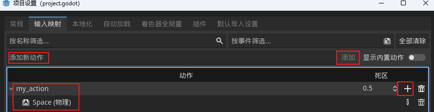

# GDScript


## 1 Hello World

首先我们创建一个空的Godot项目, 再添加一个Node节点, 命名为Main.


Ctrl+S 保存.

为Main添加一个脚本, 使用Default Template.


这个模板将为我们创建一个具有两个函数的脚本, 我们将从`_ready()`函数开始.

- `_ready()`可以看作是游戏的开始, 当节点第一次进入场景树时, 将调用这个函数, 这会在我们玩游戏时立即发生; 这样我们就可以在`_ready()`中放入想要立即发生的代码.

- `pass`基本上意味着什么都不做, 在我们尚未填写任何内容的函数中会出现

替换 `pass`为 `print("Hello, world!")`

```
extends Node


# Called when the node enters the scene tree for the first time.
func _ready():
	print("Hello, world!")

```

运行游戏, 我们就能在输出窗口看到 "Hello, world!"


## 2 输入输出

### 2.1 Label

添加一个Label节点.


把Label节点拖入到脚本中, 使用 `.`访问Label的各个属性.


```
extends Node

func _ready():
	print("Hello, world!")
	$Label.text = "Hello, world!"  # 修改Label显示的内容
	$Label.modulate = Color.GREEN  # 修改Label字体颜色
```


### 2.2 Input

下来实现一个效果, 根据输入的按键来改变Label颜色

首先在 项目 --> 项目设置 --> 输入映射 中 添加一个 "my_action" 动作, 然后绑定到 Space按键 上.



然后在脚本中创建一个 input函数.


```
func _input(event):
	if event.is_action_pressed("my_action"):	# 检测 my_action 绑定的按键是否按下
		$Label.modulate = Color.RED
	if event.is_action_released("my_action"):	# 检测 my_action 绑定的按键是否释放
		$Label.modulate = Color.GREEN
```


## 3 变量

对于玩家角色, 我们可以使用变量来存储玩家的姓名 生命值 伤害.

```
var num = 10		# 动态类型
var num: int = 10	# 指定(静态)类型
var num := 10		# 自动推断类型

# 向量:
var position = Vector2(x, y)
var position3D = Vector3(x, y, z)
```

```
@export var num = 10	# 可以让我们从检查器中来编辑变量
```


```
const AGE = 20	# 常量
```


## 4 条件控制

- if
- if else

## 5 函数

#### 产生随机数

```
func _input(event):
	if event.is_action_pressed("my_action"):
		print(randi_range(10, 100))
```

## 6 数组

```
var items = ["A", 1, "hello", true]
var items2: Array[String] = ["AAA", "BBB", "CCC"]
```

## 7 循环

```
# for
var items = ["A", 1, "hello", true]
for i in items:
	print(i)


# while
var a = 0.0
while a < 1.2:		# a小于1.2时进入循环
	print(a)
	a += 0.1
```

## 8 字典

```
var d = {"a": "AAA", "b": "aaaa"}
var d2: Dictionary
print(d.a)
print(d["a"])

for k in d:
	print(k + "-" + d[k])
```

## 9 枚举(Enums)

```
enum Alignment { ALLY, NEUTRAL, ENEMY }	# 结盟 { 盟友, 中立, 敌人 }

var unit_alignment = Alignment.ALLY

# 等价于下面的代码
const ALLY = 0
const NEUTRAL = 1
const ENEMY = 2

func _ready():
	print(Alignment.ALLY)		# 0
	print(Alignment.NEUTRAL)	# 1
	print(Alignment.ENEMY)		# 2
	
# 手动指定枚举的值
enum Alignment { ALLY = 1, NEUTRAL = 0, ENEMY = -1 }
```

使用export 在检查器中设置 枚举对象


## 10 Match

Match在godot中与其他语言的switch相当

```
enum Alignment { ALLY, NEUTRAL, ENEMY }	# 结盟 { 盟友, 中立, 敌人 }

@export var my_alignment : Alignment

func _ready():
	match my_alignment:
		Alignment.ALLY:
			print("hello friend")
		Alignment.NEUTRAL:
			print("I come in")
		Alignment.ENEMY:
			print("go die")
		_:
			print("who are you")
```


## 11 定时器(Timer)

```
signal leveled_up(msg)

var xp: int = 0

func _ready():
	leveled_up.connect(_on_leveled_up)		# 手动连接信号

func _on_timer_timeout():
	xp += 5
	print(xp)
	if xp >= 20:
		xp = 0
		leveled_up.emit("DING")

func _on_leveled_up(msg):
	print(msg)
```


## 12 Set/Get

setter

```
extends Node

signal health_changed(new_health)	# 自定义信号

var health := 100:
	set(value):
		health = clamp(value, 0, 100)
		health_changed.emit(health)

func _ready():
	health = -150
	
func _on_health_changed(new_health):
	print(new_health)
```

getter

```
var chance: float = 0.2
var chance_pct:int:
	get:
		return chance * 100
	set(val):
		chance = float(val) / 100.0

func _ready():
	print(chance_pct)
	chance_pct = 40
	print(chance_pct)
```

## 13 类(Class)

创建一个新的 Node 节点, 命名为 Character, 并添加一个脚本

```
class_name Character

extends Node

# 属性
@export var profession : String
@export var health : int

# 方法
func die():
	health = 0
	print(profession + " died.")
```

实例对象


调用类

```
extends Node

@export var character_to_kill: Character

func _ready():
	character_to_kill.die()		# 调用类方法
```

## 14 Inner Class

存在于一个类 内部的另一个类, 通常用来捆绑变量 以及 函数.

```
class_name Character

extends Node

var chest := Equipment.new()
var legs := Equipment.new()

func _ready():
	chest.armor = 20
	print(chest.armor)
	print(legs.weight)

class Equipment:
	var armor := 10
	var weight := 5
```

## 15 继承


