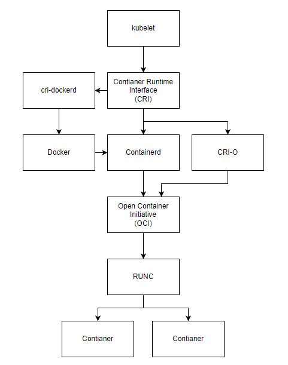

```
cat <<EOF >> /etc/hosts
192.168.3.201 k8s-master
192.168.3.202 k8s-worker01
EOF


cat <<EOF | sudo tee /etc/modules-load.d/k8s.conf
overlay
br_netfilter
EOF

sudo modprobe overlay
sudo modprobe br_netfilter

# 设置所需的 sysctl 参数，参数在重新启动后保持不变
cat <<EOF | sudo tee /etc/sysctl.d/k8s.conf
net.bridge.bridge-nf-call-iptables  = 1
net.bridge.bridge-nf-call-ip6tables = 1
net.ipv4.ip_forward                 = 1
EOF

# 应用 sysctl 参数而不重新启动
sudo sysctl --system

lsmod | grep br_netfilter
lsmod | grep overlay

sysctl net.bridge.bridge-nf-call-iptables net.bridge.bridge-nf-call-ip6tables net.ipv4.ip_forward
```


## 安装容器运行时

### 环境准备

```bash
# 转发 IPv4 并让 iptables 看到桥接流量
cat <<EOF | sudo tee /etc/modules-load.d/k8s.conf
overlay
br_netfilter
EOF

sudo modprobe overlay
sudo modprobe br_netfilter

# 设置所需的 sysctl 参数，参数在重新启动后保持不变
cat <<EOF | sudo tee /etc/sysctl.d/k8s.conf
net.bridge.bridge-nf-call-iptables  = 1
net.bridge.bridge-nf-call-ip6tables = 1
net.ipv4.ip_forward                 = 1
EOF

# 应用 sysctl 参数而不重新启动
sudo sysctl --system

# 检查 overlay 和 br_netfilter, 是否被加载
lsmod | grep br_netfilter
lsmod | grep overlay

# 确认 net.bridge.bridge-nf-call-iptables net.bridge.bridge-nf-call-ip6tables net.ipv4.ip_forward 被设置为 1
sysctl net.bridge.bridge-nf-call-iptables net.bridge.bridge-nf-call-ip6tables net.ipv4.ip_forward
```



### Containerd

Containerd 或者 CRI-O 任意装一个就行

> 文档: https://github.com/containerd/containerd/blob/main/docs/getting-started.md

```bash
# 安装 contianerd
tar Cxzvf /usr/local containerd-1.6.20-linux-amd64.tar.gz
mkdir -p /usr/local/lib/systemd/system

cd /usr/local/lib/systemd/system
wget https://raw.githubusercontent.com/containerd/containerd/main/containerd.service

systemctl daemon-reload
systemctl enable containerd

# 安装 runc, conitanerd 安装包中不包含runc, 需要手动安装
# 下载 runc.amd64文件, https://github.com/opencontainers/runc/releases
install -m 755 runc.amd64 /usr/local/sbin/runc

# 安装 CNI plugins
# 下载 cni-plugins-<OS>-<ARCH>-<VERSION>.tgz 安装包, https://github.com/containernetworking/plugins/releases
mkdir -p /opt/cni/bin
tar Cxzvf /opt/cni/bin cni-plugins-linux-amd64-v1.2.0.tgz

# 生成 containerd 配置文件
mkdir /etc/containerd
containerd config default > /etc/containerd/config.toml

vim /etc/containerd/config.toml
# 配置runc systemd cgroup驱动
[plugins."io.containerd.grpc.v1.cri".containerd.runtimes.runc]
  [plugins."io.containerd.grpc.v1.cri".containerd.runtimes.runc.options]
    SystemdCgroup = true
# 设置阿里云地址
[plugins."io.containerd.grpc.v1.cri"]
  sandbox_image = "registry.aliyuncs.com/google_containers/pause:3.6"
# 设置阿里云镜像加速器
[plugins."io.containerd.grpc.v1.cri".registry]
  [plugins."io.containerd.grpc.v1.cri".registry.mirrors]
    [plugins."io.containerd.grpc.v1.cri".registry.mirrors."docker.io"]
      endpoint = ["https://8aj710su.mirror.aliyuncs.com"]

# 启动 containerd
sudo systemctl restart containerd
```

### CRI-O

> 文档: https://github.com/cri-o/cri-o/blob/main/install.md#readme


### 部署kubernetes

```bash
# 配置 aliyun k8s yum 源
cat <<EOF > /etc/yum.repos.d/kubernetes.repo
[kubernetes]
name=Kubernetes
baseurl=https://mirrors.aliyun.com/kubernetes/yum/repos/kubernetes-el7-x86_64/
enabled=1
gpgcheck=1
repo_gpgcheck=1
gpgkey=https://mirrors.aliyun.com/kubernetes/yum/doc/yum-key.gpg https://mirrors.aliyun.com/kubernetes/yum/doc/rpm-package-key.gpg
EOF

# master 安装 kubeadm kubelet kubectl
yum install -y kubeadm-1.26.2 kubelet-1.26.2 kubectl-1.26.2
systemctl enable --now kubelet

# worker 安装 kubeadm kubelet
yum install -y kubeadm-1.26.2 kubelet-1.26.2
systemctl enable --now kubelet

# init master 节点
kubeadm init \
--image-repository registry.aliyuncs.com/google_containers \
--apiserver-advertise-address=192.168.3.201 \
--kubernetes-version=v1.26.2 \
--service-cidr=10.96.0.0/12 \
--pod-network-cidr=10.244.0.0/16 \
--v=5

# init worker节点, PASS

# 安装flannel
kubectl apply -f https://github.com/flannel-io/flannel/releases/latest/download/kube-flannel.yml

# 检查flannel镜像状态
ctr -n k8s.io c ls
```


