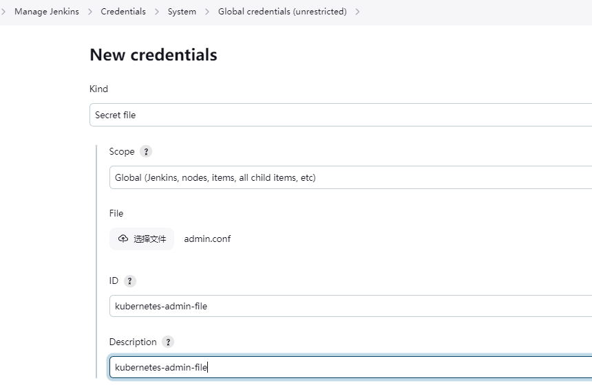
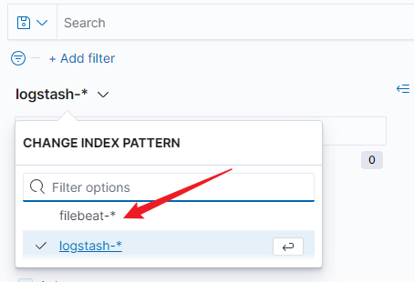

## 0. 环境搭建

### 1. 环境准备

准备三台虚拟机

Mater节点: 2c 4g

Worker01节点: 4c 8g

Worker02节点: 4c 8g

```bash
# 关闭防火墙：
systemctl stop firewalld
systemctl disable firewalld

# 关闭selinux：
sed -i '/^SELINUX=/ s/enforcing/disabled/' /etc/selinux/config
setenforce 0

# 关闭swap：
swapoff -a $ 临时
vim /etc/fstab $ 永久

# 时间同步：
# ......

# 将桥接的IPv4流量传递到iptables的链：
cat <<EOF >> /etc/sysctl.d/kubernetes.conf
net.bridge.bridge-nf-call-iptables=1
net.bridge.bridge-nf-call-ip6tables=1
net.ipv4.ip_forward=1
vm.swappiness=0
fs.file-max=52706963
fs.nr_open=52706963
EOF

# 应用内核参数
sysctl -p

# 配置域名解析
cat <<EOF > /etc/hosts
127.0.0.1   localhost localhost.localdomain localhost4 localhost4.localdomain4
::1         localhost localhost.localdomain localhost6 localhost6.localdomain6
192.168.3.201  k8s-master
192.168.3.202  k8s-worker01
192.168.3.203  k8s-worker02
EOF
```


### 2. 安装Docker

```bash
curl https://mirrors.aliyun.com/repo/Centos-7.repo > /etc/yum.repos.d/Centos-7.repo
curl https://mirrors.aliyun.com/docker-ce/linux/centos/docker-ce.repo > /etc/yum.repos.d/docker-ce.repo

yum -y install docker-ce-20.10.16

# 配置docker加速器
mkdir -p /etc/docker
tee /etc/docker/daemon.json <<-'EOF'
{
  "registry-mirrors": ["https://rfj1yucr.mirror.aliyuncs.com"],
  "exec-opts": ["native.cgroupdriver=systemd"]
}
EOF

systemctl daemon-reload
systemctl enable docker
systemctl restart docker
```

### 3. 部署kubernetes

```bash
# 配置 aliyun k8s yum 源
cat <<EOF > /etc/yum.repos.d/kubernetes.repo
[kubernetes]
name=Kubernetes
baseurl=https://mirrors.aliyun.com/kubernetes/yum/repos/kubernetes-el7-x86_64/
enabled=1
gpgcheck=1
repo_gpgcheck=1
gpgkey=https://mirrors.aliyun.com/kubernetes/yum/doc/yum-key.gpg https://mirrors.aliyun.com/kubernetes/yum/doc/rpm-package-key.gpg
EOF

# master 安装 kubeadm kubelet kubectl
yum install -y kubelet-1.22.11 kubeadm-1.22.11 kubectl-1.22.11
systemctl enable kubelet

# worker 安装 kubeadm kubelet
yum install -y kubelet-1.22.11 kubeadm-1.22.11
systemctl enable --now kubelet

# init master 节点
kubeadm init \
--image-repository registry.aliyuncs.com/google_containers \
--apiserver-advertise-address=192.168.3.201 \
--kubernetes-version=v1.22.11 \
--service-cidr=10.96.0.0/12 \
--pod-network-cidr=10.244.0.0/16 \
--v=5

echo 'export KUBECONFIG=/etc/kubernetes/admin.conf' >> /etc/profile
source /etc/profile

# init worker节点, PASS
kubeadm join 192.168.3.201:6443 --token rv1v3i.wiz3tazyfsvevu97 --discovery-token-ca-cert-hash sha256:c51284ab19976997915a712b02feb75af396cb0e1a7508ca7cfd123745b21ef1

# 安装flannel
kubectl apply -f https://github.com/flannel-io/flannel/releases/latest/download/kube-flannel.yml

# 检查集群状态
kubectl get node
watch kubectl get all -n kube-flannel
```

### 4. 安装kuboard

```bash
kubectl apply -f https://addons.kuboard.cn/kuboard/kuboard-v3.yaml

# 等待安装结束
watch kubectl get all -n kuboard
```

**浏览器访问:** [http://k8s-worker:30080](http://192.168.3.201:30080)

**用户名:** admin

密码: Kuboard123


### 5. 安装ingress

下载 ingress-nginx-controller 源码: https://github.com/kubernetes/ingress-nginx/archive/refs/tags/controller-v1.3.0.tar.gz

```bash
tar -xf ingress-nginx-controller-v1.3.0.tar.gz
cd ingress-nginx-controller-v1.3.0/deploy/static/provider/cloud/1.22

kubectl apply -f deploy.yaml
```

在 kuboard 检查部署结果


### 6. 安装helm

```bash
wget https://get.helm.sh/helm-v3.11.3-linux-amd64.tar.gz

tar -zxvf helm-v3.11.3-linux-amd64.tar.gz
mv linux-amd64/helm /usr/local/bin/

helm version
```


## 1. 安装jenkins

### 1. 安装nfs(master)

```bash
pvcreate /dev/sdb
vgcreate datavg /dev/sdb
lvcreate -l 100%FREE -n datalv datavg
mkfs.xfs /dev/datavg/datalv
echo "$(blkid /dev/datavg/datalv | awk '{print $2}')    /data    xfs    defaults    0 0" >> /etc/fstab
mkdir /data
mount -a
```

```bash
yum install -y nfs-utils
# worker节点也需要安装 nfs-utils 确保能正常挂载nfs

mkdir /data/jenkins
echo '/data/jenkins *(rw,no_root_squash)' >> /etc/exports

systemctl restart nfs && systemctl enable nfs
```

创建存储nfs存储类

```yaml
---
apiVersion: v1
kind: PersistentVolume
metadata:
  annotations:
    pv.kubernetes.io/bound-by-controller: 'yes'
  finalizers:
    - kubernetes.io/pv-protection
  name: nfs-pv-nfs-storage
  resourceVersion: '2492'
spec:
  accessModes:
    - ReadWriteMany
  capacity:
    storage: 5Gi
  claimRef:
    apiVersion: v1
    kind: PersistentVolumeClaim
    name: nfs-pvc-nfs-storage
    namespace: kube-system
    resourceVersion: '2490'
    uid: eb5c290b-0202-4870-8066-60598b574a41
  nfs:
    path: /data/jenkins
    server: 192.168.3.201
  persistentVolumeReclaimPolicy: Retain
  storageClassName: nfs-storageclass-provisioner
  volumeMode: Filesystem
---
apiVersion: storage.k8s.io/v1
kind: StorageClass
metadata:
  annotations:
    k8s.kuboard.cn/storageType: nfs_client_provisioner
  name: nfs-storage
  resourceVersion: '2510'
parameters:
  archiveOnDelete: 'false'
provisioner: nfs-nfs-storage
reclaimPolicy: Delete
volumeBindingMode: Immediate
```

### 2. 部署jenkins

> jenkins-master.yaml

```yaml
apiVersion: v1
kind: ServiceAccount
metadata:
  name: jenkins
  namespace: kube-jenkins
---
kind: Role
apiVersion: rbac.authorization.k8s.io/v1
metadata:
  name: jenkins
  namespace: kube-jenkins
rules:
  - apiGroups: ["apps"]
    resources: ["deployments"]
    verbs: ["create", "delete", "get", "list", "watch", "patch", "update"]
  - apiGroups: [""]
    resources: ["services"]
    verbs: ["create", "delete", "get", "list", "watch", "patch", "update"]
  - apiGroups: [""]
    resources: ["pods", "pods/exec"]
    verbs: ["create","delete","get","list","patch","update","watch"]
  - apiGroups: [""]
    resources: ["pods/log"]
    verbs: ["get","list","watch"]
  - apiGroups: [""]
    resources: ["secrets"]
    verbs: ["get"]
---
apiVersion: rbac.authorization.k8s.io/v1
kind: RoleBinding
metadata:
  name: jenkins
  namespace: kube-jenkins
roleRef:
  apiGroup: rbac.authorization.k8s.io
  kind: Role
  name: jenkins
subjects:
  - kind: ServiceAccount
    name: jenkins
    namespace: kube-jenkins
---
kind: ClusterRole
apiVersion: rbac.authorization.k8s.io/v1
metadata:
  name: jenkinsClusterRole
  namespace: kube-jenkins
rules:
- apiGroups: [""]
  resources: ["pods", "pods/exec"]
  verbs: ["create","delete","get","list","patch","update","watch"]
- apiGroups: [""]
  resources: ["pods/log"]
  verbs: ["get","list","watch"]
- apiGroups: [""]
  resources: ["secrets"]
  verbs: ["get"]
---
apiVersion: rbac.authorization.k8s.io/v1
kind: RoleBinding
metadata:
  name: jenkinsClusterRuleBinding
roleRef:
  apiGroup: rbac.authorization.k8s.io
  kind: ClusterRole
  name: jenkinsClusterRole
subjects:
- kind: ServiceAccount
  name: jenkins
  namespace: kube-jenkins
---
apiVersion: apps/v1
kind: StatefulSet
metadata:
  name: jenkins
  labels:
    name: jenkins
  namespace: kube-jenkins
spec:
  serviceName: jenkins
  selector:
    matchLabels:
      app: jenkins
  replicas: 1
  updateStrategy:
    type: RollingUpdate
  template:
    metadata:
      name: jenkins
      labels:
        app: jenkins
    spec:
      terminationGracePeriodSeconds: 10
      serviceAccountName: jenkins
      containers:
        - name: jenkins
          image: 'jenkins/jenkins:2.400'
          imagePullPolicy: IfNotPresent
          ports:
            - containerPort: 8080
              name: web
              protocol: TCP
            - containerPort: 50000
              name: agent
              protocol: TCP
          resources:
            limits:
              cpu: '1'
              memory: 1Gi
            requests:
              cpu: 500m
              memory: 500Mi
          env:
            - name: LIMITS_MEMORY
              valueFrom:
                resourceFieldRef:
                  resource: limits.memory
                  divisor: 1Mi
            - name: JAVA_OPTS
              value: -Xmx$(LIMITS_MEMORY)m -XshowSettings:vm -Dhudson.slaves.NodeProvisioner.initialDelay=0 -Dhudson.slaves.NodeProvisioner.MARGIN=50 -Dhudson.slaves.NodeProvisioner.MARGIN0=0.85
          volumeMounts:
            - name: jenkins-home
              mountPath: /var/jenkins_home
          livenessProbe:
            httpGet:
              path: /login
              port: 8080
              scheme: HTTP
            initialDelaySeconds: 60
            timeoutSeconds: 5
            failureThreshold: 12
          readinessProbe:
            httpGet:
              path: /login
              port: 8080
              scheme: HTTP
            initialDelaySeconds: 60
            timeoutSeconds: 5
            failureThreshold: 12
      securityContext:
        fsGroup: 1000
  volumeClaimTemplates:
    - apiVersion: v1
      kind: PersistentVolumeClaim
      metadata:
        name: jenkins-home
      spec:
        storageClassName: nfs-storage
        accessModes:
          - ReadWriteOnce
        resources:
          requests:
            storage: 10Gi
---
apiVersion: v1
kind: Service
metadata:
  name: jenkins
  namespace: kube-jenkins
  labels:
    app: jenkins
spec:
  selector:
    app: jenkins
  type: NodePort
  ports:
    - name: web
      port: 8080
      nodePort: 30180
      protocol: TCP
      targetPort: web
    - name: agent
      port: 50000
      nodePort: 30150
      protocol: TCP
      targetPort: agent
```

```bash
kubectl label nodes k8s-worker01 app=jenkins

kubectl create ns kube-jenkins

kubectl apply -f jenkins-master.yaml
```


### 3. 访问jenkins

访问: [http://k8s-worker01:30180](http://192.168.3.201:30180)

登录密码见容器日志


### 4. 配置jenkins

#### 配置国内源

页面点击 Plugin Manager -> Available, 等待加载完成

修改default.json配置文件

```bash
# master节点
cd /data/jenkins/kube-jenkins-jenkins-home-jenkins-0-pvc-4f338161-7289-426b-a1bc-62c3f7e6c0dd/updates/

sed -i 's/https:\/\/updates.jenkins.io\/download/https:\/\/mirrors.tuna.tsinghua.edu.cn\/jenkins/g' default.json
sed -i 's/http:\/\/www.google.com/https:\/\/www.baidu.com/g' default.json
```

再点击 Plugin Manager -> Advance, 修改 Update Site 为 https://mirrors.tuna.tsinghua.edu.cn/jenkins/updates/update-center.json


访问 [http://k8s-worker01-ip:30180/restart](http://192.168.3.201:30180/restart) 重启jenkins

#### 安装插件

安装以下插件:

- Git
- Pipeline
- Kubernetes
- Timestamper
- Rebuilder
- Kubernetes CLI

#### 配置 Kubernetes插件

Manage Jenkins -> Nodes and Clouds -> Clouds

- **Kubernetes 地址:** https://kubernetes.default.svc.cluster.local
- **Kubernetes 命名空间:** kube-jenkins
- **Jenkins 地址: **http://jenkins.kube-jenkins.svc.cluster.local

#### 测试 jenkins-slave

创建一个pipeline: test-jenkins-slave

```groovy
podTemplate(
  cloud: 'kubernetes', 
  label: 'jenkins-slave',
  namespace: 'kube-jenkins',
  containers: [
    containerTemplate(
      image: 'jenkins/jnlp-slave', 
      name: 'jnlp-slave', 
      workingDir: '/home/jenkins/agent',
      command: 'sleep', 
      args: '99999'
    )
  ]
) {
    node('jenkins-slave') {
      stage("pull code") {
        println "pull code"
        sleep time: 3, unit: 'MINUTES'
      }
    }
}
```

#### 测试构建推送镜像

- app应用 git仓库地址: https://gitee.com/oliween/web.git

  在jenkins中创建gitee登录凭据

  Manage Jenkins -> Credentials -> System -> Clobal credentials

- docker仓库使用阿里云个人私有仓库: registry.cn-hangzhou.aliyuncs.com

  在jenkins中创建阿里云仓库登录凭据

- 

```groovy
def version = "${version}"

def git_url = 'https://gitee.com/oliween/web.git'
def git_branch = '*/master'
timestamps {
  podTemplate(
    cloud: 'kubernetes', 
    label: 'jenkins-slave',
    namespace: 'kube-jenkins',
    containers: [
      containerTemplate(image: 'jenkins/jnlp-slave', name: 'jnlp-slave', workingDir: '/home/jenkins/agent', command: 'sleep', args: '99999'),
      containerTemplate(image: 'docker:latest', name: 'docker', ttyEnabled: true)
    ],
    volumes: [hostPathVolume(hostPath: '/var/run/docker.sock', mountPath: '/var/run/docker.sock')]
  ) 
  {
    node('jenkins-slave') {
      stage("pull code") {
        checkout scmGit(branches: [[name: "${git_branch}"]], extensions: [], userRemoteConfigs: [[credentialsId: 'gitee.com', url: "${git_url}"]])
      }
      stage('build and push image') {
        container('docker') {
          sh """
            ls
            docker build -t registry.cn-hangzhou.aliyuncs.com/oliween/my-web:${version} .
          """
          withCredentials([usernamePassword(credentialsId: 'registry.cn-hangzhou.aliyuncs.com', passwordVariable: 'password', usernameVariable: 'username')]) {
            sh """
              docker login -u ${username} -p ${password} registry.cn-hangzhou.aliyuncs.com
              docker push registry.cn-hangzhou.aliyuncs.com/oliween/my-web:${version}
            """
          }
        }
      }
    }
  }
}
```

#### 测试发布app

- 构建一个kubectl容器

  ```bash
  wget https://dl.k8s.io/v1.22.11/kubernetes-client-linux-amd64.tar.gz
  tar -xf kubernetes-client-linux-amd64.tar.gz
  cd kubernetes/client/bin
  
  cat <<EOF > Dockerfile
  FROM "busybox:latest"
  COPY ["kubectl", "/usr/local/bin/"]
  WORKDIR /root
  CMD ["/bin/sh", "-c", "sleep 99999"]
  EOF
  
  docker build -t registry.cn-hangzhou.aliyuncs.com/oliween/kubectl:1.22.11 .
  
  docker login -u ${username} -p ${password} registry.cn-hangzhou.aliyuncs.com
  docker push registry.cn-hangzhou.aliyuncs.com/oliween/kubectl:1.22.11
  ```

- 在Jenkins中导入kubernetes凭证

  - 下载 master节点 /etc/kubernetes/admin.conf 文件

  - 在 Manage Jenkins -> Credentials -> System -> Clobal credentials 选择 Secert File, 上传下载的文件

    

    

- 创建一个带参数的pipeline

  

  pipeline内容如下:

  ```groovy
  def version = "${version}"
  
  def git_url = 'https://gitee.com/oliween/web.git'
  def git_branch = '*/master'
  timestamps {
    podTemplate(
      cloud: 'kubernetes', 
      label: 'jenkins-slave',
      namespace: 'kube-jenkins',
      containers: [
        containerTemplate(image: 'jenkins/jnlp-slave', name: 'jnlp-slave', workingDir: '/home/jenkins/agent', command: 'sleep', args: '999999'),
        containerTemplate(image: 'docker:latest', name: 'docker', ttyEnabled: true),
        containerTemplate(image: 'registry.cn-hangzhou.aliyuncs.com/oliween/kubectl:1.22.11', name: 'kubectl', ttyEnabled: true)
      ],
      volumes: [hostPathVolume(hostPath: '/var/run/docker.sock', mountPath: '/var/run/docker.sock')]
    ) 
    {
      node('jenkins-slave') {
        stage("pull code") {
          checkout scmGit(branches: [[name: "${git_branch}"]], extensions: [], userRemoteConfigs: [[credentialsId: 'gitee.com', url: "${git_url}"]])
        }
        stage('build and push image') {
          container('docker') {
            sh """
              ls
              docker build -t registry.cn-hangzhou.aliyuncs.com/oliween/my-web:${version} .
            """
            withCredentials([usernamePassword(credentialsId: 'registry.cn-hangzhou.aliyuncs.com', passwordVariable: 'password', usernameVariable: 'username')]) {
              sh """
                docker login -u ${username} -p ${password} registry.cn-hangzhou.aliyuncs.com
                docker push registry.cn-hangzhou.aliyuncs.com/oliween/my-web:${version}
              """
            }
          }
        }
        stage('deploy application') {
          container('kubectl') {
            withKubeConfig(clusterName: 'kubernetes', contextName: 'kubernetes-admin@kubernetes', credentialsId: 'kubernetes-admin-file', namespace: '', restrictKubeConfigAccess: false, serverUrl: 'https://192.168.3.201:6443') {
              sh """
                sed -i 's/VERSION/${version}/g' deploy/my-web.yaml
                kubectl apply -f deploy/my-web.yaml
              """
            }
          }
        }
      }
    }
  }
  ```

  #### 验证发布的application

  ```bahs
  curl http://k8s-worker02:30050/hello
  ```

  


## 2. 安装kube-prometheus

下载 kube-prometheus

```bash
git clone https://github.com/prometheus-operator/kube-prometheus.git
```

### 1. 部署 kube-prometheus

```bash
cd kube-prometheus
kubectl create -f manifests/setup
kubectl create -f manifests/
```

手动把不能拉取的image pull下来

```bash
docker pull bitnami/kube-state-metrics:2.8.2
docker pull v5cn/prometheus-adapter:v0.10.0

docker tag bitnami/kube-state-metrics:2.8.2 registry.k8s.io/kube-state-metrics/kube-state-metrics:v2.8.2
docker tag v5cn/prometheus-adapter:v0.10.0 registry.k8s.io/prometheus-adapter/prometheus-adapter:v0.10.0
```


### 2. 暴露服务

分别修改 alertmanager-main, grafana, prometheus-k8s 三个 Service 为NodePort

- prometheus-k8s: 9093 -> 30090
- grafana: 3000 -> 30030
- alertmanager-main: 9090 -> 30093


浏览器验证:


使用 账号: admin 密码: admin 登录 grafana


## 3. 部署redis集群

准备一个nfs存储类, 起名: redis-storage

> redis-storage.yaml

```yaml
---
apiVersion: v1
kind: PersistentVolume
metadata:
annotations:
pv.kubernetes.io/bound-by-controller: 'yes'
finalizers:
- kubernetes.io/pv-protection
name: nfs-pv-redis-storage
spec:
accessModes:
- ReadWriteMany
capacity:
storage: 5Gi
claimRef:
apiVersion: v1
kind: PersistentVolumeClaim
name: nfs-pv-redis-storage
namespace: kube-system
nfs:
path: /data/redis
server: 192.168.3.201
persistentVolumeReclaimPolicy: Retain
storageClassName: nfs-storageclass-provisioner
volumeMode: Filesystem
---
apiVersion: storage.k8s.io/v1
kind: StorageClass
metadata:
  annotations:
    k8s.kuboard.cn/storageType: nfs_client_provisioner
  name: redis-storage
parameters:
  archiveOnDelete: 'false'
provisioner: nfs-redis-storage
reclaimPolicy: Delete
volumeBindingMode: Immediate
```

> redis-cm.yaml

```yaml
apiVersion: v1
kind: Namespace
metadata:
  name: redis
---
apiVersion: v1
kind: ConfigMap
metadata:
  name: redis-cluster-config
  namespace: redis
data:
  redis-config: |
    appendonly yes
    protected-mode no
    dir /data
    port 6379
    cluster-enabled yes
    cluster-config-file /data/nodes.conf
    cluster-node-timeout 5000
    masterauth redis@redis.com
    requirepass redis@redis.com
```

> redis-sts.yaml

```yaml
---
apiVersion: apps/v1
kind: StatefulSet
metadata:
  name: redis
  namespace: redis
  labels:
    app: redis
spec:
  serviceName: redis-headless
  replicas: 6
  selector:
    matchLabels:
      app: redis
  template:
    metadata:
      labels:
        app: redis
    spec:
      affinity:
        podAntiAffinity:
          preferredDuringSchedulingIgnoredDuringExecution:
          - weight: 100
            podAffinityTerm:
              labelSelector:
                matchExpressions:
                - key: app
                  operator: In
                  values:
                  - redis
              topologyKey: kubernetes.io/hostname
      containers:
        - name: redis
          image: redis:6.2.7
          command:
            - "redis-server"
          args:
            - "/etc/redis/redis.conf"
            - "--protected-mode"
            - "no"
            - "--cluster-announce-ip"
            - "$(POD_IP)"
          env:
            - name: POD_IP
              valueFrom:
                fieldRef:
                  fieldPath: status.podIP
          ports:
            - name: redis-6379
              containerPort: 6379
              protocol: TCP
          volumeMounts:
            - name: config
              mountPath: /etc/redis
            - name: data
              mountPath: /data
          resources:
            limits:
              cpu: 500m
              memory: 1000Mi
            requests:
              cpu: 100m
              memory: 500Mi
      volumes:
        - name: config
          configMap:
            name: redis-cluster-config
            items:
              - key: redis-config
                path: redis.conf
  volumeClaimTemplates:
    - metadata:
        name: data
        namespace: redis
      spec:
        accessModes: [ "ReadWriteOnce" ]
        storageClassName: "redis-storage"
        resources:
          requests:
            storage: 5Gi
---
apiVersion: v1
kind: Service
metadata:
  name: redis-headless
  namespace: redis
  labels:
    app: redis
spec:
  ports:
    - name: redis-6379
      protocol: TCP
      port: 6379
      targetPort: 6379
  selector:
    app: redis
  clusterIP: None
  type: ClusterIP
```

运行 yaml 文件

```bash
kubectl apply -f redis-cm.yaml
kubectl apply -f redis-sts.yaml
```


等待pod启动


初始化集群, 需要输入一次 yes

```bash
kubectl exec -it redis-0 -n redis -- redis-cli -a redis@redis.com --cluster create --cluster-replicas 1 $(kubectl get pods -n redis -l app=redis -o jsonpath='{range.items[*]}{.status.podIP}:6379 {end}')
```

验证集群状态

```bash
kubectl exec -it redis-0 -n redis -- redis-cli -a redis@redis.com --cluster check $(kubectl get pods -n redis -l app=redis -o jsonpath='{range.items[0]}{.status.podIP}:6379{end}')
```


## 4. 自动水平伸缩

### 部署 metrics-server

> metrics-server.yaml

```yaml
---
apiVersion: v1
kind: Service
metadata:
  labels:
    k8s-app: metrics-server
  name: metrics-server
  namespace: kube-system
spec:
  ports:
    - name: https
      port: 443
      protocol: TCP
      targetPort: 443
  selector:
    k8s-app: metrics-server

---
apiVersion: rbac.authorization.k8s.io/v1
kind: ClusterRole
metadata:
  labels:
    k8s-app: metrics-server
    rbac.authorization.k8s.io/aggregate-to-admin: 'true'
    rbac.authorization.k8s.io/aggregate-to-edit: 'true'
    rbac.authorization.k8s.io/aggregate-to-view: 'true'
  name: 'system:aggregated-metrics-reader'
  namespace: kube-system
rules:
  - apiGroups:
      - metrics.k8s.io
    resources:
      - pods
      - nodes
    verbs:
      - get
      - list
      - watch

---
apiVersion: rbac.authorization.k8s.io/v1
kind: ClusterRole
metadata:
  labels:
    k8s-app: metrics-server
  name: 'system:metrics-server'
  namespace: kube-system
rules:
  - apiGroups:
      - ''
    resources:
      - pods
      - nodes
      - nodes/stats
      - namespaces
      - configmaps
    verbs:
      - get
      - list
      - watch

---
apiVersion: rbac.authorization.k8s.io/v1
kind: ClusterRoleBinding
metadata:
  labels:
    k8s-app: metrics-server
  name: 'metrics-server:system:auth-delegator'
  namespace: kube-system
roleRef:
  apiGroup: rbac.authorization.k8s.io
  kind: ClusterRole
  name: 'system:auth-delegator'
subjects:
  - kind: ServiceAccount
    name: metrics-server
    namespace: kube-system

---
apiVersion: rbac.authorization.k8s.io/v1
kind: ClusterRoleBinding
metadata:
  labels:
    k8s-app: metrics-server
  name: 'system:metrics-server'
  namespace: kube-system
roleRef:
  apiGroup: rbac.authorization.k8s.io
  kind: ClusterRole
  name: 'system:metrics-server'
subjects:
  - kind: ServiceAccount
    name: metrics-server
    namespace: kube-system

---
apiVersion: rbac.authorization.k8s.io/v1
kind: RoleBinding
metadata:
  labels:
    k8s-app: metrics-server
  name: metrics-server-auth-reader
  namespace: kube-system
roleRef:
  apiGroup: rbac.authorization.k8s.io
  kind: Role
  name: extension-apiserver-authentication-reader
subjects:
  - kind: ServiceAccount
    name: metrics-server
    namespace: kube-system

---
apiVersion: v1
kind: ServiceAccount
metadata:
  labels:
    k8s-app: metrics-server
  name: metrics-server
  namespace: kube-system

---
apiVersion: apiregistration.k8s.io/v1
kind: APIService
metadata:
  labels:
    k8s-app: metrics-server
  name: v1beta1.metrics.k8s.io
  namespace: kube-system
spec:
  group: metrics.k8s.io
  groupPriorityMinimum: 100
  insecureSkipTLSVerify: true
  service:
    name: metrics-server
    namespace: kube-system
  version: v1beta1
  versionPriority: 100

---
apiVersion: apps/v1
kind: Deployment
metadata:
  labels:
    k8s-app: metrics-server
  name: metrics-server
  namespace: kube-system
spec:
  replicas: 2
  selector:
    matchLabels:
      k8s-app: metrics-server
  strategy:
    rollingUpdate:
      maxUnavailable: 1
  template:
    metadata:
      labels:
        k8s-app: metrics-server
    spec:
      affinity:
        nodeAffinity:
          preferredDuringSchedulingIgnoredDuringExecution:
            - preference:
                matchExpressions:
                  - key: node-role.kubernetes.io/master
                    operator: Exists
              weight: 100
        podAntiAffinity:
          requiredDuringSchedulingIgnoredDuringExecution:
            - labelSelector:
                matchLabels:
                  k8s-app: metrics-server
              namespaces:
                - kube-system
              topologyKey: kubernetes.io/hostname
      containers:
        - args:
            - '--cert-dir=/tmp'
            - '--secure-port=443'
            - '--kubelet-preferred-address-types=InternalIP,ExternalIP,Hostname'
            - '--kubelet-use-node-status-port'
            - '--kubelet-insecure-tls=true'
            - '--authorization-always-allow-paths=/livez,/readyz'
            - '--metric-resolution=15s'
          image: registry.cn-hangzhou.aliyuncs.com/oliween/metrics-server:v0.5.0
          imagePullPolicy: IfNotPresent
          livenessProbe:
            failureThreshold: 3
            httpGet:
              path: /livez
              port: https
              scheme: HTTPS
            periodSeconds: 10
          name: metrics-server
          ports:
            - containerPort: 443
              name: https
              protocol: TCP
          readinessProbe:
            failureThreshold: 3
            httpGet:
              path: /readyz
              port: https
              scheme: HTTPS
            initialDelaySeconds: 20
            periodSeconds: 10
          resources:
            requests:
              cpu: 100m
              memory: 200Mi
          securityContext:
            readOnlyRootFilesystem: true
            runAsNonRoot: true
            runAsUser: 1000
          volumeMounts:
            - mountPath: /tmp
              name: tmp-dir
      nodeSelector:
        kubernetes.io/os: linux
      priorityClassName: system-cluster-critical
      serviceAccountName: metrics-server
      tolerations:
        - effect: ''
          key: node-role.kubernetes.io/master
          operator: Exists
      volumes:
        - emptyDir: {}
          name: tmp-dir

---
apiVersion: policy/v1beta1
kind: PodDisruptionBudget
metadata:
  name: metrics-server
  namespace: kube-system
spec:
  minAvailable: 1
  selector:
    matchLabels:
      k8s-app: metrics-server
```

```bash
kubectl apply -f metrics-server.yaml
```

### 对my-app启动自动伸缩

- 修改my-web resources 如下:

  ```yaml
  resources:
    limits:
      cpu: 5m
      memory: 20Mi
    requests:
      cpu: 2m
      memory: 10Mi
  ```

- 执行脚本, 拉高my-web负载

  ```bash
  while true; do curl http://192.168.3.201:30050/hello; done
  ```

- 启动自动伸缩

  ```bash
  kubectl autoscale deployment my-web -n my-app --max=3 --min=1 --cpu-percent=50
  
  # 查看hpa
  kubectl get hpa -n my-app
  ```


- 可以观察到已经发生自动伸缩

  

## 5. 监控web应用

**监控 my-app**

部署一个 blackbox-exporter 监控 my-web( http://192.168.3.201:30050/hello)

```yaml
cat <<EOF > my-web-exporter.yaml
kind: Probe
apiVersion: monitoring.coreos.com/v1
metadata:
  # probe名
  name: test-website
  namespace: monitoring
spec:
  interval: 60s
  module: http_2xx
  prober:
    # blackbox-exporter 的 URL
    url: blackbox-exporter.monitoring.svc.cluster.local:19115
  targets:
    staticConfig:
      static:
      # 被监控的URL
      - http://192.168.3.201:30050/hello
EOF

kubectl apply -f my-web-exporter.yaml
```

导入grafana图表: 13659


kube-prometehus 已经提供了一些资源的监控:


## 6. 灰度部署

### 1. 分区更新

- 修改 my-app 部署文件

  - replicas: 9
  - kind: StatefulSet

  ```yaml
  apiVersion: apps/v1
  kind: StatefulSet
  metadata:
    name: my-web-s
    namespace: my-app
    labels:
      name: my-web-s
  spec:
    serviceName: my-web-s
    replicas: 9
    selector:
      matchLabels:
        name: my-web-s
    template:
      metadata:
        labels:
          name: my-web-s
      spec:
        containers:
          - name: my-web-s
            image: 'registry.cn-hangzhou.aliyuncs.com/oliween/my-web:v0.1'
            imagePullPolicy: IfNotPresent
            command: 
              - python
            args:
              - main.py
            ports:
              - containerPort: 5000
                name: my-web-s
                protocol: TCP
            resources:
              limits:
                cpu: 40m
                memory: 50Mi
              requests:
                cpu: 20m
                memory: 20Mi 
  ---
  apiVersion: v1
  kind: Service
  metadata:
    name: my-web-s
    namespace: my-app
    labels:
      name: my-web-s
  spec:
    selector:
      name: my-web-s
    type: NodePort
    ports:
      - name: my-web-s
        port: 5000
        nodePort: 30060
        protocol: TCP
        targetPort: my-web-s
  
  ```

- 设置 不更新 副本数

  ```bash
  kubectl patch statefulset.apps my-web-s -n my-app -p '{"spec":{"updateStrategy":{"type":"RollingUpdate", "rollingUpdate":{"partition":3}}}}'
  ```

  

- 查看当前pod image版本

  ```bash
  for i in `seq 0 8`; do image=$(kubectl describe pod my-web-s-$i -n my-app | grep 'Image:' | awk '{print $2}'); echo "my-web-s-$i  $image"; done
  ```

  

- 更新 image

  ```bash
  kubectl set image statefulset/my-web-s -n my-app my-web-s=registry.cn-hangzhou.aliyuncs.com/oliween/my-web:v0.2
  ```

  查看更新结果

  

### 2. 灰度发布

#### 环境准备

- 需要先部署ingress, 参考 0. 5. 安装ingress 内容

- 分别使用 my-app:v0.1 和 my-app:v0.2 部署两个deployment (yaml见 https://gitee.com/oliween/exam/tree/master/yaml/canary)

  ```bash
  kubectl apply -f app-v1.yaml
  kubectl apply -f app-v2.yaml
  ```

- 检查部署结果:


- 访问测试:


- 准备一个ingress, 将 www.mo.com 指向app-v1

  ```bash
  kubectl apply -f canary-v1.yaml
  ```

  

- 查找ingress-controller节点, 写入域名解析


```
echo "192.168.3.203 www.mo.com" >> /etc/hosts
```

- 测试访问

  

#### 流量切分

##### 根据header切分

将 header中含有 "foo:bar" 的请求, 转发至 app-v2

> canary-v2.yaml

```yaml
apiVersion: networking.k8s.io/v1
kind: Ingress
metadata:
  name: app-v2-release
  annotations:
    nginx.ingress.kubernetes.io/canary: "true"
    nginx.ingress.kubernetes.io/canary-by-header: "foo"
    nginx.ingress.kubernetes.io/canary-by-header-value: "bar"
spec:
  ingressClassName: nginx
  rules:
  - host: www.mo.com
    http:
      paths:
      - path: /
        backend:
          service:
            name: app-v2
            port:
              number: 80
        pathType: ImplementationSpecific
```


测试访问:


##### 基于cookie切分

cookie=always会被转发到 app-v2, 不带cookie 以及 cookie=never 会被转发到 app=v1

```yaml
metadata:
  name: app-v2-release
  annotations:
    nginx.ingress.kubernetes.io/canary: "true"
    nginx.ingress.kubernetes.io/canary-by-cookie: "mo"
```

测试访问:


### 权重切分

30%流量被 发送到 app-v2

```
metadata:
  name: app-v2-release
  annotations:
    nginx.ingress.kubernetes.io/canary: "true"
    nginx.imgress.kubernetes.io/canary-weight: "30"
```


## 7. 部署EFK

### 1.  部署前准备

- 访问 https://github.com/kubernetes/kubernetes/releases/tag/v1.22.11 下载 1.22.11 版本源码

- 在 kubernetes-1.22.11/cluster/addons/fluentd-elasticsearch 中 找到 部署文件

  

- 创建一个存储类 elastic-storage 用于存储elastic数据

  ```yaml
  ---
  apiVersion: v1
  kind: PersistentVolume
  metadata:
    annotations:
      pv.kubernetes.io/bound-by-controller: 'yes'
    finalizers:
      - kubernetes.io/pv-protection
    name: nfs-pv-elastic-storage
    resourceVersion: '2492'
  spec:
    accessModes:
      - ReadWriteMany
    capacity:
      storage: 5Gi
    claimRef:
      apiVersion: v1
      kind: PersistentVolumeClaim
      name: nfs-pv-elastic-storage
      namespace: kube-system
    nfs:
      path: /data/elastic
      server: 192.168.3.201
    persistentVolumeReclaimPolicy: Retain
    storageClassName: nfs-storageclass-provisioner
    volumeMode: Filesystem
  ---
  apiVersion: storage.k8s.io/v1
  kind: StorageClass
  metadata:
    annotations:
      k8s.kuboard.cn/storageType: nfs_client_provisioner
    name: elastic-storage
  parameters:
    archiveOnDelete: 'false'
  provisioner: nfs-elastic-storage
  reclaimPolicy: Delete
  volumeBindingMode: Immediate
  ```
  
  

### 2. 收集平台日志

#### 部署elasticsearch

修改 es-statefulset.yaml 文件中存储, 替换 emptyDir 为 elastic-storage 存储类

```
# 删除 volumes
      volumes:
        - name: elasticsearch-logging
          emptyDir: {}
# 增加 volumeClaimTemplates
  volumeClaimTemplates:
    - metadata:
        name: elasticsearch-logging
        namespace: logging
      spec:
        accessModes: [ "ReadWriteOnce" ]
        storageClassName: "elastic-storage"
        resources:
          requests:
            storage: 5Gi
```


```bash
kubectl apply -f create-logging-namespace.yaml
kubectl apply -f es-service.yaml
kubectl apply -f es-statefulset.yaml

watch kubectl get pods -n logging
```

#### 部署fluentd

```bash
kubectl apply -f fluentd-es-configmap.yaml
kubectl apply -f fluentd-es-ds.yaml
```

#### 部署kibana

```bash
kubectl apply -f kibana-service.yaml
kubectl apply -f kibana-deployment.yaml
```

浏览器访问: http://192.168.3.201:30051/


回到 Discovery


### 3. 收集应用日志

#### 部署zookeeper

```bash
helm install zookeeper . -n logging
```


#### 部署kafka

```bash
helm install kafka . -n logging
```


#### 部署logstash

```bash
kubectl apply -f logstash-cm.yaml -n logging
kubectl apply -f logstash-service.yaml -n logging
kubectl apply -f logstash.yaml -n logging
```

#### 部署测试app+filebeat

```yaml
kubectl apply -f filebeat-cm.yaml -n logging
kubectl apply -f app-filebeat.yaml -n logging
```

#### 配置kibana


**Create index pattern**, 输入 filebeat-*


访问 Discovery, 选择 filebeat



查看日志


## 8. terraform自动化管理(未完成)


