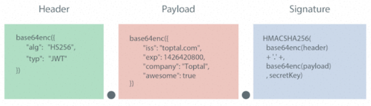

## CORS

```shell
go get github.com/gin-contrib/cors
```

**`cors2.Default()` 允许任意源的访问**

```go
func main() {
	g := gin.Default()
	g.Use(cors2.Default())
	g.GET("/info", func(c *gin.Context) {
		c.JSON(http.StatusOK, gin.H{"msg": "hello"})
	})
	_ = g.Run(":8000")
}
```

**自定义CORS配置**

```go
g := gin.Default()
g.Use(cors2.New(cors2.Config{
    // 允许跨域请求来源的列表, * 则允许所有请求
    AllowOrigins: []string{"https://foo.com"},
    AllowMethods: []string{"PUT", "PATCH"},
    // 允许客户端用于跨域请求的非简单头的列表
    AllowHeaders: []string{"Origin", "Content-Length", "Content-Type"},
    // 指示哪些头可以安全地暴露到CORS API规范的API中
    ExposeHeaders: []string{"Content-Length"},
    // 指示请求是否可以包括用户凭据，如Cookie、HTTP身份验证或客户端SSL证书
    AllowCredentials: true,
    // 指示请求的结果可以缓存多长时间（以秒为单位）
    MaxAge: 12 * time.Hour,
}))
```


## JWT

```shell
github.com/dgrijalva/jwt-go
```

### JWT-GO

#### 生成JWT

```go
```

#### 解析JWT

```go
```


### JWT概念

#### JWT认证过程 

```
用户 --登录--> 服务器
用户 <--jwt-- 服务器
用户 --携带jwt,request--> 服务器
用户 <--验证jwt通过,返回response-- 服务器
```

网上大多数介绍JWT的文章实际介绍的都是JWS(JSON Web Signature), 但是JWT并不等于JWS，JWS只是JWT的一种实现，除了JWS外，JWE(JSON Web Encryption)也是JWT的一种实现。

#### JWS

JSON Web Signature是一个有着简单的统一表达形式的字符串：



**头部（Header）**

头部用于描述关于该JWT的最基本的信息，例如其类型以及签名所用的算法等。 JSON内容要经Base64 编码生成字符串成为Header。

**载荷（PayLoad）**

payload的五个字段都是由JWT的标准所定义的。

1. iss: 该JWT的签发者
2. sub: 该JWT所面向的用户
3. aud: 接收该JWT的一方
4. **exp(expires): 什么时候过期，这里是一个Unix时间戳**
5. iat(issued at): 在什么时候签发的

后面的信息可以按需补充。 JSON内容要经Base64 编码生成字符串成为PayLoad。

**签名（signature）**

这个部分header与payload通过header中声明的加密方式，使用密钥secret进行加密，生成签名。 JWS的主要目的是保证了数据在传输过程中不被修改，验证数据的完整性。但由于仅采用Base64对消息内容编码，因此不保证数据的不可泄露性。所以不适合用于传输敏感数据。

#### JWE

相对于JWS，JWE则同时保证了安全性与数据完整性。 JWE由五部分组成：


JWE组成

具体生成步骤为：

1. JOSE含义与JWS头部相同。
2. 生成一个随机的Content Encryption Key （CEK）。
3. 使用RSAES-OAEP 加密算法，用公钥加密CEK，生成JWE Encrypted Key。
4. 生成JWE初始化向量。
5. 使用AES GCM加密算法对明文部分进行加密生成密文Ciphertext,算法会随之生成一个128位的认证标记Authentication Tag。 6.对五个部分分别进行base64编码。

**可见，JWE的计算过程相对繁琐，不够轻量级，因此适合与数据传输而非token认证，但该协议也足够安全可靠，用简短字符串描述了传输内容，兼顾数据的安全性与完整性。**

