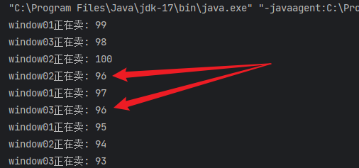

### 1. Scanner

```java
    public static void main(String[] args) {
        Scanner scanner = new Scanner(System.in);   // import java.util.Scanner;
        System.out.println("输入整数:");
        int i = scanner.nextInt();
        System.out.println("输入了: " + i);
    }
```

#### 匿名对象

多次使用的场景会造成资源浪费;

```java
    public static void main(String[] args) {
        System.out.println("pls input a number: ");
        int i = new Scanner(System.in).nextInt();
        System.out.println("number is: " + i);
    }
```

### 2. Radom

```java
    public static void main(String[] args) {
        Random random = new Random();   // import java.util.Random;
        for (int i = 0; i < 3; i++) {
            System.out.println("random number: " + random.nextInt(2)); // 生成 [0, 2-1) 的随机数
        }
    }
```

### 3. 数组

#### 3.1 普通数组

```java
    public static void main(String[] args) {
        int[] arr = new int[]{1,2,3};
        System.out.println(Arrays.toString(arr));
    }
```

#### 3.2 对象数组

```java
import java.util.Arrays;

class Student {
    private String name;

    public Student(String name) {
        this.name = name;
    }

    public void setName(String name) {
        this.name = name;
    }

    public String getName() {
        return name;
    }
}

public class Main {
    public static void main(String[] args) {
        Student[] students = new Student[3];
        Student s1 = new Student("刘备");
        Student s2 = new Student("关羽");
        Student s3 = new Student("张飞");

        students[0] = s1;
        students[1] = s2;
        students[2] = s3;

        for (int i = 0; i < students.length; i++) {
            System.out.println("student name: " + students[i].getName());
        }

    }
}
```

#### 3.3 ArrayList

```java
    public static void main(String[] args) {
        ArrayList<String> list = new ArrayList<>();
        list.add("刘备");
        list.add("关羽");
        list.add("张飞");

        for (int i = 0; i < list.size(); i++){
            System.out.println(list.get(i));
        }
    }
```

### 4. 包装类

| 基本类型 | 基本类型包装类 |
| :------- | :------------- |
| byte     | Byte           |
| short    | Short          |
| int      | Integer        |
| long     | Long           |
| float    | Float          |
| double   | Double         |
| char     | Character      |
| boolean  | Boolean        |

### 5. String 类

```java
    public static void main(String[] args) {
        char[] chars = {'a', 'b', 'c'};
        String str = new String(chars);     // 使用 char[] 构造 String
        System.out.println("str: " + str);  // str: abc

        byte[] bytes = {97, 98, 99};
        String str2 = new String(bytes);        // 使用 字节数组 构造
        System.out.println("str2: " + str2);    // str2: abc

        String str3 = "Abc";
        System.out.println(str.equals(str3));           // 字符串比较               false
        System.out.println(str.equalsIgnoreCase(str3)); // 字符串比较, 忽略大小写     true

        System.out.println(str.length());                   // 返回字符串长度      3
        System.out.println(str.concat("--"));               // 将指定字符串连接到该字符串的末尾     abc--
        System.out.println(str.charAt(1));                  // 返回指定索引处的字符             b
        System.out.println((str+str2).indexOf("bc"));       // 返回子串第一次出现处的索引       1
        System.out.println((str + str2).substring(1));      // 返回 [1, 结尾] 子串              bcabc
        System.out.println((str + str2).substring(1, 4));   // 返回 [1,4) 子串                  bca

        String str4 = "aa|bb|cc";
        System.out.println(Arrays.toString(str4.split("\\|")));     // [aa, bb, cc]
    }
```

### 6. Arrays类

`Arrys.toString()`

### 7. Math 类

- Math.abs(double a)        返回绝对值
- Math.ceil(double a)       返回大于等于参数的最小整数
- Math.floor(double a)      返回小于等于参数的最大整数
- Math.round(double a)      四舍五入

### 8. 多态

```java
    public static void main(String[] args) {
        Animal a = new Cat();
        a.eat();    // 猫吃鱼

        Animal a2 = new Dog();
        a2.eat();   // 狗吃肉
    }
```

### 9. 抽象类

使用 abstract 关键字修饰方法，该方法就成了抽象方法，抽象方法只包含一个方法名，而没有方法体;
如果一个类包含抽象方法，那么该类必须是抽象类;

> 抽象类可以包含 属性, 方法, 构造方法;

```java
修饰符 abstract 返回值类型 方法名 (参数列表)；
```

继承抽象类的子类必须重写父类所有的抽象方法。
否则，该子类也必须声明为抽象类。
最终，必须有子类实现该父类的抽象方法，否则，从最初的父类到最终的子类都不能创建对象，失去意义。

### 9. 接口

接口，是Java语言中一种引用类型，是方法的集合;
包含: 抽象方法, 默认方法, 静态方法, 私有方法;

```java
public interface HumanInterface {
    public abstract void method1(); // 抽象方法: abstract 可以省略, 没有方法体, 该方法供子类实现使用。

    public default void method2() {  // 默认方法: 使用 default 修饰, 不可省略, 供子类调用或者子类重写;
        System.out.println(" ");
    }

    public static void method3() {  // 静态方法: 使用 static 修饰, 供接口直接调用;
        System.out.println(" ");
    }

    private void method4(){         // 私有方法/私有静态方法: 使用 private 修饰, 供接口中的默认方法或者静态方法调用;
        System.out.println(" ");
    }
}
```

### 10. final

- 修饰类
  - 被修饰的类，不能被继承
- 修饰方法
  - 被修饰的方法，不能被重写
- 修饰变量
  - 基本类型的局部变量，被final修饰后，只能赋值一次，不能再更改。
  - 引用类型的局部变量，被final修饰后，只能指向一个对象，地址不能再更改。但是不影响对象内部的成员变量值的修改
  - 成员变量涉及到初始化的问题, 只能通过 直接 或者 构造方法 初始化, 二选一;
  
### 11. 内部类

### 12. Object类

- toString()
- equals()

### 13. 日期时间类

#### Date

```java
    System.out.println(new Date());     // 打印当前时间
    System.out.println(0L);     // 把毫秒值 转换为时间对象
```

#### DateFormat

- 时间对象转字符串
  ```java
      public static void main(String[] args) {
          Date date = new Date();
          DateFormat f = new SimpleDateFormat("yyyy-MM-dd HH:mm:ss");
          String str = f.format(date);
          System.out.println(str);    // 2023-07-04 21:32:25
      }
  ```
- 字符串转时间对象
  ```java
      public static void main(String[] args) {
          String str = "2023年1月2日 09时10分11秒";
          DateFormat f = new SimpleDateFormat("y年M月d日 H时m分s秒");
          try {
              Date date = f.parse(str);
              System.out.println(date);
          } catch (Exception e) {
              System.out.printf(e.getMessage());
          }
      }
  ```

### 14. System类

- System.currentTimeMillis()
  - 返回以毫秒为单位的当前时间
- System.arraycopy(src, srcPos, dest, destPos, length)
  - 将数组中指定的数据拷贝到另一个数组中
  - ```
    src         源数组
    srcPos      源数组索引起始位置
    dest        目标数组
    destPos     目标数组索引起始位置
    length      复制元素个数
    ```
    ```java
        public static void main(String[] args) {
        String[] arr1 = {"a", "b", "c", "d", "e"};
        String[] arr2 = {"A", "B", "C", "D", "E"};
        System.arraycopy(arr1, 1, arr2, 0, 3);
        System.out.println(Arrays.toString(arr2));  // [b, c, d, D, E]
    }
    ```

### 15. StringBuilder

```java
    public static void main(String[] args) {
        StringBuilder builder = new StringBuilder("hello");
        builder.append("world").append(" ").append(100).append(true);
        System.out.println(builder);                // helloworld 100true
        System.out.println(builder.toString());     // helloworld 100true
    }
```

### 16. 包装类

### 17. Collection

Collection是所有单列集合的父接口;

- Collection
  - java.util.List
    - java.util.ArrayList
    - java.util.LinkedLis
  - java.util.Set
    - java.util.HashSet
    - java.util.TreeSet

常用方法:

- `public boolean add(E e)`：  把给定的对象添加到当前集合中 。
- `public void clear()` :清空集合中所有的元素。
- `public boolean remove(E e)`: 把给定的对象在当前集合中删除。
- `public boolean contains(E e)`: 判断当前集合中是否包含给定的对象。
- `public boolean isEmpty()`: 判断当前集合是否为空。
- `public int size()`: 返回集合中元素的个数。
- `public Object[] toArray()`: 把集合中的元素，存储到数组中。

#### Iterator

用于迭代 Collection 中的元素;

```java
    public static void main(String[] args) {
        Collection<String> coll = new ArrayList<>();
        coll.add("刘备");
        coll.add("关羽");
        coll.add("张飞");
        Iterator<String> it = coll.iterator();
        while (it.hasNext()) {
            System.out.println(it.next());
        }
        // 增强for
        for (String i: coll) {
            System.out.println(i);
        }
    }
```

#### 泛型

定义时缺省数据类型, 使用时, 确定数据类型;

#### List

常用方法:

- `public void add(int index, E element)`: 将指定的元素，添加到该集合中的指定位置上。 
- `public E get(int index)`: 返回集合中指定位置的元素。 
- `public E remove(int index)`: 移除列表中指定位置的元素, 返回的是被移除的元素。 
- `public E set(int index, E element)`: 用指定元素替换集合中指定位置的元素,返回值的更新前的元素

##### ArrayList

底层是数组, 增删慢, 查找快

##### LinkedList

底层是链表, 增删快, 查找慢

常用方法:

- `public void addFirst(E e)`: 将指定元素插入此列表的开头。
- `public void addLast(E e)`: 将指定元素添加到此列表的结尾。
- `public E getFirst()`: 返回此列表的第一个元素。
- `public E getLast()`: 返回此列表的最后一个元素。
- `public E removeFirst()`: 移除并返回此列表的第一个元素。
- `public E removeLast()`: 移除并返回此列表的最后一个元素。
- `public E pop()`: 从此列表所表示的堆栈处弹出一个元素。
- `public void push(E e)`: 将元素推入此列表所表示的堆栈。
- `public boolean isEmpty()`：如果列表不包含元素，则返回true。

#### Set

`Set` 接口中元素无序，并且都会以某种规则保证存入的元素不出现重复。

##### HashSet

元素不能重复, 无序

###### LinkedHasSet

元素不能重复, 有序

### 18. Collections

用于操作集合

常用方法:

- `public static boolean addAll(Collection c, T... elements)`: 往集合中添加一些元素。 
- `public static void shuffle(List list)`: 打乱顺序, 打乱集合顺序。 
- `public static void sort(List list)`: 将集合中元素按照默认规则排序。 
- `public static void sort(List list，Comparator )`: 将集合中元素按照指定规则排序。

#### Comparator比较器

```java
	public static void main(String[] args) {
        ArrayList<String> arr = new ArrayList<>();
        Collections.addAll(arr, "acc", "cba", "bad");
        Collections.sort(arr, new Comparator<String>() {
            // 按照第一个字母降序排序
            @Override
            public int compare(String o1, String o2) {
                return o2.charAt(0) - o1.charAt(0);
            }
        });
        System.out.println(arr);
    }
```

### 19. Map

常用方法:

- `public V put(K key, V value)`: 把指定的键与指定的值添加到Map集合中。 
- `public V remove(Object key)`: 把指定的键 所对应的键值对元素在Map集合中删除，返回被删除元素的值。 
- `public V get(Object key)`: 根据指定的键，在Map集合中获取对应的值。 
- `public Set keySet()`: 获取Map集合中所有的键，存储到Set集合中。 
- `public Set> entrySet()`: 获取到Map集合中所有的键值对对象的集合(Set集合)。

#### HashMap

##### LinkedHasMap

有序HashMap

### 20. 异常

异常的根类: java.lang.Throwable

子类: java.lang.Error java.lang.Exception

- Error: 严重的Error, 无法通过处理的错误
- Exception: 异常, 产生后可以通过代码的方式纠正, 使程序继续运行

Throwable常用方法:

- `public void printStackTrace()`: 打印异常的详细信息
- `public String getMessage()`: 获取发生异常的原因
- `public String toString()`: 获取异常的类型和异常描述信息(不用)

#### 异常处理

##### throw 抛出异常

```java
throw new 异常类名(参数);

throw new NullPointerException("要访问的arr数组不存在");
throw new ArrayIndexOutOfBoundsException("该索引在数组中不存在, 已超出范围");
```

##### throws 声明异常

用于提醒开发者, 抛出异常

```java
修饰符 返回值类型 方法名(参数) throws 异常类名1,异常类名2...{}
```

```java
public void read(String path) throws FileNotFoundException {
    raise new FileNotFoundException("文件不存在")
}
```

##### try...catch...finally 捕获异常

```java
try {
    编写可能出现异常的代码;
} catch (异常类型A e) {
    处理异常A的代码;
    // 记录日志|打印异常信息|继续抛出异常
} catch (异常类型B e) {
    处理异常B的代码;
} finally {
    无论是否发生异常都需要执行的代码;
}
```

### 21. 多线程

#### 并发/并行

- 并发: 只两个或多个事件在通过一个时间段内发生;
- 并行: 只两个或多个事件在同一时刻发生(同时发生);

#### 进程/线程

- 进程: 

  是指一个内存中运行的应用程序, 每个进程都有一个独立的内存空间, 一个应用程序可以同时运行多个进程;

  进程也是程序的一次执行过程, 是系统运行程序的基本单位;

  系统运行一个程序即是一个进程从创建、运行到消亡的过程;

- 线程:

  线程是进程中的一个执行单元, 负责当前进程中程序的执行, 一个进程中至少有一个线程;

  一个进程中是可以有多个线程的, 这个应用程序也可以成为多线程程序;

##### 线程调度

- 分时调度

  所有线程轮流使用CPU的使用权, 平均分配每个线程占用CPU的时间;

- 抢占式调度

  优先让优先级高的线程使用CPU, 如果线程的优先级相同, 那么会随机选择一个(线程随机性), Java使用的是抢占式调度;

#### Thread 线程类

步骤一:

1. 定义Thread类的子类, 并重写该类的`run()`方法, 该`run()`方法的方法体就代表了线程需要完成的任务, 因此把`run()`方法称为线程执行体;
2. 创建`Thread`子类的实例;
3. 调用线程对象的`start()`方法来启动该线程;

```java
class MyThread extends Thread {
    // 调用父类的String参数构造方法, 指定线程的名称
    public MyThread(String name) {
        super(name);
    }

    @Override
    public void run() {
        for (int i = 0; i < 3; i++) {
            System.out.println(this.getName() + ": 正在执行 ! " + i);
        }
    }
}

public class Main {
    public static void main(String[] args) {
        Thread mt = new MyThread("新的线程");
        mt.start();
        for (int i = 0; i < 10; i++) {
            System.out.println("main线程 ! " + i);
        }
    }
}
```

步骤二:

1. 定义`Runnable`接口的实现类, 并重写该接口的`run()`方法, 该`run()`方法的方法体同样是该线程的线程执行体;
2. 创建`Runnable`实现类的实例, 并以此实例作为`Thread`的target来创建`Thread`类, 该`Thread`对象才是真正的线程对象;
3. 调用线程对象的`start()`方法来启动线程;

```java

class MyRunnable implements Runnable {
    @Override
    public void run() {
        for (int i = 0; i < 3; i++) {
            System.out.println("子线程: " + i);
        }
    }
}

public class Main {
    public static void main(String[] args) {
        Thread t = new Thread(new MyRunnable());
        t.start();
        for (int i = 0; i < 5; i++) {
            System.out.println("main线程: " + i);
        }
    }
}
```

构造方法:

- `public Thread()`: 分配一个新的线程对象。
- `public Thread(String name)`: 分配一个指定名字的新的线程对象。
- `public Thread(Runnable target)`: 分配一个带有指定目标新的线程对象。
- `public Thread(Runnable target,String name)`: 分配一个带有指定目标新的线程对象并指定名字。

常用方法:

- `public String getName()`: 获取当前线程名称。
- `public void start()`: 导致此线程开始执行; Java虚拟机调用此线程的run方法。
- `public void run()`: 此线程要执行的任务在此处定义代码。
- `public static void sleep(long millis)`: 使当前正在执行的线程以指定的毫秒数暂停（暂时停止执行）。
- `public static Thread currentThread()`: 返回对当前正在执行的线程对象的引用。

##### Thread和Runnable区别

继承`Thread`类不适合共享资源, 实现`Runnable`接口, 容易实现资源共享;

实现`Runnable`比继承`Thread`的优势:

1. 适合多个相同的程序代码的线程去共享同一个资源;
2. 可以避免java中的单继承的局限性;
3. 增加程序的健壮性, 实现解耦操作, 代码可以被多个线程共享, 代码和线程独立;
4. 线程池只能放入实现`Runnable`或`Callable`线程类, 不能直接放入继承`Thread`的类;

> 扩充: 在Java中, 每次程序运行至少启动两个线程, 一个是main线程, 一个是垃圾回收线程; 因为每当使用java命令执行一个类的时候, 实际上都会启动一个jvm, 每一个jvm其实就是在操作系统中启动了一个进程.

##### 匿名内部类的方式

使用线程的匿名内部类方式, 可以方便的实现每个线程执行不同的线程任务操作;

```java
public class Main {
    public static void main(String[] args) {
        Runnable r = new Runnable() {
            @Override
            public void run() {
                for (int i = 0; i < 3; i++) {
                    System.out.println("子线程: " + i);
                }
            }
        };
        new Thread(r).start();
        for (int i = 0; i < 5; i++) {
            System.out.println("main线程: " + i);
        }
    }
}
```

### 22. 线程安全

多个子线程争抢同一个资源, 同时修改资源数据, 导致数据错误;

```java
class Ticket implements Runnable {
    private int ticket = 100;

    @Override
    public void run() {
        while (true) {
            if (ticket > 0) {
                try {
                    Thread.sleep(10);   // 模拟出票时间
                } catch (InterruptedException e) {
                    e.printStackTrace();
                }
                String name = Thread.currentThread().getName();
                System.out.println(name + "正在卖: " + ticket--);
            } else {
                break;
            }
        }
    }
}

public class Main {
    public static void main(String[] args) {
        Ticket ticket = new Ticket();
        // 模拟三个售票窗口
        Thread t1 = new Thread(ticket, "window01");
        Thread t2 = new Thread(ticket, "window02");
        Thread t3 = new Thread(ticket, "window03");
        // 同时卖票
        t1.start();
        t2.start();
        t3.start();
    }
}
```



#### synchronized 线程同步

##### 同步代码块

`synchronized`关键字可以用于方法中的某个区块中, 表示只对这个区块的资源实行互斥访问;

```java
synchronized(同步锁){
    需要同步的代码块;
}
```

同步锁: 对象的同步锁只是一个概念, 可以想象为在对象上标记了一个锁;

1. 锁对象可以是任意类型
2. 多个线程对象要使用同一把锁

```java
class Ticket implements Runnable {
    private int ticket = 100;

    Object lock = new Object();

    @Override
    public void run() {
        while (true) {
            synchronized (lock) {
                if (ticket > 0) {
                    try {
                        Thread.sleep(10);   // 模拟出票时间
                    } catch (InterruptedException e) {
                        e.printStackTrace();
                    }
                    String name = Thread.currentThread().getName();
                    System.out.println(name + "正在卖: " + ticket--);
                } else {
                    break;
                }
            }
        }
    }
}
```

##### 同步方法

使用`synchronized`修饰的方法, 就叫做同步方法, 保证A线程执行该方法的时候, 其他线程只能在方法外等候;

```java
pubilc synchroized void method(){
    可能会产生线程安全问题的代买;
}
```

> 同步锁是谁?
>
> 对于非static方法, 同步锁就是this;
>
> 对于static方法, 我们使用当前方法所在类的字节码对象(类名.class)

```java
class Ticket implements Runnable {
    private int ticket = 100;

    public synchronized void sellTicket() {
        if (ticket > 0) {
            try {
                Thread.sleep(10);
            } catch (InterruptedException e) {
                e.printStackTrace();
            }
            String name = Thread.currentThread().getName();
            System.out.println(name + "正在卖: " + ticket--);
        }
    }

    @Override
    public void run() {
        while (true) {
            sellTicket();
        }
    }
}
```

##### Lock锁

`java.util.concurrent.locks.Lock`机制提供了比`synchroized代码块`和`synchroized方法`更广泛的锁定操作, 同步代码块/同步方法具有的功能Lock都有, 除此之外更强大, 更体现面向对象;

Lock锁也称同步锁:

- `public void lock()`: 加同步锁
- `public void unlock()`: 释放同步锁

```java
class Ticket implements Runnable {
    private int ticket = 100;
    Lock lock = new ReentrantLock();

    @Override
    public void run() {
        while (true) {
            lock.lock();
            if (ticket > 0) {
                try {
                    Thread.sleep(10);
                } catch (InterruptedException e) {
                    e.printStackTrace();
                }
                String name = Thread.currentThread().getName();

                System.out.println(name + "正在卖: " + ticket--);
            }
            lock.unlock();
        }
    }
}
```

### 23. 线程状态

当线程被创建并启动后, 不是一启动就进入了执行状态, 也不是一直处于执行状态;

在线程的生命周期中, `java.lang.Thread.State`枚举了六种线程状态:

| 线程状态                | 导致状态发生条件                                             |
| ----------------------- | ------------------------------------------------------------ |
| NEW(新建)               | 线程刚被创建, 但是并未启动, 还没调用start()方法;             |
| Runnable(可运行)        | 线程在java虚拟机中运行的状态, 可能正在运行自己的代码, 也可能没有, 这取决与操作系统处理器; |
| Blocked(锁阻塞)         | 当一个线程试图获取一个对象锁, 而该对象锁被其他线程持有, 则该线程进入Blocked状态; 当线程持有锁时, 该线程将变成Runnable状态; |
| Waiting(无限等待)       | 一个线程在等待另一个线程(唤醒)动作时, 该线程进入Waiting状态; 进入这个状态后是不能自动唤醒的, 必须等待另一个线程调用`notify`或者`notifyAll`方法才能够唤醒; |
| Timed Waiting(计时等待) | 同waiting状态, 有几个方法又超时参数, 调用他们将Timed Waiting状态; 这一状态将一直保持到超时期慢或者接收到唤醒通知; 带有超时参数的常用方法又`Thread.sleep`, `Object.wait`; |
| Terminated(被终止)      | 因为run方法正常退出而死亡, 或者因为没有捕获的异常终止了run方法而死亡; |

### 24. 线程池

Java中, 线程池的顶级接口是`java.util.concurrent.Executor`, 但这只是一个执行线程的工具;

真正的线程池接口是`java.util.concurrent.ExecutorService`;

`Executor`类中创建线程池的方法如下:

- `public static ExecutorService newFixedThreadPool(int nThreads)`: 返回线程池对象; (创建的是有界限线程池, 也就是池中的线程个数是可以指定最大数量)

使用线程池`ExectorService`对象方法如下:

- `public Future<?> submit(Runnable task)`: 获取线程池中的某一个线程对象, 并执行;

  `Future`接口: 用来记录线程任务执行完毕后产生的结果;

#### 线程池创建与使用

使用线程池中线程对象的步骤:

1. 创建线程对象`ExectorService`;
2. 创建`Runnable`接口子类对象; (task)
3. 提交`Runnable`接口子类对象; (submit)
4. 关闭线程池(一般不做);

`Runnable`实现类代码:

```java
class MyRunnable implements Runnable{
    @Override
    public void run() {
        System.out.println("我要一个教练");
        try {
            Thread.sleep(2000);
        } catch (InterruptedException e) {
            e.printStackTrace();
        }
        System.out.println("教练来了: " +Thread.currentThread().getName());
        System.out.println("教完游泳, 教练离开");
    }
}
```

线程池测试类:

```java
public class Main {
    public static void main(String[] args) {
        // 创建线程池对象
        ExecutorService service = Executors.newFixedThreadPool(2); // 包含2个线程对象
        // 创建Runnable实例对象
        MyRunnable r = new MyRunnable();

        // 从线程池中获取线程对象, 然后调用MyRunnable中的run()
        service.submit(r);
        // 再获取两个线程对象
        service.submit(r);
        service.submit(r); // 因为线程池只有两个线程对象, 当前两个没有执行完的时候, 这里会阻塞;
        // 注意: submit方法调用结束后, 程序并不终止, 是因为线程池控制了线程的关闭
        // 将使用完的线程又归还到了线程池中
        // 关闭线程池
        // service.shutdown();
    }
}
```

### 25. Lambda表达式

传统写法:

```java
public class Main {
    public static void main(String[] args) {
        Runnable task = new Runnable() {
            @Override
            public void run() {
                System.out.println("子线程任务.");
            }
        };
        new Thread(task).start(); // 启动线程
    }
}
```

对于`Runnable`的匿名内部类用法, 可以分析出以下内容:

- `Thread`类需要`Runnable`接口作为参数, 其中的抽象`run`方法是用来指定线程任务内容的核心;
- 为了指定`run`的方法体, 不得不需要`Runnable`接口的实现类;
- 为了省去一个定义`RunnableImple`实现类的麻烦, 不得不使用匿名内部类;
- 必须覆盖重写抽象`run`方法, 所以方法名称、方法参数、方法返回值 不得不 再写一遍, 且不能写错;
- 而实际上, 似乎只有方法体才是关键所在;

```java
public class Main {
    public static void main(String[] args) {
        new Thread(() -> System.out.println("子任务执行")).start();
    }
}
```

#### Lambda的参数和返回值

> 需求: 使用数组存储多个Person对象; 对数组中的Person对象使用Arrays的sort方法通过年龄进行升序排序;

定义一个Person类

```java
class Person {
    private String name;
    private int age;

    Person(String name, int age) {
        this.name = name;
        this.age = age;
    }

    @Override
    public String toString() {
        return this.name + " - " + this.age;
    }

    public void setName(String name) {
        this.name = name;
    }

    public void setAge(int age) {
        this.age = age;
    }

    public String getName() {
        return name;
    }

    public int getAge() {
        return age;
    }
}
```

传统写法:

```java
public class Main {
    public static void main(String[] args) {
        ArrayList<Person>  arrPerson = new ArrayList<>();
        arrPerson.add(new Person("a", 15));
        arrPerson.add(new Person("b", 18));
        arrPerson.add(new Person("c", 16));
        Collections.sort(arrPerson, new Comparator<Person>() {
            @Override
            public int compare(Person o1, Person o2) {
                return o1.getAge() - o2.getAge();
            }
        });
        for (Person p : arrPerson) {
            System.out.println(p);;
        }
    }
}
```

Lambda写法:

```java
arrPerson.sort(arrPerson, (Person o1, Person o2) -> { 
    return o1.getAge() - o2.getAge();
});
// 省略格式
// arrPerson.sort((o1, o2) -> o2.getAge() - o1.getAge());
// arrPerson.sort(Comparator.comparingInt(Person::getAge));
```

##### 省略规则

1. 小括号内参数类型可以省略;
2. 如果小括号内只有一个参数, 小括号可以省略;
3. 如果大括号内只有一个语句, 则无论是否又返回值, 都可以省略大括号、return关键字及语句分号;

#### Lambda表达式使用前提

1. 使用Lambda必须又接口, 而且要求接口中有且仅有一个抽象方法;

   无论是JDK内置的`Runnable`、`Comparator`接口还是自定义的接口, 只有当接口中的抽象方法存在且唯一时, 才可以使用Lambda;

2. 使用Lambda必须具有上下文推断;

   也就是方法的参数或局部变量类型必须为Lambda对应的接口类型, 才能使用Lambda作为该接口的实现类;

备注: 有且仅有一个抽象方法的接口, 称为"函数式接口";

### 26. File类

`java.io.File`类是文件和目录路径名的抽象表示, 主要用于文件和目录的创建、查找和删除等操作;

构造方法

- `public File(String pathname)`：通过将给定的路径名字符串转换为抽象路径名来创建新的File实例。
- `public File(String parent, String child)`：从父路径名字符串和子路径名字符串创建新的File实例。
- `public File(File parent, String child)`：  从父抽象路径名和子路径名字符串创建新的File实例。

```java
File f1 = new File("D:/aaa/a.txt");
File f2 = new File("D:/aaa", "a.txt");
File f3 = new File(new File("D:/aaa"), "a.txt");
```

常用方法

- `public String getAbsolutePath()`：返回此File的绝对路径名字符串。
- `public String getPath()`：将此File转换为路径名字符串。
- `public String getName()`：返回由此File表示的文件或目录的名称。
- `public long length()`：返回由此File表示的文件的长度。

```java
File f1 = new File("D:/aaa/a.txt");
System.out.println(f1.getAbsolutePath());   // D:\aaa\a.txt
System.out.println(f1.getPath());       // D:\aaa\a.txt
System.out.println(f1.getName());       // a.txt
System.out.println(f1.length());        // 0
```

判断方法

- `public boolean exists()`：此File表示的文件或目录是否实际存在。
- `public boolean isDirectory()`：此File表示的是否为目录。
- `public boolean isFile()`：此File表示的是否为文件。

```java
File f1 = new File("D:/aaa/a.txt");
System.out.println(f1.exists());        // true
System.out.println(f1.isDirectory());   // false
System.out.println(f1.isFile());        // true
```

删除方法

- `public boolean createNewFile()`：当且仅当具有该名称的文件尚不存在时，创建一个新的空文件。
- `public boolean delete()`：删除由此File表示的文件或目录。
- `public boolean mkdir()`：创建由此File表示的目录。
- `public boolean mkdirs()`：创建由此File表示的目录，包括任何必需但不存在的父目录。

```java
try {
    File f1 = new File("D:/aaa/a.txt");
    System.out.println(f1.createNewFile());     // false
    File f2 = new File("D:/aaa/b.txt");
    System.out.println(f2.createNewFile());     // true
    System.out.println(f2.delete());
    System.out.println(new File("D:/bbb").mkdir());
    System.out.println(new File("D:/ccc/cc/c").mkdirs());
} catch (IOException e) {
    e.printStackTrace();
}
```

目录遍历

- `public String[] list()`：返回一个String数组，表示该File目录中的所有子文件或目录。
- `public File[] listFiles()`：返回一个File数组，表示该File目录中的所有的子文件或目录。

```java
File f = new File("D:/ccc");
String[] arr = f.list();
System.out.println(Arrays.toString(arr));   // [a.txt, b.txt, c1, c2, cc]

File[] arrList = f.listFiles();
for(File file : arrList) {
    System.out.println(file.getAbsoluteFile());
}
```

### 27. 递归

- 递归：指在当前方法内调用自己的这种现象。 
- 递归的分类: 递归分为两种，直接递归和间接递归。 
  - 直接递归称为方法自身调用自己。 
  - 间接递归可以A方法调用B方法，B方法调用C方法，C方法调用A方法。

- 注意事项： 
  - 递归一定要有条件限定，保证递归能够停止下来，否则会发生栈内存溢出。
  - 在递归中虽然有限定条件，但是递归次数不能太多。否则也会发生栈内存溢出。
  - 构造方法,禁止递归。

### 28. 字节流

#### OutputStream字节输出流

`java.io.OutputStream`抽象类是表示字节输出流的所有类的超类, 将指定的字节信息写出到目的地; 它定义了字节输出流的基本共性功能方法;

- `public void close()`：关闭此输出流并释放与此流相关联的任何系统资源。
- `public void flush()`：刷新此输出流并强制任何缓冲的输出字节被写出。 
- `public void write(byte[] b)`：将 b.length字节从指定的字节数组写入此输出流。
- `public void write(byte[] b, int off, int len)`：从指定的字节数组写入len字节，从偏移量off开始输出到此输出流。 
- `public abstract void write(int b)`：将指定的字节输出流。

##### FileOutputStream类

`java.io.FileOutputStream`类是文件输出流, 用于将数据写出到文件;

**构造方法:**

- `public FileOutputStream(File file)`：创建文件输出流以写入由指定的File对象表示的文件。 
- `public FileOutputStream(String name)`：创建文件输出流以指定的名称写入文件。

当创建一个流对象时，必须传入一个文件路径。

该路径下，如果没有这个文件，会创建该文件; 如果有这个文件，会清空这个文件的数据。

**写出字节数据:**

1. 写出字节: `write(int b)`, 每次可以写出一个字节数据;
2. 写出字节数组: `write(byte[] b)`
3. 写出指定长度字节数组: `write(byte[] b, int off, int len)`

**数据追加续写:**

创建文件时保留文件数据, 追加内容;

- `public FileOutputStream(File file, boolean append)`： 创建文件输出流以写入由指定的File对象表示的文件。
- `public FileOutputStream(String name, boolean append)`： 创建文件输出流以指定的名称写入文件。

#### InputStream字节输入流

`java.io.InputStream`抽象类是表示字节输入流的所有类的超类，可以读取字节信息到内存中。定义了字节输入流的基本共性功能方法。

- `public void close()`：关闭此输入流并释放与此流相关联的任何系统资源。 
- `public abstract int read()`： 从输入流读取数据的下一个字节。 
- `public int read(byte[] b)`： 从输入流中读取一些字节数，并将它们存储到字节数组b中 。

##### FileInputStream类

**构造方法:**

- `FileInputStream(File file)`： 通过打开与实际文件的连接来创建一个FileInputStream，该文件由文件系 统中的 File对象 file命名。 
- `FileInputStream(String name)`： 通过打开与实际文件的连接来创建一个FileInputStream，该文件由文件 系统中的路径名 name命名。

当创建一个流对象时，必须传入一个文件路径。该路径下，如果没有该文件,会抛出`FileNotFoundException`。

**读取字节数据:**

1. 读取字节流: `read`方法，每次可以读取一个字节的数据，提升为int类型，读取到文件末尾，返回-1。
2. 使用字节数组读取: `read(byte[] b)`，每次读取b的长度个字节到数组中，返回读取到的有效字节个数，读取到末尾时，返回-1。

### 29. 字符流

#### Reader字符输入流

`java.io.Reader`抽象类是表示用于读取字符流的所有类的超类，可以读取字符信息到内存中。它定义了字符输入流的基本共性功能方法。

- `public void close()`：关闭此流并释放与此流相关联的任何系统资源。 
- `public int read()`： 从输入流读取一个字符。 
- `public int read(char[] cbuf)`： 从输入流中读取一些字符，并将它们存储到字符数组cbuf中 。

##### FileReader类

`java.io.FileReader`类是读取字符文件的便利类。构造时使用系统默认的字符编码和默认字节缓冲区。

字符编码：字节与字符的对应规则。Windows系统的中文编码默认是GBK编码表。 idea中UTF-8

字节缓冲区：一个字节数组，用来临时存储字节数据。

**构造方法:**

- `FileReader(File file)`：创建一个新的 FileReader ，给定要读取的File对象。 
- `FileReader(String fileName)`：创建一个新的 FileReader ，给定要读取的文件的名称。

**读取字符数据:**

1. 读取字符: `read`方法，每次可以读取一个字符的数据，提升为int类型，读取到文件末尾，返回 -1
2. 使用字符数组读取： `read(char[] cbuf)`，每次读取b的长度个字符到数组中，返回读取到的有效字符个数， 读取到末尾时，返回 -1

#### Writer字符输出流

`java.io.Writer`抽象类是表示用于写出字符流的所有类的超类，将指定的字符信息写出到目的地。它定义了字符输出流的基本共性功能方法。

- `void write(int c)` 写入单个字符。
- `void write(char[] cbuf)` 写入字符数组。
- `abstract void write(char[] cbuf, int off, int len)` 写入字符数组的某一部分,off数组的开始索引,len 写的字符个数。
- `void write(String str)` 写入字符串。
- `void write(String str, int off, int len)` 写入字符串的某一部分,off字符串的开始索引,len写的字符个数。
- `void flush()` 刷新该流的缓冲。
- `void close()` 关闭此流，但要先刷新它。

##### FileWriter类

`java.io.FileWriter`类是写出字符到文件的便利类。构造时使用系统默认的字符编码和默认字节缓冲区。

**构造方法:**

- `FileWriter(File file)`：创建一个新的 FileWriter，给定要读取的File对象。
- `FileWriter(String fileName)`：创建一个新的 FileWriter，给定要读取的文件的名称。

**基本写出数据:**

1. 写出字符：`write(int b)` 方法，每次可以写出一个字符数据

2. 写出字符数组：`write(char[] cbuf)` 和 `write(char[] cbuf, int off, int len)` ，每次可以写出字符数 组中的数据
3. 写出字符串： `write(String str)` 和 `write(String str, int off, int len)` ，每次可以写出字符串中的 数据

**关闭和刷新:**

- `flush`：刷新缓冲区，流对象可以继续使用。

- `close`:先刷新缓冲区，然后通知系统释放资源。流对象不可以再被使用了。

### 30. I/O异常处理

#### JDK7前

```java
public class HandleException1 {
	public static void main(String[] args) {
        // 声明变量
        FileWriter fw = null;
        try {
            //创建流对象
            fw = new FileWriter("fw.txt");
            // 写出数据
            fw.write("aaaa"); //黑马程序员
        } catch (IOException e) {
        	e.printStackTrace();
        } finally {
            try {
                if (fw != null) {
            	    fw.close();
	            }
            } catch (IOException e) {
              	e.printStackTrace();
            }
        }
    }
}

```

#### JDK7

```java
try (创建流对象语句，如果多个,使用';'隔开) {
	// 读写数据
} catch (IOException e) {
	e.printStackTrace();
}
```

#### JDK9

改进前

```java
// 被final修饰的对象
final Resource resource1 = new Resource("resource1");
// 普通对象
Resource resource2 = new Resource("resource2");
// 引入方式：创建新的变量保存
try (Resource r1 = resource1;
    Resource r2 = resource2) {
    // 使用对象
}
```

改进后

```java
// 被final修饰的对象
final Resource resource1 = new Resource("resource1");
// 普通对象
Resource resource2 = new Resource("resource2");
// 引入方式：直接引入
try (resource1; resource2) {
	// 使用对象
}
```

### 31. 属性集

#### Properties类

构造方法:

- `public Properties()`: 创建一个空的属性列表

基本存储方法:

- `public Object setProperty(String key, String value)`： 保存一对属性。 
- `public String getProperty(String key)`：使用此属性列表中指定的键搜索属性值。 
- `public Set stringPropertyNames()`：所有键的名称的集合。

与流相关的方法:

- `public void load(InputStream inStream)`：从字节输入流中读取键值对。

```java
```


 
