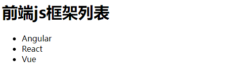

[toc]

## 1. Hello, React

BootCDN 下载js

### 1.1 JSX 创建虚拟DOM

```html
<body>
<!--准备好一个容器-->
<div id="test"></div>

<!--引入react核心库-->
<script src="../js/react.development.js"></script>
<!--引入react-dom 用于支持react操作DOM-->
<script src="../js/react-dom.development.js"></script>
<!--引入babel 用于将jsx转为js-->
<script src="../js/babel.min.js"></script>

<script type="text/babel"> /* 此处一定写babel */
// 1. 创建虚拟DOM
const VDOM = <h1 id="title">Hello, React</h1> /* 此处一定不要写引号， 因为不是字符串 */
// 2. 渲染虚拟DOM到页面
// ReactDOM.render(虚拟DOM, 容器)
ReactDOM.render(VDOM, document.getElementById('test'))
</script>
</body>
```

### 1.2 JS创建虚拟DOM

```html
<body>
<!--准备好一个容器-->
<div id="test"></div>

<!--引入react核心库-->
<script src="../js/react.development.js"></script>
<!--引入react-dom 用于支持react操作DOM-->
<script src="../js/react-dom.development.js"></script>

<script type="text/javascript"> /* 此处改为默认javascript */
// 1. 创建虚拟DOM
// const VDOM = React.createElement(标签名, 标签属性, 标签内容)
const VDOM = React.createElement('h1', {id: 'title'}, 'Hello, React')
// 2. 渲染虚拟DOM到页面
// ReactDOM.render(虚拟DOM, 容器)
ReactDOM.render(VDOM, document.getElementById('test'))
</script>
</body>
```

### 1.3 多行格式VDOM

```jsx
const VDOM = (
    <h1 id="title">
        <span>Hello, React</span>
    </h1>
)
```

### 1.4 虚拟DOM和真实DOM

```js
console.log('虚拟DOM', VDOM) 		   // 虚拟DOM {$$typeof: Symbol(react.element), type: 'h1', key: null, ref: null, props: {…}, …}
console.log(typeof VDOM) 			// object
console.log(VDOM instanceof Object) // true
```

关于虚拟DOM：

1. 本质是Object类型的对象（一般对象）

2. 虚拟DOM比较”轻“，属性少；真实DOM比较”重“

    因为虚拟DOM是React内部在用，无需真实DOM上那么多的属性

3. 虚拟DOM最终会被React转化为真实DOM，最终呈现在页面上

## 2. JSX

### 2.1 语法规则

- 全称：JavaScript XML
- react定义的一种类似于XML的JS扩展语法：JS-XML
- 本质是 React.createElement(component, props, ...children)方法的语法糖
- 作用：用来创建虚拟DOM
    - 写法： var VDOM = <h1>Hello World</h1>
    - 注意1：虚拟DOM不是字符串，也不是HTML/XML标签
    - 注意2：虚拟DOM最终产生的就是一个JS对象
- 标签名任意：HTML标签或其他标签

```jsx
<head>
    <meta charset="UTF-8">
    <title>Title</title>
    <style>
        .title {
            background: orange;
            width: 200px;
        }
    </style>
</head>
<body>
<!--准备好一个容器-->
<div id="test"></div>

<!--引入react核心库-->
<script src="../js/react.development.js"></script>
<!--引入react-dom 用于支持react操作DOM-->
<script src="../js/react-dom.development.js"></script>
<!--引入babel 用于将jsx转为js-->
<script src="../js/babel.min.js"></script>

<script type="text/babel"> /* 此处一定写babel */
const myId = "aLecTesT"
const myData = "HellO, reAct"
// 1. 创建虚拟DOM
const VDOM = (  // 定义虚拟DOM时，不要写引号
    <div> // 只有一个根标签
        // 样式的类名指定，不要用class，要用className
        <h2 className="title" id={myId.toLowerCase()}> // 标签中混入JS表达时，要用{}
            // 内联样式，要用style={{key:value}}的形式去写
            <span style={{color: 'blue', fontSize: '50px'}}>{myData.toLowerCase()}</span>
        </h2>
        <input type="text"/> // 标签必须闭合
        <Good>good</Good> // 标签首字母
    </div>
)
// 2. 渲染虚拟DOM到页面
ReactDOM.render(VDOM, document.getElementById('test'))
</script>
</body>
```

语法规则：

- 定义虚拟DOM时，不要写引号
- 标签中混入JS表达时，要用{}
- 样式的类名指定，不要用class，要用className
- 内联样式，要用style={{key:value}}的形式去写
- 只有一个根标签
- 标签必须闭合
- 标签首字母
    - 若小写字母开头，则将该标签转为html中同名元素；若html中无该标签对应同名元素，则报错
    - 若大写字母开头，react就去渲染对应的组件，若组件没有定义则报错

### 2.2 练习



```jsx
<script type="text/babel"> /* 此处一定写babel */
const data = ['Angular', 'React', 'Vue']
const VDOM = (
    <div>
        <h1>前端js框架列表</h1>
        <ul>
            {
                data.map((item, index)=>{
                    return <li key={index}>{item}</li>
                })
            }
        </ul>
    </div>
)
ReactDOM.render(VDOM, document.getElementById('test'))
</script>
```

## 3. 模块与组件

### 3.1 函数式组件

```jsx
<script type="text/babel"> /* 此处一定写babel */
// 1. 创建函数式组件
function MyComponent(){
    console.log(this) // undefine babel编译后开启严格模式，该模式下禁止函数this指向window
    return <h1>我是函数定义的组件</h1>
}
// 2. 渲染组件到页面
ReactDOM.render(<MyComponent/>, document.getElementById('test'))
</script>
```

**执行了 ReactDOM.render() 之后**

1. react解析组件标签，找到MyComponent组件

2. 发现组件时使用函数定义的，随后调用该函数，讲返回的虚拟DOM转为真实DOM，随后呈现在页面中


### 3.2 类式组件

```jsx
<script type="text/babel"> /* 此处一定写babel */
// 1. 创建类式组件
class MyComponent extends React.Component{
    render(){
        // render，在类的原型对象上，供实例使用
        // this 是 MyComponent的实例对象
        console.log(this)
        return (
            <div>
                <h1>我是类定义的组件</h1>
            </div>
        )
    }
}
// 2. 渲染组件到页面
ReactDOM.render(<MyComponent/>, document.getElementById('test'))

</script>
```

**执行了ReactDOM.render()**

1. React解析组件标签，找到MyComponent组件

2. 发现组件时使用类定义的，随后new出来该类的实例，并通过该实例调用到原型的render方法

3. 将render返回的虚拟DOM转为真实DOM，随后呈现在页面中

### 3.3 父子组件

在父组件中 render() 中 直接写 子组件标签

```
<script type="text/babel">
    class A extends React.Component {
        render() {
            // A 是 B 的父组件
            return (
                <div>
                    <div>A</div>
                    <B/>
                </div>
            )
        }
    }

    class B extends React.Component {
        render() {
            return <div>B</div>
        }
    }

    ReactDOM.render(<A/>, document.getElementById('test'))
</script>
```


## 4. 组件实例三大属性

- state
  - 组件存储数据
- props
  - ReactDOM render时, 标签往组件内传值
- ref
  - 绑定的事件, 从组件内取值


### 4.1 state

- 用于存储组件内部的数据


```js
<script type="text/babel">
    // 1. 创建组件
    class Weather extends React.Component {
        // 借助构造器往state中存储值
        constructor(props) {
            super(props)
            this.state = {isHot: true, wind: '微风'} // state 初始化
            this.changeWeather = this.changeWeather.bind(this)
            /*
            右侧 this.changeWeather.bind(this)
            this - 实例对象, 还没有changeWeatcher, 向上找到原型(类)的changeWeatcher, 这个changeWeatcher中的this是undefined
            bind - 给实例中添加一个新的函数, 同时改变 函数中this指向 为 传入的参数
            把右侧bind生成的新的函数, 赋值到左侧this实例对象的changWeather属性上
             */
        }

        changeWeather() {
            // 由于changeWeather是作为onClick的回调,所以不是通过实例调用的,是直接调用
            // 类中的方法默认开启了局部的严格模式,所以changeWeather中的this在onClick时是undefined
            console.log(this) // 不bind的话 是undefined
            const {isHot} = this.state
            // this.state.isHot = !isHot // state不允许直接修改
            this.setState({isHot: !isHot}) // state 必须通过setState修改, 且新的数据会合并到旧的state中
        }

        render() {
            console.log(this)
            const {isHot} = this.state // 解构赋值, 读取状态
            // 根据this.state.isHot 的值 渲染
            return <h1 id="title" onClick={this.changeWeather}>今天天气很{isHot ? '炎热' : '凉爽'}, {this.state.wind}</h1>

        }
    }

    // 2. 渲染组件
    ReactDOM.render(<Weather/>, document.getElementById('test'))

    // 原生事件绑定
    /* const title = document.getElementById('title')
    title.addEventListener('click', ()=>{
        console.log('点击了1')
    }) */
    /* const title = document.getElementById('title')
    title.onclick = () => {
        console.log('点击了2')
    } */
</script>
```

**总结:**

- onClick调用事件方法, 是回调, 会导致方法中的this指向变为undefined

  需要在constructor给实例对象的事件方法, 使用bind 把this指向更新到实例上

- this.state不允许直接修改, 需要使用React.Component中的setState方法

- setState中传入的字典, 是插入和更新动作, 不会把state中的数据完全替换掉

### 4.2 state简化写法

```js
<script type="text/babel">
    // 1. 创建组件
    class Weather extends React.Component {
        state = {isHot: true, wind: '微风'}
        
        // 自定义方法 -- 使用赋值语句+箭头函数
        changeWeather = () => {
            const {isHot} = this.state
            this.setState({isHot: !isHot})
        }
        // 箭头函数没有自己的this, 当在箭头函数中使用this, 会找到箭头函数外层的this(实例this)

        render() {
            const {isHot} = this.state // 解构赋值, 读取状态
            return <h1 id="title" onClick={this.changeWeather}>今天天气很{isHot ? '炎热' : '凉爽'}, {this.state.wind}</h1>
        }
    }
    // 2. 渲染组件
    ReactDOM.render(<Weather/>, document.getElementById('test'))
</script>
```

### 4.3 props

- 用于从组件外部传递数据到组件内
- props是只读的, 不允许修改

```js
<script type="text/babel">
    class Person extends React.Component {
        render() {
            console.log(this)
            // this.props.name = 'jack' // 报错, props是只读的
            const {name, age, gender} = this.props
            return (
                <ul>
                    <li>姓名: {name}</li>
                    <li>性别: {gender}</li>
                    <li>年龄: {age}</li>
                </ul>
            )
        }
    }
    ReactDOM.render(<Person name="tom" age="18" gender="男"/>, document.getElementById('test'))
    ReactDOM.render(<Person name="jerry" age="18" gender="男"/>, document.getElementById('test2'))
</script>
```


### 4.4 props批量传递数据

```js
<script type="text/babel">
    class Person extends React.Component {
        render() {
            console.log(this)
            const {name, age, gender} = this.props
            return (
                <ul>
                    <li>姓名: {name}</li>
                    <li>性别: {gender}</li>
                    <li>年龄: {age}</li>
                </ul>
            )
        }
    }

    ReactDOM.render(<Person name="tom" age="18" gender="男"/>, document.getElementById('test'))
    const p = {name: 'jerry', age: 20, gender: '男'}
    // ReactDOM.render(<Person name={p.name} age={p.age} gender={p.gender} />, document.getElementById('test2'))
    ReactDOM.render(<Person {...p} />, document.getElementById('test2'))
</script>
```

**总结:**

- <Person {...p} /> 是 <Person name={p.name} age={p.age} gender={p.gender} /> 的语法糖, 能够把p中所有的属性传递到组件中

- p中的属性必须和组件中调用的属性名完全一致

- <Person {...p} /> 中的 {...p}

  - {} 代表使用原生js语法
  - ...p 是 raect + babel 允许 展开运算符 展开对象, 且仅仅适用于标签传递时使用

  

### 4.5 props传值限制

- 对传递的标签属性进行类型限制
- 对传递标签进行必要性限制
- 对属性指定默认值

```js
<body>
<div id="test"></div>
<div id="test2"></div>
<div id="test3"></div>
<script src="../js/react.development.js"></script>
<script src="../js/react-dom.development.js"></script>
<script src="../js/babel.min.js"></script>
<!--引入prop-types, 用于对标签属性进行限制 (PropTypes)-->
<script src="../js/prop-types.js"></script>
<script type="text/babel">
    class Person extends React.Component {
        render() {
            console.log(this)
            const {name, age, gender} = this.props
            return (
                <ul>
                    <li>姓名: {name}</li>
                    <li>性别: {gender}</li>
                    <li>年龄: {age+1}</li>
                </ul>
            )
        }
    }
    // Person增加propTypes类属性, 对标签属性进行类型, 必要性限制
    Person.propTypes = {
        name: PropTypes.string.isRequired, // 限制name是 字符串, 必传
        gender: PropTypes.string,
        age: PropTypes.number, // 限制age是 number
        speak: PropTypes.func // 限制speak是 函数
    }
    // Person增加defaultProps类属性, 对标签属性默认值限制
    Person.defaultProps = {
        gender: '不男不女', // 设置默认值
        age: 0
    }

    ReactDOM.render(<Person name="tom" speak={speak}/>, document.getElementById('test')) // 年龄: 181
    ReactDOM.render(<Person name={'100'} age={18} gender="男"/>, document.getElementById('test2')) // 年龄: 19
    // 标签传递的值都是字符串
    const p = {name: 'jerry', age: 20, gender: '男'}
    // ReactDOM.render(<Person name={p.name} age={p.age} gender={p.gender} />, document.getElementById('test2'))
    ReactDOM.render(<Person {...p} />, document.getElementById('test3'))

    function speak(){
        console.log('说话了')
    }
</script>
```


**总结:**

- 使用限制要引入prop-types.js, 会导入一个 PropTypes对象
- 使用 类.propTypes 进行类型约束, 使用 类.defaultProps 进行默认值约束
- PropTypes.string.isRequired PropType.类型.是否必传
  - 类型 string(字符串), number(数字), func(函数)
  - isRequired(必传)

### 4.6 props简化写法

把 propTypes, defaultProps 在类中定义, 使用 static 修饰, 作为类属性

```js
<script type="text/babel">
    class Person extends React.Component {
        // 对标签属性进行类型, 必要性限制
        static propTypes = {
            name: PropTypes.string.isRequired, // 限制name是 字符串, 必传
            gender: PropTypes.string,
            age: PropTypes.number, // 限制age是 number
            speak: PropTypes.func // 限制speak是 函数
        }
        // 对标签属性默认值限制
        static defaultProps = {
            gender: '不男不女', // 设置默认值
            age: 0
        }
        render() {
            console.log(this)
            // this.props.name = 'jack' // 报错, props是只读的
            const {name, age, gender} = this.props
            return (
                <ul>
                    <li>姓名: {name}</li>
                    <li>性别: {gender}</li>
                    <li>年龄: {age+1}</li>
                </ul>
            )
        }
    }
    ReactDOM.render(<Person name="tom" speak={speak}/>, document.getElementById('test')) // 年龄: 181
    ReactDOM.render(<Person name={'100'} age={18} gender="男"/>, document.getElementById('test2')) // 年龄: 19
    // 标签传递的值都是字符串
    const p = {name: 'jerry', age: 20, gender: '男'}
    // ReactDOM.render(<Person name={p.name} age={p.age} gender={p.gender} />, document.getElementById('test2'))
    ReactDOM.render(<Person {...p} />, document.getElementById('test3'))

    function speak(){
        console.log('说话了')
    }
</script>
```

### 4.7 构造器中props的作用

构造器是否接受props, 是否传递给super, 取决于, 是否希望在构造器中通过this访问props

```js
<script type="text/babel">
    class Person extends React.Component {
        constructor(props) {
            console.log('before', this.props) // 报错
            super(props);
            console.log('after', this.props)
        }
        // 对标签属性进行类型, 必要性限制
        static propTypes = {
            name: PropTypes.string.isRequired, // 限制name是 字符串, 必传
            gender: PropTypes.string,
            age: PropTypes.number // 限制age是 number
        }
        // 对标签属性默认值限制
        static defaultProps = {
            gender: '男', // 设置默认值
            age: 0
        }
        render() {
            console.log(this)
            // this.props.name = 'jack' // 报错, props是只读的
            const {name, age, gender} = this.props
            return (
                <ul>
                    <li>姓名: {name}</li>
                    <li>性别: {gender}</li>
                    <li>年龄: {age+1}</li>
                </ul>
            )
        }
    }
    ReactDOM.render(<Person name="tom"/>, document.getElementById('test'))
</script>
```

### 4.8 函数式组件使用props

- 把props作为函数参数传入
- 参数约束通过 函数名.propsType 绑定到函数上

```js
<script type="text/babel">
    function Person(props) {
        console.log(props)
        const {name, gender, age} = props
        return (
            <ul>
                <li>姓名: {name}</li>
                <li>性别: {gender}</li>
                <li>年龄: {age + 1}</li>
            </ul>
        )
    }

    Person.propTypes = {
        name: PropTypes.string.isRequired, // 限制name是 字符串, 必传
        gender: PropTypes.string,
        age: PropTypes.number, // 限制age是 number
        speak: PropTypes.func // 限制speak是 函数
    }
    Person.defaultProps = {
        gender: '不男不女', // 设置默认值
        age: 0
    }
    ReactDOM.render(<Person name="tom"/>, document.getElementById('test')) // 年龄: 181
</script>
```

### 4.9 字符串形式refs

**字符串类型ref**

- 用于标记组件, 事件中, 通过this.refs 可以获取到标记了ref属性的标签
- 不推荐使用, 字符串太多会影响效率
  - 可以使用 回调形式 或者 createRef 替代


```js
<script type="text/babel">
    class Demo extends React.Component {
        // showData = () => {
        //     console.log(this)
        //     const input1 = document.getElementById('input1')
        //     alert(input1.value)
        // }
        showData = () => {
            console.log(this)
            console.log(this.refs) // {input1: input#input1, button1: button, input2: input}
            console.log(this.refs.input1) // <input id="input1" type="text" placeholder="点击按钮提示数据">
            const {input1} = this.refs
            alert(input1.value)
        }

        showData2 = () => {
            alert(this.refs.input2.value)
        }

        render() {
            return (
                <div>
                    <input id="input1" ref="input1" type="text" placeholder="点击按钮提示数据"/>
                    &nbsp;
                    <button ref="button1" onClick={this.showData}>点我提示左侧数据</button>
                    &nbsp;
                    <input ref="input2" onBlur={this.showData2} type="text" placeholder="失去焦点提示数据"/>
                </div>
            )
        }
    }

    ReactDOM.render(<Demo/>, document.getElementById('test'))
</script>
```

### 4.10 回调形式ref

```js
<script type="text/babel">
    class Demo extends React.Component {
        showData = () => {
            alert(this.input1.value)
        }

        showData2 = () => {
            alert(this.input2.value)
        }
        render() {
            return (
                <div>
                    <input id="input1" ref={c => this.input1 = c} type="text" placeholder="点击按钮提示数据"/>
                    &nbsp;
                    <button onClick={this.showData}>点我提示左侧数据</button>
                    &nbsp;
                    <input ref={c => this.input2 = c} onBlur={this.showData2} type="text" placeholder="失去焦点提示数据"/>
                </div>
            )
        }
    }
    ReactDOM.render(<Demo/>, document.getElementById('test'))
</script>
```

说明:

```js
ref={(a)=>{console.log('@', a, this);this.input1=a}}
// a 就是 input标签本身
// this.input1=a 把标签本身 放到实例自身上的input1属性上
// 简化:
ref={(currentNode)=>{this.input1=currentNode}}
ref={(c)=>{this.input1=c}}
ref={c => this.input1=c}
```

### 4.11 类绑定形式ref

**回调形式ref回调次数问题**

```js
<script type="text/babel">
    class Demo extends React.Component {
        state = {isHot: true}

        showData = () => {
            // alert(this.input1.value)
            console.log(this.input11.value)
        }

        changeWeatcher = () => {
            const {isHot} = this.state
            this.setState({isHot: !isHot})
        }
        saveInput = (c) => {
            this.input11 = c
            console.log(c)
        }
        render() {
            return (
                <div>
                    <h2>今天天气很{this.state.isHot ? '炎热' : '凉爽'}</h2>
                    {/*内联形式:<input ref={c => {this.input1 = c;console.log(c)}} type="text" placeholder="点击按钮提示数据"/>*/}
                    &nbsp;
                    类绑定形式:
                    <input ref={this.saveInput} type="text"/>
                    <button onClick={this.showData}>点我提示输入数据</button>
                    <button onClick={this.changeWeatcher}>点我切换天气</button>
                </div>
            )
        }
    }
    ReactDOM.render(<Demo/>, document.getElementById('test'))
</script>
```

**说明:**

- 内联样式:
  - 每次render时会被回调两次; 
- 类绑定形式
  - 能够避免多次调用ref

- 但是这是无关紧要; 也就是说, 平时使用内联就行


### 4.12 createRef

**麻烦 但是React推荐**


```js
<script type="text/babel">
    class Demo extends React.Component {
        /*
        React.createRef() 调用后可以返回一个容器, 该容器可以存储被ref所标识的节点
        该容器一次只能存储一个节点
         */
        MyRef = React.createRef()
        showData = () => {
            console.log(this.MyRef)
            console.log(this.MyRef.current.value)
        }

        render() {
            return (
                <div>
                    <input ref={this.MyRef} type="text" placeholder="点击按钮提示数据"/> {/*容器中这个节点会被覆盖掉*/}
                    <input ref={this.MyRef} type="text" placeholder="点击按钮提示数据2"/>
                    &nbsp;
                    <button onClick={this.showData}>点我提示左侧数据</button>

                </div>
            )
        }
    }
    ReactDOM.render(<Demo/>, document.getElementById('test'))
</script>
```

### 4.13 event 事件处理

- 通过 onXxx 属性指定事件处理函数(注意大小写)
  - React使用的是自定义(合成)事件, 而不是原生DOM事件 ---- 为了更好的兼容性
  - React中的事件是通过事件委托方式处理的(委托给组件最外层的元素) ---- 为了高效
- 通过 event.target 得到发生事件的DOM元素 (比如: 绑定事件的和要取的值 是同一个元素, 可以使用event处理)

```js
<script type="text/babel">
    class Demo extends React.Component {
        myRef1 = React.createRef()
        // myRef2 = React.createRef()

        showInfo1 = () => {
            console.log(this.myRef1.current.value)
        }
        showInfo2 = (event) => {
            console.log(event)
            console.log(event.target.value)
            // console.log(this.myRef2.current.value)
        }

        render() {
            return (
                <div> {/*onClick onBlur 都会委托给div执行*/}
                    <input ref={this.myRef1} type="text" placeholder="点击按钮显示数据"/>&nbsp;
                    <button onClick={this.showInfo1}>点我显示左侧数据</button>
                    &nbsp;<input {/*ref={this.myRef2}*/} onBlur={this.showInfo2} type="text" placeholder="失去焦点显示数据"/>
                </div>
            )
        }
    }

    ReactDOM.render(<Demo/>, document.getElementById('test'))
</script>
```

### 4.14 收集表单数据

#### 4.14.1 非受控组件  

- 页面中输入类dom的值, 现用现取

```js
<script type="text/babel">
    class Login extends React.Component {
        handleSubmit = (event) => {
            event.preventDefault() // 阻止组件默认事件(表单提交)
            console.log(this)
            const {username,password} = this
            alert(`用户名: ${username.value} 密码: ${password.value}`)
        }
        render() {
            return (
                <form action="" onSubmit={this.handleSubmit} method="post">
                    用户名: <input ref={c=> this.username = c} type="text" name="username"/>
                    密码: <input ref={c=> this.password = c} type="password" name="password"/>
                    <button>登录</button>
                </form>
            )
        }
    }
    ReactDOM.render(<Login/>, document.getElementById('test'))
</script>
```


#### 4.14.2 受控组件(推荐)

- 页面中所有输入类组件, 能把信息存储到state中, 使用时再从state中取出来
- 要用值的时候要从state中取, 值受state控制

```js
<script type="text/babel">
    class Login extends React.Component {
        state = { // 先初始化再使用
            username: "",
            password: "",
        }
        handleSubmit = (event) => {
            event.preventDefault() // 阻止组件默认事件
            const {username, password} = this.state
            alert(`用户名: ${username} 密码: ${password}`)

        }
        saveUsername = (event) => {
            console.log(event.target.value)
            this.setState({"username": event.target.value})
        }
        savePassword = (event)=>{
            this.setState({"password": event.target.value})
        }
        render() {
            return (
                <form action="" onSubmit={this.handleSubmit} method="post">
                    用户名: <input onChange={this.saveUsername} type="text" name="username"/>
                    密码: <input onChange={this.savePassword} type="password" name="password"/>
                    <button>登录</button>
                </form>
            )
        }
    }

    ReactDOM.render(<Login/>, document.getElementById('test'))
```


#### 4.14.3 高阶函数

js红宝书600页

**高阶函数:** 如果一个函数符合下面2个规范中的任何一个, 那该函数就是高阶函数

- 若A函数, 接收的参数是一个函数, 那么A就可以称之为高阶函数  ----  (函数式编程)
- 若A函数, 调用的返回值依然是一个函数, 那么A就可以称之为高阶函数  ----  (闭包)

**函数柯里化:** 通过函数调用继续返回函数的方式, 实现多次接受参数 最后统一处理的函数编码形式

- ```js
  <script type="text/javascript">
      function sum(a, b, c) {
          return a + b + c
      }
      console.log(sum(1, 2, 3))
  
      // 柯里化
      function sum2(a) {
          return (b) => {
              return (c) => {
                  return a + b + c
              }
          }
      }
      console.log(sum2(4)(5)(6))
  </script>
  ```

> 柯里化实现

```js
<script type="text/babel">
    class Login extends React.Component {
        state = { // 先初始化再使用
            username: "",
            password: "",
        }
        handleSubmit = (event) => {
            event.preventDefault() // 阻止组件默认事件
            const {username, password} = this.state
            alert(`用户名: ${username} 密码: ${password}`)
        }
        // 高阶函数(柯里化)写法
        saveFormData = (key) => {
            return (event) => {
                console.log('1', event)
                console.log('2', key)
                console.log('3', event.target.value)
                this.setState({[key]: event.target.value})
            }
        }
        render() {
            return (
                <form action="" onSubmit={this.handleSubmit} method="post">
                    用户名: <input onChange={this.saveFormData('username')} type="text" name="username"/>
                    密码: <input onChange={this.saveFormData('password')} type="password" name="password"/>
                    <button>登录</button>
                </form>
            )
        }
    }
    ReactDOM.render(<Login/>, document.getElementById('test'))
</script>
```

> 不用柯里化实现

```js
<script type="text/babel">
    class Login extends React.Component {
        state = { // 先初始化再使用
            username: "",
            password: "",
        }
        handleSubmit = (event) => {
            event.preventDefault() // 阻止组件默认事件
            const {username, password} = this.state
            alert(`用户名: ${username} 密码: ${password}`)
        }

        saveFormData = (key, event) => {
            this.setState({[key]: event.target.value})
        }

        render() {
            return (
                <form action="" onSubmit={this.handleSubmit} method="post">
                    用户名: <input onChange={event=>this.saveFormData("username", event)} type="text" name="username"/>
                    密码: <input onChange={(event)=>{this.saveFormData("password", event)}} type="password" name="password"/>
                    <button>登录</button>
                </form>
            )
        }
    }

    ReactDOM.render(<Login/>, document.getElementById('test'))
</script>
```


## 5. 生命周期

```js
<script type="text/babel">
    class Demo extends React.Component {
        state = {opacity: 1}
        death = () => {
            // 卸载组件
            ReactDOM.unmountComponentAtNode(document.getElementById('test'))
        } 
        componentDidMount(){
            setInterval(() => {
                let {opacity} = this.state
                if (opacity < 0) {
                    opacity = 1
                } else {
                    opacity -= 0.01
                }
                this.setState({opacity: opacity})
                console.log(this.state.opacity)
            }, 20)
        }
        render() {
            // 每次render都会创建一个新的setInterval()
            // setInterval(() => {
            //     let {opacity} = this.state
            //     if (opacity < 0) {
            //         opacity = 1
            //     } else {
            //         opacity -= 0.01
            //     }
            //     this.setState({opacity: opacity})
            //     console.log(this.state.opacity)
            // }, 20)
            return (
                <div>
                    <h2 style={{opacity: this.state.opacity}}>React学不会怎么办?</h2>
                    <button onClick={this.death}>不学了</button>
                    {/*与设计要求不符, 要求页面自动变化*/}
                    {/* <button onClick={this.startChange}>开始变化</button>*/}
                </div>)
        }
    }
    ReactDOM.render(<Demo/>, document.getElementById('test'))
</script>
```

### 5.1 生命周期(旧)


#### 5.1.1 挂载流程

**初次渲染流程：** 由 ReactDOM.render() 触发

1. 构造器 constructor

2. 组件将要挂载 componentWillMount

3. 渲染 render

4. **组件挂载完毕 componentDidMount**  ===>  常用

    一般在这个钩子中做一些初始化的事情：开启定时器，发送网络请求，订阅消息

5. **组件将要卸载 componentWillUnmount  ===>  常用**

    一般在这个钩子中收尾工作：关闭定时器，取消订阅消息

```js
<script type="text/babel">
    class Count extends React.Component {
        // 1 挂载：构造器
        constructor(props) {
            super(props);
            // 初始化状态
            this.state = {sum: 0}
            console.log("1 构造器 constructor")
        }
        // 2 挂载：组件将要挂载
        componentWillMount(){
            console.log('2 组件将要挂载 componentWillMount')
        }

        // 4 挂载：组件挂载完毕
        componentDidMount(){
            console.log('4 组件挂载完毕 componentDidMount')
        }

        // 5 挂载：组件将要卸载
        componentWillUnmount(){
            console.log('5 组件将要卸载 componentWillUnmount')
        }

        add = () => {
            let {sum} = this.state
            this.setState({sum: sum + 1})
        }
        // 卸载组件按钮的回调
        death = ()=> {
            ReactDOM.unmountComponentAtNode(document.getElementById('test'))
        }
        // 3 挂载：render
        render() {
            console.log('3 render')
            return (
                <div>
                    <h2>当前是：{this.state.sum}</h2>
                    <button onClick={this.add}>点我+1</button>
                    <button onClick={this.death}>卸载组件</button>
                </div>
            )
        }
    }

    ReactDOM.render(<Count/>, document.getElementById('test'))
</script>
```

#### 5.1.2 更新流程

- **流程一**: 父组件render
    1. componentWillReceiveProps
    2. shouldComponentUpdate
    3. componentWillUpdate
    4. render
    5. componentDidUpdate
    6. componentWillUnmount
- **流程二**：setState
    1. shouldComponentUpdate
    2. componentWillUpdate
    3. render
    4. componentDidUpdate
    5. componentWillUnmount

- **流程三**：forceUpdate
    1. componentWillUpdate
    2. render
    3. componentDidUpdate
    4. componentWillUnmount

##### setState

```js
<script type="text/babel">
    class Count extends React.Component {
        state = {sum: 0}
        /*
        控制组件更新的阀门：shouldComponentUpdate
        不写shouldComponentUpdate，框架内会含有一个返回为true的方法
        无返回值，在执行时会报错
        true: 组件会被更新，后续钩子也会被执行
        false： 组件不会被更新，后续钩子不会被执行
         */
        shouldComponentUpdate(){
            const {sum} = this.state
            console.log('1 组件是否要被更新', 0 === sum % 2)
            return 0 === sum % 2
        }
        componentWillUpdate(){
            console.log('2 componentWillUpdate 组件将要更新')
        }
        componentDidUpdate(){
            console.log('4 componentDidUpdate 组件更新完毕')
        }
        add = () => {
            let {sum} = this.state
            this.setState({sum: sum + 1})
        }
        // 卸载组件按钮的回调
        death = ()=> {
            ReactDOM.unmountComponentAtNode(document.getElementById('test'))
        }
        // 1.3 挂载：render
        render() {
            console.log('3 render')
            return (
                <div>
                    <h2>当前是：{this.state.sum}</h2>
                    <button onClick={this.add}>点我+1</button>
                    <button onClick={this.death}>卸载组件</button>
                </div>
            )
        }
    }
    ReactDOM.render(<Count/>, document.getElementById('test'))
</script>
```

##### forceUpdate

```js
<script type="text/babel">
    class Count extends React.Component {
        state = {sum: 0}
        shouldComponentUpdate(){
            console.log('组件是否要被更新 false')
            return false
        }
        componentWillUpdate(){
            console.log('2 componentWillUpdate 组件将要更新')
        }
        componentDidUpdate(){
            console.log('4 componentDidUpdate 组件更新完毕')
        }
        add = () => {
            let {sum} = this.state
            this.setState({sum: sum + 1})
        }
        // 卸载组件按钮的回调
        death = ()=> {
            ReactDOM.unmountComponentAtNode(document.getElementById('test'))
        }
        // 强制更新: 不受shouldComponentUpdate限制
        update =()=>{
            this.forceUpdate()
            console.log('1 强制更新')
        }
        // 3 挂载：render
        render() {
            console.log('3 render')
            return (
                <div>
                    <h2>当前是：{this.state.sum}</h2>
                    <button onClick={this.add}>点我+1</button>
                    <button onClick={this.death}>卸载组件</button>
                    <button onClick={this.update}>强制更新</button>
                </div>
            )
        }
    }
    ReactDOM.render(<Count/>, document.getElementById('test'))
</script>
```

##### 父组件render

```js
<script type="text/babel">
    class A extends React.Component {
        state = {carName: '奔驰'}

        changeCar = () => {
            this.setState({carName: '奥拓'})
        }

        render() {
            // A 是 B 的父组件
            return (
                <div>
                    <div>A</div>
                    <button onClick={this.changeCar}>换车</button>
                    <B carName={this.state.carName}/>
                </div>
            )
        }
    }

    class B extends React.Component {
        componentWillReceiveProps(){
            // 第一次传的props不会触发这个钩子
            console.log('1. 子组件(B)将要接收props')
        }
        shouldComponentUpdate(){
            console.log('2. shouldComponentUpdate')
            return true
        }
        componentWillUpdate(){
            console.log('3. componentWillUpdate')
        }
        componentDidUpdate(){
            console.log('5. componentDidUpdate')
        }
        render() {
            console.log('4. render')
            return <div>B, 接收到：{this.props.carName}</div>
        }
    }

    ReactDOM.render(<A/>, document.getElementById('test'))
</script>
```


### 5.2 生命周期(新)


##### getDerivedStateFromProps

- 通过props中的值, 更新state

- 如果有场景, 需要state中的值在任何时候都取决于props, 可以使用 getDerivedStateFromProps

```js
<script type="text/babel">
    class Count extends React.Component {
        constructor(props) {
            super(props);
            this.state = {count: 0}
        }

        static getDerivedStateFromProps(props){
            // 通过props中的值, 更新state
            console.log('getDerivedStateFromProps')
            console.log(props)
            return props
        }

        add = () => {
            let {count} = this.state
            this.setState({count: ++count})
        }
        delete = () => {
            ReactDOM.unmountComponentAtNode(document.getElementById('test'))
        }
        update = () => {
            this.forceUpdate()
        }
        render() {
            console.log('render')
            return (
                <div>
                    <h2>当前是: {this.state.count}</h2>
                    <button onClick={this.add}>点我+1</button>
                    <button onClick={this.delete}>卸载组件</button>
                    <button onClick={this.update}>强制更新</button>
                </div>
            )
        }
    }
    ReactDOM.render(<Count count={199}/>, document.getElementById('test'))
</script>
```

##### getSnapshotBeforeUpdate

在更新前, 获取快照

```js
<script type="text/babel">
    class Count extends React.Component {
        constructor(props) {
            super(props);
            this.state = {count: 0}
            console.log('constructor')
        }

        getSnapshotBeforeUpdate(p) {
            console.log('getSnapshotBeforeUpdate')
            return 'snapshotValue'
        }

        componentDidUpdate(preProps, preState,snapshotValue) {
            // setState 前的 state
            // 初始化时的props
            // 从getSnapshotBeforeUpdate return的值
            console.log('componentDidUpdate', preProps, preState,snapshotValue )
        }

        add = () => {
            let {count} = this.state
            this.setState({count: ++count})
        }
        delete = () => {
            ReactDOM.unmountComponentAtNode(document.getElementById('test'))
        }
        update = () => {
            this.forceUpdate()
        }

        render() {
            console.log('render')
            return (
                <div>
                    <h2>当前是: {this.state.count}</h2>
                    <button onClick={this.add}>点我+1</button>
                    <button onClick={this.delete}>卸载组件</button>
                    <button onClick={this.update}>强制更新</button>
                </div>
            )
        }
    }

    ReactDOM.render(<Count count={199}/>, document.getElementById('test'))
</script>
```

> 案例


- 新闻 每秒在头部多一个
- 滑动滑块后, 页面就静止, 新闻数继续增加

```js
<script type="text/babel">
    class NewsList extends React.Component {
        state = {newsArr: []}

        componentDidMount() {
            setInterval(()=>{
                const {newsArr} = this.state
                const news = '新闻' + (newsArr.length + 1)
                this.setState({newsArr: [news, ...newsArr]})
            }, 1000)
        }

        getSnapshotBeforeUpdate(){
            return this.refs.list.scrollHeight
        }

        componentDidUpdate(preProps, preState, height){
            console.log(preProps, preState, height)
            this.refs.list.scrollTop += this.refs.list.scrollHeight - height
        }

        render() {
            return (
                <div className="list" ref="list">
                    {
                        this.state.newsArr.map((n, index)=>{
                            return <div className="news" key={index}>{n}</div>
                        })
                    }
                </div>
            )
        }
    }

    ReactDOM.render(<NewsList/>, document.getElementById('test'))
</script>
```


## 6. DOM的diff算法

1. react/vue中的key有什么作用？（key的内部原理是什么）
2. 为什么遍历列表时，key最好不要用index？

<hr>

- 虚拟DOM中key的作用

    key是虚拟DOM对象的标识

    当状态中的数据发生变化时，react会根据【新数据】生成【新的虚拟DOM】，随后React进行【新虚拟DOM】与【旧虚拟DOM】的diff比较，比较规则如下：

    - 旧虚拟DOM中找到了与新虚拟DOM相同的key
        - 若虚拟DOM中内容没变，直接使用之前的真实DOM
        - 若虚拟DOM中内容变了，则生成新的真实DOM，随后替换掉页面中之前的真实DOM
    - 旧虚拟DOM中未找到与新虚拟DOM相同的key
        - 根据数据创建新的真实DOM，随后渲染到页面

- 用index作为key可能会引发的问题

    - 若对数据进行：逆序添加、逆序删除等破坏顺序操作

        会产生没有必要的真实DOM更新 ==> 界面效果没问题，但是效率低

    - 如果结构中还包含输入类DOM

        会产生错误DOM更新 ==> 界面有问题

    - 注意！如果不存在对数据的逆序添加、逆序删除等破坏顺序的操作

        仅用于渲染列表展示，使用index作为key是没有问题的

- 开发中如何选择key

    - 最好使用每条数据的唯一标识作为key，比如id、手机号、身份证号、学号等唯一值
    - 如果只是简单的展示数据，用index也是可以的

## 7. 脚手架

### 7.1 创建项目并启动

- 全局安装：npm install -g create-react-app
- 切换到创建项目的目录：create-react-app <项目名>
- 进入项目：cd <项目名>
- 启动项目：npm start

<React.StrictMode> 检查代码中不合理的地方


## 10. 复习

### 10.1 类的基本知识

```js
<script type="text/javascript">
    // 创建一个Person类
    class Person {
        // 构造器方法
        constructor(name, age) {
            // 构造器中的this是类的实例对象
            this.name = name
            this.age = age
        }

        // 一般方法，程序员自己写的方法
        speak() {
            // speak方法放在了类的原型对象上，供实例使用
            // 通过Person实例调用speak时，speak中的this就是Person实例
            console.log(`我叫${this.name}，我年龄是${this.age}`)
        }
    }

    // 创建一个Student类，继承Person类
    class Student extends Person {
        constructor(name, age, grade) {
            super(name, age);
            // 构造器中的this是类的实例对象
            this.grade = grade
        }
        // 重写从父类继承的方法
        speak() {
            console.log(`我叫${this.name}，我年龄是${this.age}，我读${this.grade}`)
        }
        study(){
            console.log('我学习')
        }
    }

    // 创建一个Person的实例对象
    const p1 = new Person('tom', 18)
    const p2 = new Person('bob', 19)
    console.log(p1)
    console.log(p2)
    p1.speak()
    p2.speak()
    // p1.speak().call({a: 1, b: 1}) // call能修改函数中this指向

    const s1 = new Student('小张', 15, '高二')
    console.log(s1)
    s1.speak()
    s1.study()
</script>
```

总结：

- 类中的构造器不是必须写的，要对实例进行一些初始化的操作，如添加指定属性时才写
- 如果A类继承B类，且A中写了构造器，那么构造器中的super是必须要调用的
- 类中所定义的方法，都是放在了类的原型对象上，供对象使用

### 10.2 原生事件绑定

```js
<body>
<button id="btn1">按钮1</button>
<button id="btn2">按钮2</button>
<button onclick="demo()">按钮3</button>
<script type="text/javascript">
    const btn1 = document.getElementById('btn1')
    btn1.addEventListener('click', () => {
        alert('按钮1被点击了')
    })
    const btn2 = document.getElementById('btn2')
    btn2.onclick = () => {
        alert('按钮2被点击了')
    }
    function demo() {
        alert('按钮3被点击了') // react推荐
    }
</script>
</body>
```


### 10.3 类中方法的this指向

```js
<script type="text/javascript">
    class Person {
        constructor(name, age) {
            this.name = name
            this.age = age
        }

        study() {
            console.log(this)
        }
    }

    const p1 = new Person('tom', 18)
    p1.study() // 通过实例调用study方法
    const x = p1.study // 直接调用, react中的事件绑定
    x() // undefined
</script>
```


### 10.4 展开运算符

```js
<script>
    let arr1 = [1, 3, 5, 7, 9]
    let arr2 = [2, 4, 6, 8, 10]
    // ... 展开运算符
    console.log(...arr1) // 1 3 5 7 9 展开一个数组
    let arr3 = [...arr1, ...arr2] // 合并两个数组
    console.log(arr3) // [1,3,5,7,9,2,4,6,8,10]

    function sum(a, b) {
        return a + b
    }

    console.log(sum(1, 2))

    function sum2(...numbers) { // 不定长传参
        // numbers 是数组
        return numbers.reduce((preValue, currentValue) => {
            return preValue + currentValue
        })
    }

    console.log(sum2(1, 3, 4, 5))

    let p = {name: 'tom', age: 18}
    // console.log(...p) // ... 不能展开对象
    let p2 = p
    p2.name = 'jerry'
    console.log(p.name, p2.name)
    let p3 = {...p} // {...obj}可以用来复制一个对象
    p3.name = 'alec'
    console.log(p.name, p2.name, p3.name)

    let p4 = {...p3, name: 'oob', age: 99, addr: 'BJ'} // 复制的同时,修改对象
    console.log(p4)
</script>
```


### 10.5 对象相关的知识

```js
<script type="text/javascript">
    let a = 'name'
    let obj = {} // --> {name: 'tom'}
    obj[a] = 'tom'
    console.log(obj)
</script>
```

