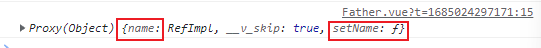
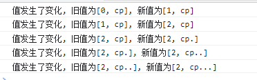
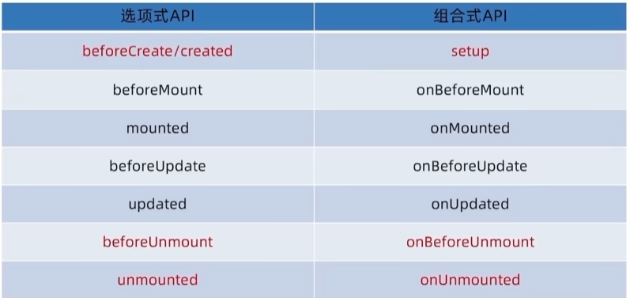
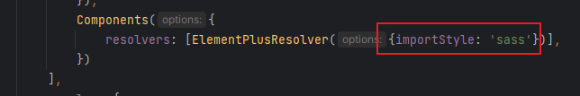
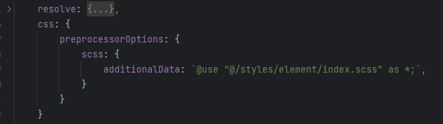

## 1. 选项式API

### 1.1 插值语法

```vue
<template>
  <h3>1. 内容渲染指令</h3>
  {{ msg1_1 }}
  <p v-text="msg1_2"></p>
  <p v-html="msg1_3"></p>
  javascript 表达式:
  {{ number + 1 }}
  {{ number ? 'Yes' : 'No' }}
</template>

<script>
export default {
  name: "CH01",
  data() {
    return {
      msg1_1: "hello vue",
      msg1_2: "this is a test program",
      msg1_3: "<h5 style='color: red'>测试 v-html</h5>",
      number: 0
    }
  }
}
</script>
```

### 1.2 指令

#### 1.2.1 v-bind

```javascript
v-bind
	给标签属性绑定值
    	<a v-bind:herf="url">跳转</a>
	<a :herf="url">跳转</a>

v-module
	数据双向绑定
    <input type="text" v-model:value="name2">
```

```vue
<template>
  <h3>2. 属性绑定指令</h3>
  <input type="text" v-bind:placeholder="msg2_1">
  v-bind简写:
  <input type="text" :placeholder="msg2_1">
</template>

<script>
export default {
  name: "CH01",
  data() {
    return {
      msg2_1: "请输入内容"
    }
  }
}
</script>
```

#### 1.2.2 v-model

```html
<template>
  <h3>双向绑定</h3>
  <p>用户名: {{ username }}</p>
  <input type="text" v-model.lazy:name="username">
  <p>省份: {{ province }}</p>
  <select v-model="province">
    <option value="">请选择</option>
    <option value="1">北京</option>
    <option value="2">西安</option>
  </select>
</template>

<script>
export default {
  name: "CH02",
  data(){
    return {
      username: "",
      province: ""
    }
  }
}
</script>
```

#### 1.2.3 v-on

```javascript
<template>
  <h3>3. 事件绑定</h3>
  count: {{ count }}
  <button v-on:click="addOne">+1</button>
  <button @click="subOne">-1</button>
  <button @click="eventShow">eventShow</button>
  <button @click="add(2)">+2</button>
  <button @click="sub(2, $event)"> -2 $event </button>
  $event 可以解决是使用参数后event被覆盖的问题

  <h5>事件修饰符</h5>
  <a href="https://www.baidu.com" @click.prevent="onLinkClick">百度</a>
</template>

<script>
export default {
  name: "CH01",
  data() {
    return {
      count: 0
    }
  },
  methods: {
    addOne() {
      this.count += 1;
    },
    subOne() {
      this.count -= 1;
    },
    eventShow(event){
      console.log(event)
      alert(event)
    },
    add(num){
      this.count += num
    },
    sub(num, event){
      console.log(event)
    },
    onLinkClick(event){
      console.log(event)
    }
  }
}
</script>
```

##### 事件修饰符

- prevent: 阻止默认事件(常用)
- stop: 阻止事件冒泡(常用)
- once: 事件只触发一次(常用_
- capture: 使用事件的捕获模式
- self: 只有event.target是当前操作的元素时才触发事件
- passive: 事件的默认行为立即执行, 无需等待事件回调执行完毕

```html
<!-- prevent 屏蔽掉a标签默认动作 -->
<a href="https://www.baidu.com" @click.prevent="showInfo1">百度</a>

<!-- stop 屏蔽掉 外层div中的点击事件 -->
<div @click="showInfo1" style="height: 30px; background-color: skyblue">
    <button @click.stop="showInfo2">按钮</button> 
</div>

<!-- once 事件只触发一次 -->
<button @click.once="showInfo1">按钮</button>
```

#### 1.2.4 v-if | v-show

```vue
<template>
  <h3>条件渲染指令</h3>

  <h5>v-if</h5>
  <button @click="generateRadom">产生随机数</button>
  <p>随机数: {{ num }}</p>
  <div v-if="num < 0.3">
    随机数小于 0.3
  </div>
  <div v-else-if="num>=0.3 && num < 0.7">
    随机数大于等于 0.3 小于 0.7
  </div>
  <div v-else>
    随机数大于等于 0.7
  </div>

  <hr>

  <h5>v-show</h5>
  <button @click="refresh">刷新</button>
  <div :style="{backgroundColor:'red'}" v-show="display"> 看看</div>

  <hr>

  <h3> v-for </h3>
  <ul>
    <li v-for="(item, index) in list" v-bind:key="item.id">索引是: {{ index }}, id是: {{ item.id }}, 姓名是: {{ item.name }}</li>
  </ul>
</template>

<script>
export default {
  name: "CH03",
  data() {
    return {
      num: 0,
      display: true,
      list: [
        {id: 11, name: "cd"},
        {id: 22, name: "ls"}
      ]
    }
  },
  methods: {
    generateRadom() {
      this.num = Math.random()
    },
    refresh() {
      this.display = !this.display
    }
  }
}
</script>
```

### 1.3 子组件

> Father.vue

```vue
<template>
  <Child :name="child.name" :age="child.age"/>
  <hr>
  <Child02 @sendData="getData"></Child02>
  {{ child02.number }}
  <hr>
  父组件数据: child03: { name: {{ child03.name }}, age:{{ child03.age }} }
  <Child03 :name="child03.name" v-model:age="child03.age"></Child03>
</template>

<script>
import Child from "@/components/CH04/Child.vue";
import Child02 from "@/components/CH04/Child02.vue";
import Child03 from "@/components/CH04/Child03.vue";

export default {
  name: "Father",
  components: {Child: Child, Child02, Child03},
  data() {
    return {
      child: {name: "cd", age: 18},
      child02: {number: 0},
      child03: {name: "ls", age: 22}
    }
  },
  methods:{
    getData(number){
      this.child02.number = number
    }
  }
}
</script>
```

#### 1.3.1 props

> Child.vue

```vue
<template>
  <h3>父向子传数据</h3>
  <h5>child: name: {{ name }} age: {{ age }}</h5>
</template>

<script>
export default {
  name: "Child",
  props: ["name", "age"]
}
</script>

<style scoped>

</style>
```

#### 1.3.2 自定义事件 emits

> Child02.vue

```vue
<template>
  <h3>子向父传数据</h3>
  <button @click="add">send</button>
</template>

<script>
export default {
  name: "Child02",
  emits: ["sendData"],
  data() {
    return {
      number: 0
    }
  },
  methods: {
    add() {
      this.number += 10
      this.$emit("sendData", this.number)
    }
  }
}
</script>
```

#### 1.3.3 父子双向数据传递

> Child03.vue

```vue
<template>
  <h3>父子双向传输数据</h3>
  <h5>child03: name: {{ name }} age: {{ age }}</h5>
  <button @click="sendData">+1</button>
</template>

<script>
export default {
  name: "Child03",
  props: {name: String, age: Number},
  emits: ["update:age"],
  methods: {
    sendData() {
      this.$emit("update:age", this.age + 1)
    },
    add() {
      this.age += 1
    }
  }
}
</script>
```

### 1.4 ref

用于标记定位DOM元素

```vue
<template>
  <h3>ref</h3>
  <div v-if="isShow" style="height: 100px; width: 200px; background: skyblue" ref="myRef"></div>
  <button @click="getRef">click</button>
</template>

<script>
export default {
  name: "CH",
  data() {
    return {
      isShow: true
    }
  },
  methods: {
    getRef() {
      console.log(this.$refs.myRef)
      this.$refs.myRef.style.background = "pink"
    }
  }
}
</script>
```

### 1.5 插槽

> Father.vue

```vue
<template>
  <h3>插槽</h3>
  <child>插入点内容</child>
  <child></child>
  <hr>
  <h3>具名插槽</h3>
  <child02>
    <template v-slot:header><p>header</p></template>
    <template v-slot:default><p>default</p></template>
    <template v-slot:footer><p>footer</p></template>
  </child02>
  <hr>
  <h3>作用域插槽</h3>
  <child03>
    <template v-slot:default="scope">
      {{ scope }}
    </template>
  </child03>
  <h5>作用域插槽解构赋值</h5>
  <child03>
    <template v-slot:default="{info}">
      {{ info.address }}
    </template>
  </child03>

</template>

<script>
import Child from "@/components/CH05/Child.vue";
import Child02 from "@/components/CH05/Child02.vue";
import Child03 from "@/components/CH05/Child03.vue";

export default {
  name: "Father",
  components: {Child, Child02, Child03}
}
</script>
```

#### 1.5.1 普通插槽

> Child.vue

```vue
<template>
  <slot><p>这是一个插槽</p></slot>
</template>

<script>
export default {
  name: "Child"
}
</script>
```

#### 1.5.2 具名插槽

> Child02.vue

```vue
<template>
  <div>
    <h5>header内容</h5>
    <slot name="header"></slot>
    <hr>
    <h5>主要内容</h5>
    <slot></slot>
    <hr>
    <h5>footer内容</h5>
    <slot name="footer"></slot>
  </div>
</template>

<script>
export default {
  name: "Child02"
}
</script>
```

#### 1.5.3 作用域插槽

> Chiled03.vue

```vue
<template>
  <div>
    <slot :info="information"></slot>
  </div>
</template>

<script>
export default {
  name: "Child03",
  data() {
    return {
      information: {
        name: "cp",
        address: "BJ"
      }
    }
  }
}
</script>
```

## 2. 组合式API

### 2.1 setup入口

```vue
<script>
export default {
  setup() {
    console.log("setup")
    const msg = "hello vue3.0"

    const logMsg = () => {
      console.log(msg)
    }

    return {msg, logMsg}
  }
}
</script>

<template>
  {{ msg }}
  <button @click="logMsg">click</button>
</template>
```

```vue
<script setup>
const msg = "hello vue3.0"

const logMsg = () => {
  console.log(msg)
}
</script>

<template>
  {{ msg }}
  <button @click="logMsg">click</button>
</template>
```

### 2.2 reactive 和 ref

- reactive 作用: 接收一个 对象类型的数据 作为参数, 返回一个响应式的对象

  ```vue
  <script setup>
    import { reactive } from "vue";
  
    const state = reactive({count: 0})
    const countAdd = () => {
      state.count++
    }
  </script>
  
  <template>
  	<button @click="countAdd">{{ state.count }}</button>
  </template>
  ```
- ref 作用: 接收 简单类型 或者 对象类型的数据 传入, 并返回一个响应式的对象

  ```vue
  <script setup>
    import { ref } from "vue";
    const number = ref(0)
    const numberAdd = ()=>{
      number.value ++
    }
  </script>
  
  <template>
  	<button @click="numberAdd">{{ number }}</button>
  </template>
  ```

### 2.3 computed计算属性

```vue
<script setup>
import {ref} from "vue";

const list = ref([1, 2, 3, 4, 5, 6, 7, 8])

import {computed} from "vue";

const computedList = computed(() => {
  return list.value.filter(item => item > 2)
})

setTimeout(() => {
  list.value.push(9, 10)
}, 3000)
</script>

<template>
  <div>原始响应式数组 - {{ list }}</div>
  <div>计算后的数组 - {{ computedList }}</div>
</template>
```

### 2.4 组件通信

#### 父传子 - defineProps

> Father.vue

```vue
<script setup>
import Child from "@/components/CH/Child.vue";
import {ref} from "vue";

const count = ref(100)
</script>

<template>
  <div class="father">
    <h2>父组件</h2>
    <Child :count="count" message="father message"></Child>
  </div>
</template>

<style scoped>

</style>
```

> Child.vue

```vue
<script setup>
const props = defineProps({
  message: String,
  count: Number
})

console.log(props)
console.log(props.message)
</script>

<template>
  <div class="son">
    <h3>子组件</h3>
    <div>父组件传入的数据 - {{ message }} - {{ count }}</div>
  </div>
</template>

<style scoped>

</style>
```

#### 子传父 - defineEmits

> Father.vue

```vue
<script setup>
import Child from "@/components/CH/Child.vue";

const getMessage=(msg)=>{
  console.log(msg)
}
</script>

<template>
  <h2>父组件</h2>
  <Child @getMsg="getMessage"></Child>
</template>
```

> Child.vue

```vue
<script setup>
const emit = defineEmits(['getMsg'])
const sendMsg = () => {
  // TODO: 触发自定义事件, 传数据给父组件
  emit('getMsg', 'this is from child component')
}
</script>

<template>
  <h3>子组件</h3>
  <button @click="sendMsg">触发自定义事件</button>
</template>
```

### 2.5 模板引用

通过 ref标识 获取真实的dom对象或者组件实例对象

```vue
<script setup>
import {onMounted, ref} from "vue";
// 1. 创建一个ref对象
const elRef = ref(null)
// 组件挂载完毕后才能获取
onMounted(()=>{
  console.log(elRef.value)
})
</script>

<template>
  <!--  2. 通过ref标识绑定ref对象-->
  <h3 ref="elRef">一个dom标签</h3>
</template>
```

#### defineExpose

默认情况下在<script setup>语法糖下 子组件内部的属性和方法是不开放给父组件访问的(不能通过ref获取到), 可以通过defineExpose编译宏指定哪些属性和方法允许访问

> Father.vue

```vue
<script setup>
import Child from "@/components/CH/Child.vue";
import {onMounted, ref} from "vue";

const childRef = ref(null)
onMounted(() => {
  console.log(childRef.value)
})
</script>

<template>
  <Child ref="childRef"></Child>
</template>
```

> Child.vue

```vue
<script setup>
import {ref} from "vue";

const name = ref('child')
const setName = () => {
  name.value = name.value + '.'
}

defineExpose({
  name,
  setName
})
</script>

<template>
  <h3>这是一个子组件</h3>
</template>
```



### 2.6 provide 和 inject

**作用和场景:**

顶层组件向任意的底层组件传递数据和方法, 实现跨层组件通信.

- 在顶层组件通过 provide函数 提供数据
- 在底层组件通过 inject函数 获取数据

> Layer01.vue

```vue
<script setup>
import Layer02 from "@/components/CH10/Layer02.vue";
import {provide, ref} from "vue";

// 1. 传递静态数据
provide('strKey', 'this is a test string')

// 2. 传递ref对象
const count = ref(0)
provide('refObjKey', count)
setTimeout(() => {
  count.value = 10
}, 3000)

// 3. 传递方法
const add = () => {
  count.value++
}
provide('funcKey', add)
</script>
```

> Layer02.vue

```vue
<script setup>
import Layer03 from "@/components/CH10/Layer03.vue";
</script>

<template>
  <h3>中层组件</h3>
  <Layer03></Layer03>
</template>
```

> Layer03.vue

```vue
<script setup>
import {inject} from "vue";

// 1. 接收数据
const strData = inject('strKey')
// 2. 接受ref对象
const refObjData = inject('refObjKey')
// 3. 接收方法
const funcData = inject('funcKey')
</script>

<template>
  底层组件
  <div>来自顶层组件的数据为: {{ strData }}</div>
  <div>来自顶层组件的响应式数据为: {{ refObjData }}</div>
  <button @click="funcData">点</button>
</template>
```


## 3. watch

侦听一个或多个数据的变化, 数据变化时执行回调函数

额外参数:

- immediate 立即执行
- deep 深度侦听

#### 侦听单个数据

```vue
<script setup>
import {ref, watch} from "vue";

const count = ref(0)
// TODO: 侦听单个数据
watch(count, (newValue, oldValue) => {
  console.log(`count值发生了变化, 旧值为${oldValue}, 新值为${newValue}`)
})

const add = () => {
  count.value++
}
</script>

<template>
  <button @click="add"> {{ count }}</button>
</template>
```

#### 侦听多个数据

同时侦听多个响应数据, 不管哪个数据发生变化都需要执行回调

```vue
<script setup>
import {ref, watch} from "vue";

const count = ref(0)
const name = ref('cp')
// TODO: 侦听多个数据
watch([count, name], ([newCount, newName], [oldCount, oldName]) => {
  console.log(`值发生了变化, 旧值为[${oldCount}, ${oldName}], 新值为[${newCount}, ${newName}]`)
})

const add = () => {
  count.value++
}
const changeName = () => {
  name.value += '.'
}
</script>

<template>
  <button @click="add"> {{ count }}</button>
  <br>
  <button @click="changeName"> {{ name }}</button>
</template>
```



**immediate**

当watch侦听器一被创建, 就执行一次watch中的方法

```js
// TODO: 侦听多个数据
watch([count, name], ([newCount, newName], [oldCount, oldName]) => {
  console.log(`值发生了变化, 旧值为[${oldCount}, ${oldName}], 新值为[${newCount}, ${newName}]`)
}, {immediate: true})
```

**deep**

- 通过watch监听的ref对象默认是浅层侦听, 直接修改嵌套对象的对象属性不会触发回调函数, 需要开启deep选项
- deep有性能损耗, 尽量不要开启, 用精确侦听替代

```vue
<script setup>
import {ref, watch} from "vue";

const state = ref({count: 0})

watch(state, (newValue, oldValue) => {
  console.log(`newValue: ${newValue.count}, oldValue: ${oldValue.count}`)
}, {deep: true})
// 没有{deep: true}, 不会触发watch回调
const add = () => {
  state.value.count++
}
</script>

<template>
  <button @click="add">{{ state.count }}</button>
</template>
```

**精确侦听**

```vue
<script setup>
import {ref, watch} from "vue";

const state = ref({count: 0, age: 20})

watch(
    () => state.value.count,
    (newValue, oldValue) => {
      console.log(`newValue: ${newValue}, oldValue: ${oldValue}`)
    })

const add = () => {
  state.value.count++
}
const addAge = () => {
  state.value.age++
}
</script>

<template>
  <button @click="add">{{ state.count }}</button>
  <button @click="addAge">{{ state.age }}</button>
</template>
```

## 4. 生命周期



```vue
<script setup>
import {onMounted} from "vue";
onMounted(()=>{
  console.log("组件挂载完毕1")
})
onMounted(()=>{
  console.log("组件挂载完毕2")
})
onMounted(()=>{
  console.log("组件挂载完毕3")
})
</script>
```

多次使用同一生命周期函数, 会按照编写顺序, 依次执行

## 5. Router

### 5.1 router定义

> Father.vue

```vue
<template>
  <h3>路由</h3>
  <router-link to="/home">主页</router-link> |
  <router-link to="/movie">电影</router-link> |
  <router-link to="/about">关于</router-link>

  <router-view></router-view>
</template>

<script>
export default {
  name: "Father"

}
</script>
```

> ChildHome.vue

```vue
<template>
  <h1>主页</h1>
</template>

<script>
export default {
  name: "ChildHome"
}
</script>
```

> ChildMovie.vue

```vue
<template>
  <h1>电影</h1>
</template>

<script>
export default {
  name: "ChildMovie"
}
</script>
```

**启用router**

> main.js

```javascript
import './assets/main.css'

import {createApp} from 'vue'
import App from './App.vue'
import router from "@/components/CH07/router/router";

const app = createApp(App)
app.use(router)	// use router

app.mount('#app')
```

**配置路由**

> route.js

```javascript
import {createRouter, createWebHashHistory} from "vue-router";

import ChildHome from "@/components/CH07/ChildHome.vue";
import ChildMovie from "@/components/CH07/ChildMovie.vue";
import ChildAbout from "@/components/CH07/ChildAbout.vue";


const router = createRouter({
    history: createWebHashHistory(),
    routes: [
        {path: '/', redirect:'/home'},
        {path: '/home', component: ChildHome},
        {path: '/movie', component: ChildMovie},
        {
            path: '/about',
            redirect: '/about/table01',
            component: ChildAbout
    ]
})
export default router
```

### 5.2 定义子路由

> ChildAbout.vue

```vue
<template>
  <h1>关于</h1>
  <!--子路由-->
  <router-link to="/about/table01">table01</router-link> |
  <router-link to="/about/table02">table02</router-link>
  <router-view></router-view>
</template>

<script>
export default {
  name: "ChildAbout"
}
</script>
```

> ChildTable01.vue

```vue
<template>
  <h3>Table01</h3>
  <div style="width: 200px; height: 100px; background: pink"></div>
</template>

<script>
export default {
  name: "ChildTable01"
}
</script>
```

> ChildTable02.vue

```vue
<template>
  <h3>Table02</h3>
  <div style="width: 200px; height: 100px; background: skyblue"></div>
</template>

<script>
export default {
  name: "ChildTable02"
}
</script>
```

**修改route.js**

```javascript
import {createRouter, createWebHashHistory} from "vue-router";

import ChildHome from "@/components/CH07/ChildHome.vue";
import ChildMovie from "@/components/CH07/ChildMovie.vue";
import ChildAbout from "@/components/CH07/ChildAbout.vue";

import ChildTable01 from "@/components/CH07/ChildTable01.vue";
import ChildTable02 from "@/components/CH07/ChildTable02.vue";

const router = createRouter({
    history: createWebHashHistory(),
    routes: [
        {path: '/', redirect:'/home'},
        {path: '/home', component: ChildHome},
        {path: '/movie', component: ChildMovie},
        {
            path: '/about',
            redirect: '/about/table01',
            component: ChildAbout,
            children: [
                {path: 'table01', component: ChildTable01},
                {path: 'table02', component: ChildTable02},
            ]},
    ]
})
export default router
```

### 5.3 命名路由

> route.js

```javascript
const router = createRouter({
    history: createWebHashHistory(),
    routes: [
        ...
        {path: '/home', name: 'home',component: ChildHome},
        ...
```

> Father.vue

```vue
<router-link :to="{name: 'home'}">主页</router-link>
```

## 6. Pinia

### 6.1 添加Pinia到vue项目

```
npm create vite@latest study-pinia

cd study-pinia
npm install

npm install pinia
```

> main.js

```js
import {createApp} from 'vue'
import {createPinia} from "pinia";

import App from './App.vue'

const pinia = createPinia()

createApp(App).use(pinia).mount('#app')
```

#### 计数器案例

> src/stores/counter.js

```js
import {ref} from "vue";
import {defineStore} from "pinia";

export const useCounterStore = defineStore('counter', () => {
    // 定义数据
    const count = ref(0)

    // 定义修改数据的方法
    const add = () => {
        count.value++
    }

    // 以对象的方式return 供组件使用
    return {
        count, add
    }
})
```

> src/App.vue

```vue
<script setup>
// 1. 导入 use 开头的方法
import {useCounterStore} from "@/stores/counter";
// 2. 执行方法得到store实例对象
const counterStore = useCounterStore()
</script>

<template>
  <button @click="counterStore.add">{{ counterStore.count}}</button>
</template>
```

### 6.2 getter

Pinia中getter直接使用 compute函数 进行模拟

```js
const count = ref(0)

// getter
const doubleCount = computed(() => count.value * 2)
```

### 6.3 异步action

```js
const API_URL = 'http://geek.itheima.net/v1_0/channels'
// 准备数据(state)
const list = ref([])
// 异步action
const loadList = async () => {
    const res = await axios.get(API_URL)
    list.value = res.data.data.channels
}
```

### 6.4 storeToRefs

```js
import {useCounterStore} from "@/stores/counter";

const counterStore = useCounterStore()

// const {count, doubleCount} = counterStore // 会导致响应式丢失
const {count, doubleCount} = storeToRefs(counterStore)

// 方法需要从原本的counterStore中解构赋值
const {add} = counterStore
```

## 7. Element Plus

```bash
npm install element-plus --save
# 自动按需引入
npm install -D unplugin-vue-components unplugin-auto-import
```

代码插入vite.config.js

```js
// vite.config.ts
import AutoImport from 'unplugin-auto-import/vite'
import Components from 'unplugin-vue-components/vite'
import { ElementPlusResolver } from 'unplugin-vue-components/resolvers'

export default defineConfig({
  plugins: [
    AutoImport({
      resolvers: [ElementPlusResolver()],
    }),
    Components({
      resolvers: [ElementPlusResolver()],
    }),
  ],
})
```

## 8. 定制主题色

- **安装scss**

  ```bash
  npm i sass -D
  ```

- **准备定制样式文件** 

  > styles/element/index.scss

  ```scss
  @forward "element-plus/theme-chalk/src/common/var.scss" with (
    $colors: (
      'primary': (
        'base': #27ba9b,
      ),
      'success': (
        'base': #1dc779,
      ),
      'warning': (
        'base': #ffb302,
      ),
      'danger': (
        'base': #e26237,
      ),
      'error': (
        'base': #cf4444,
      ),
    ),
  );
  ```

- **对ElementPlus样式进行覆盖**

  - 通知Element采用scss语言
  - 导入定制scss文件覆盖

  > vite.config.js

  



## 9. 引入axios

```bash
npm i axios
```

配置基础实例

- 接口基地址
- 接口超时时间
- 请求拦截器
- 响应拦截器

> src/utils/http.js

```js
import axios from "axios";

// 创建axios实例
const httpInstance = axios.create({
    baseURL: 'http://pcapi-xiaotuxian-front-devtest.itheima.net',
    timeout: 5000 // 5s
})

// axios请求拦截器
httpInstance.interceptors.request.use(config => {
    return config
}, e => Promise.reject(e))

// axios响应拦截器
httpInstance.interceptors.response.use(res => res.data, e => {
    return Promise.reject(e)
})

export default httpInstance
```

**测试**

> apis/testAPI.js

```js
import httpInstance from "@/utils/http";

export function getCategory() {
    return httpInstance({
        url: 'home/category/head'
    })
}
```

> main.js

```js
// 测试接口函数
import {getCategory} from "@/apis/testAPI";

getCategory().then(res => console.log(res))
```

