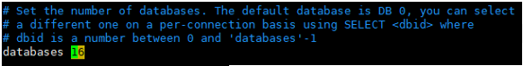

[toc]

# 1 NoSQL数据库分类

- 键值对存储数据库: Redis, Memcached
- 面向列存储数据库: HBase
- 面向文档数据库: MongoDB
- 面向图形数据库: Neo4j

 

# 2 Redis简介

Redis是一个C语言开发的开源, 高性能键值对存储数据库;

Redis支持字符串(String), 列表(List), 有序集合(Sorted Set), 散列(Hash), 集合(Set)等;

Redis内置复制, Lua脚本, LRU回收, 事务及不同级别磁盘持久化功能;

通过Redis Sentinel实现高可用;

通过Redis Cluster提供自动分区等相关功能;

 

**Redis****使用场景**

- 做缓存
- 做计数器应用
- 实现消息队列
- 做实时系统, 消息系统
- 实现排行榜应用
- 做数据过期处理
- 做大型社交网络
- 分布式集群架构中的session分离

 

# 3 安装Redis

```shell
wget http://download.redis.io/releases/redis-5.0.9.tar.gz

tar -xf redis-5.0.9.tar.gz
cd redis-5.0.9

dnf install -y gcc gcc-c++ make openssl-devel systemd-devel 

make BUILD_TLS=yes USE_SYSTEMD=yes

make install

mkdir /etc/redis

cp -v redis.conf /etc/redis/
```

**注意:** 6.x版本在CentOS7环境会需要更高版本gcc, 默认的gcc编译会报错;

 

安装好后在/usr/local/bin目录会生成redis工具: redis-cli, redis-server, redis-sentinel, …

 

## 配置redis.conf

```
daemonize yes
```

## 启动redis

```shell
[root@localhost redis-5.0.9]# redis-server /etc/redis/redis.conf
```

## 查看启动状态

```shell
[root@localhost redis-5.0.9]# ps -ef | grep redis
root      14255  14213  0 17:56 pts/0    00:00:00 ./src/redis-server *:6379
root      14286  14213  0 17:56 pts/0    00:00:00 grep --color=auto redis
```

## 关闭redis

```shell
./redis-cli shutdown

kill redis_pid
```

## 连接到Redis

```shell
[root@localhost redis-5.0.9]# redis-cli 
127.0.0.1:6379>
```

备注: 如果存在值是中文的情况, 可以使用 **redis-cli --raw** 显示中文字符; 

## 开机自启动

```shell
echo 'redis-server /etc/redis/redis.conf' >> /etc/rc.d/rc.local

chmod 755 /etc/rc.d/rc.local
```

# 4 性能测试 redis-benchmark

测试: 100个并发连接 每个并发100000请求

redis-benchmark -h localhost -p 6379 -c 100 -n 100000


# 5 基础知识

- 默认有16个数据库, 默认使用第0个, 使用SELECT dbid切换

  


- KEYS * 查看所有的key

- FLUSHALL 清除所有数据

- FLUSHDB 清空当前数据库

- redis是单线程的, redis是基于内存操作的, CPU不是redis性能瓶颈, redis的瓶颈是机器的内存和网络带宽, 使用单线程可以满足;

- **为什么Redis单线程还这么快?** 

  Redis是将所有数据都存放在内存中的; 如果使用多线程, CPU**上下文切换**, 会消耗时间; 所以对于内存系统来说, 如果没有上下文切换, 效率就是最高的! 多次读写都是在一个CPU上的, 在内存足够的情况下吗这个就是最佳方案;


