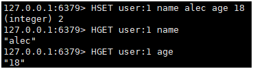

# 6 Redis基本数据类型(五个)

## 6.1 Redis-Key

| KEYS *             | 查看所有key         |
| ------------------ | ------------------- |
| EXISTS key         | 判断当前key是否存在 |
| MOVE key dbid      | 移动key到其他数据库 |
| EXPIRE key seconds | 设置key过期时间(秒) |
| TTL key            | 查看当前key剩余时间 |
| TYPE key           | 判断KEY类型         |

## 6.2 String(字符串)

| SET key value     | 设置值;                                                      |
| ----------------- | ------------------------------------------------------------ |
| GET key           | 获取值;                                                      |
| KEYS *            | 获取所有key;                                                 |
| EXISTS key        | 判断某个key是否存在;                                         |
| APPEND  key value | key后追加字符串, 如果追加的字符串不存在, 那么就相当于set key |
| STRLEN  key       | 获取key值长度                                                |

| INCR key             | key值 +1         |
| -------------------- | ---------------- |
| DECR key             | key值 -1         |
| INCRBY key increment | key值 +increment |
| DECRBY key increment | key值 -increment |

| GETRANGE key start end     | 截取 [start, end] 的 key 值, 0开始; 支持负数, 最后一位-1 |
| -------------------------- | -------------------------------------------------------- |
| SETTRANGE key offset value | 把offset处的值替换为value                                |

| SETEX key secondes value | (set with expire) 设置过期时间(秒)                      |
| ------------------------ | ------------------------------------------------------- |
| SETNX key value          | (set  if not exist) key不存在再设置; 会在分布式锁中使用 |

| MSET key1 value1 [key2 value2 key3 value3 …]   | 同时设置多个key 值             |
| ---------------------------------------------- | ------------------------------ |
| MGET key1 [key2 key3 …]                        | 同时获取多个key值              |
| MSETNX key1 value1 [key2 value2 key3 value3 …] | 不存在再设置; 有一个存在就失败 |

### 对象

| SET user:1  {name:alec,age:18}       | 设置user:1对象值是一个json字符串             |
| ------------------------------------ | -------------------------------------------- |
| MSET user:1:name alec  user:1:age 20 | MSET 对象:{id}:{属性} 值, 避免解析json字符串 |
| GETSET key value                     | 先获取值, 再设置值                           |

### String应用场景

- 计数器
- 统计多单位的数量(访问量, 关注数 ...)
- 粉丝数
- 对象缓存存储

## 6.3 List

在redis中可以把list做成**栈,  队列,  阻塞队列**;

| LPUSH key element  [element ...]         | 依次向list头部插入元素                                       |
| ---------------------------------------- | ------------------------------------------------------------ |
| RPUSH key element [element ...]          | 依次向list尾部追加值                                         |
| LRANGE key start end                     | 获取list中[start, end]的值, 0开始; 支持负数, 最后一位-1      |
| **LRANGE** **key  0 -1**                 | **获取list中所有的值**                                       |
| LPOP key                                 | 移除list头部一个元素                                         |
| RPOP key                                 | 移除list尾部一个元素                                         |
| LINDEX key index                         | 获取list下标是index的值, 0开始                               |
| LLEN key                                 | 获取list长度                                                 |
| LREM key count element                   | 移除list中count个值等于element的元素;   count=0, 移除所有element元素  count>0, 从左向右计数  count<0, 从右向左计数 |
| LTRIM key start stop                     | 截取出list中[start, end]的值, 存在list中                     |
| RPOPLPUSH source  destination            | 取出source最后一个元素, 插入到destination头部                |
| LSET key index element                   | 修改list index处值为element, 更新操作;   key或者下标不存在都会报错; |
| LINSERT key  BEFORE\|AFTER pivot element | 在pivot(元素值)前或者后面插入一个元素                        |

| **LPUSH** **+** **RPOP** | **队列** |
| ------------------------ | -------- |
| **LPUSH** **+** **LPOP** | **栈**   |

## 6.4 Set(集合)

set中的值不能重复

| SADD key member [member  ...] | 向set中添加元素       |
| ----------------------------- | --------------------- |
| **SMEMBERS key**              | **查看set中元素**     |
| SISMEMBER key member          | 判断member是否在set中 |
| SCARD key                     | 获取set中元素个数     |
| SREM key member [member  ...] | 删除set中元素         |

### set无序不重复集合

| SRANDMEMBER key [count]          | 随机从set中选出count个元素, set中不消失         |
| -------------------------------- | ----------------------------------------------- |
| SPOP key [count]                 | 随机移除count个元素(抽奖程序)                   |
| SMOVE source  destination member | 把source集合中的member元素移动到destination集合 |

###  

### 微博, B站共同关注(交集)

数学集合:

- 交集
- 并集
- 差集
- *补集*

| SINTER key [key ...]   | 交集           |
| ---------------------- | -------------- |
| SDIFF  key1 [key* ...] | key1和key*的差 |
| SUNION key [key ...]   | 并集           |

## 6.5 Hash(哈希)

| HSET key field value                     | hash设置键值对, redis 6.x 版本可以设置多个值 |
| ---------------------------------------- | -------------------------------------------- |
| HGET key field                           | 取hash中filed的值                            |
| HMSET key field value  [field value ...] | 向hash同时设置多个键值对                     |
| HMGET key  field [field ...]             | 获取hash多个键的值                           |
| HGETALL key                              | 获取hash中所有键值对                         |
| HDEL key  field [field ...]              | 删除hash中指定键                             |

 

| HLEN key           | 获取hash长度             |
| ------------------ | ------------------------ |
| HEXISTS key  field | 判断hash中指定键是否存在 |
| HKEYS key          | 只获取hash中所有的键     |
| HVALS key          | 只获取hash中所有的值     |

 

| HINCRBY key  field increment | hash中field键的值加上increment; increment可以是负数 |
| ---------------------------- | --------------------------------------------------- |
| HSETNX key  field value      | 如果不存在, 则设置hash                              |

 

hash变更的数据 user name age, 尤其是用户信息之类的, 经常变动的信息; 

**HASH更适合对象的存储,  String更适合存储文本**



## 6.6 Zset(有序集合)

在set的基础上, 增加了一个值, set k1 v1  zset k1 score1 v1; 增加了排序规则

 

| ZADD key  score member [score member ...] | 在zset中增加元素, score是规则           |
| ----------------------------------------- | --------------------------------------- |
| ZRANGE key  start stop                    | 显示[start, end]的元素, 按score升序排列 |
| **ZRANGE key 0 -1**                       | **显示全部元素**                        |
| **ZREVRANGE  key start stop**             | **降序排列**                            |

| ZRANGEBYSCORE  key min max             | 按照score, 在[min, max]区间排序, 区间外不显示   |
| -------------------------------------- | ----------------------------------------------- |
| ZRANGEBYSCORE  key -inf +inf           | 按照score, 从负无穷到正无穷排序                 |
| ZRANGEBYSCORE  zs -inf +inf WITHSCORES | 按照score, 从负无穷到正无穷排序,  同时显示value |

| ZREM key  member [member ...] | 移除zset中元素                     |
| ----------------------------- | ---------------------------------- |
| ZCARD key                     | 获取zset中元素个数                 |
| ZCOUNT key  min max           | 获取zset中[min, max]区间的元素数量 |

### 案例思路

点击量排行榜, 热搜, 工资单;

# 7 redis特殊数据类型(三个)

## 7.1 geospatial地理位置

朋友定位, 附近的人, 打车距离计算

Redis在3.2版本就推出了; 这个功能可以推算地理位置信息, 两地质检的距离, 方圆几里内的人;

查询城市经纬度 http://www.jsons.cn/lngcode/

 ```
 添加 经度 纬度 名称 信息 到key中GEOADD key  longitude latitude member ...		|	添加 经度 纬度 名称 信息 到key中
 ```

```shell
GEOADD china:city 116.40 39.90 BeiJing
GEOADD china:city 121.47 31.23 ShangHai
GEOADD china:city 106.50 29.53 ChongQing
GEOADD china:city 114.08 22.54 ShenZhen
GEOADD china:city 120.15 30.28 HangZhou
GEOADD china:city 108.94 34.26 XiAn  
```

**注意:** 南北两极无法导入

 ```
 GEOPOS key  member [member ...]		|	获取指定城市经纬度值
 ```

```shell
127.0.0.1:6379> GEOPOS china:city XiAn
1) 1) "125.13999849557876587"
   2) "42.92000122112879268"
```

```
GEODIST key  member1 member2 [m|km|ft|mi]		|	计算两个元素的距离
```

```shell
127.0.0.1:6379> GEODIST china:city BeiJing ShangHai km
"1067.3788"
127.0.0.1:6379> GEODIST china:city BeiJing XiAn km
"911.3409"
```

### 附近的人, 通过半径查询

```
GEORADIUS  key longitude latitude radius m|km|ft|mi 	|	通过 精度 维度查询半径内的元素
```

```shell
# 以100 30 这个经纬度为中心, 查找1000km以内的元素
127.0.0.1:6379> GEORADIUS china:city 110 30 1000 km
1) "ChongQing"
2) "XiAn"
3) "ShenZhen"
4) "HangZhou"

# 显示元素到中心位置的距离
127.0.0.1:6379> GEORADIUS china:city 110 30 500 km WITHDIST
1) 1) "ChongQing"
   2) "341.9374"
2) 1) "XiAn"
   2) "484.2186"

# 显示元素经纬度
127.0.0.1:6379> GEORADIUS china:city 110 30 500 km WITHDIST WITHCOORD
1) 1) "ChongQing"
   2) "341.9374"
   3) 1) "106.49999767541885376"
      2) "29.52999957900659211"
2) 1) "XiAn"
   2) "484.2186"
   3) 1) "108.93999785184860229"
      2) "34.25999964418929977"

# 显示指定个数
127.0.0.1:6379> GEORADIUS china:city 110 30 500 km WITHDIST WITHCOORD COUNT 1
1) 1) "ChongQing"
   2) "341.9374"
   3) 1) "106.49999767541885376"
      2) "29.52999957900659211"
```

```
GEORADIUS  key longitude latitude radius m|km|ft|mi		|	查看指定元素半径范围内的元素
```

```shell
127.0.0.1:6379> GEORADIUSBYMEMBER china:city BeiJing 1000 km
1) "BeiJing"
2) "XiAn"
```

```
GEOHASH key  member [member ...]		|	返回11位的hash字符串, 代表经纬度
```

```shell
127.0.0.1:6379> GEOHASH china:city BeiJing ChongQing
1) "wx4fbxxfke0"
2) "wm5xzrybty0"
```

### GEO底层实现原理就是Zset, 可以使用Zset命令来操作GEO

  ```shell
  127.0.0.1:6379> ZREM china:city ChongQing
  (integer) 1
  127.0.0.1:6379> ZRANGE china:city 0 -1
  1) "XiAn"
  2) "ShenZhen"
  3) "HangZhou"
  4) "ShangHai"
  5) "BeiJing"
  ```

## 7.2 Hyperloglog

### 基数

A = {1,2,3,4,5, 2, 3, 4}

基数: A中不重复元素 = {1,2,3,4,5}

 

Redis2.8.9更新了Hyperloglog数据结构

Redis Hyperloglog 基数的统计算法

优点: 占用内存空间固定, 2^64不同元素的计数, 只需要12KB内存;

缺点: 有0.81%错误率(可以接受)

 

网页的UV(一个人访问一个网站多次, 但还是算作一个人)

传统方式, set集合保存用户id, 然后就可以统计set中元素数量作为标准判断;

这个方式如果保存大量的用户id, 就会比较麻烦, 我们的目的是为了计数, 而不是保存用户id;

| PFADD key element  [element ...]           | 向Hyperloglog中添加元素                |
| ------------------------------------------ | -------------------------------------- |
| PFCOUNT key [key ...]                      | 统计PFCOUNT  后面所有H中不重复元素个数 |
| PFMERGE destkey  sourcekey [sourcekey ...] | 把多个sourcekey  合并成一个destkey     |

如果允许容错, 那么就可以使用Hyperloglog;

如果不允许容错, 就是用set或自己的数据类型即可;

 

## 7.3 Bitmaps

**场景:**

统计用户信息, 活跃, 不活跃; 登录, 未登录; 打卡;

适用只有两个状态的数据;

 

bitmaps位图, 数据结构, 都是操作二进制位来进行记录, 就只有0和1两个值;

 

365天 = 365bit

1字节=8bit

365/8=46个字节

 

| SETBIT key offset value  | 给offset处的bitmaps设置value |
| ------------------------ | ---------------------------- |
| GETBIT key offset        | 查看某个offset的值           |
| BITCOUNT key [start end] | 统计bitmaps中1值的个数       |
