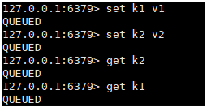
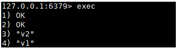
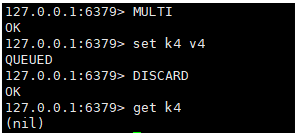

# 8 事务

**本质:**

- 一组命令一起执行;
- 一个事务中所有的命令都会被序列化, 在事务的执行过程中, 会按照顺序执行;
- 一次性, 顺序性, 排他性;

 **原子性:**

- 要么同时成功, 要么同时失败; 
- redis单条命令是保证原子性的; 
- **但是redis事务是不保证原子性的;**

**隔离性:** 

- redis事务没有隔离级别的概念;
- 所有命令在事务中没有直接执行, 只有发起执行命令的时候才会执行;

### Redis事务

- 开启事务 **MULTI**

  

- 命令入队 **command**

  

- 执行事务 **EXEC**

  

- 重新开启新的事务 **MULTI**

  取消事务 **DISCARD**

  事务队列中的命令都不会被执行

  

### 监控

**悲观锁:**

- 很悲观, 认为什么时候都会出问题, 无论做什么都会加锁;

**乐观锁:**

- 很乐观, 认为什么时候都不会出问题, 所以不会上锁; 更新数据的时候去判断一下, 在此期间时候有人修改过这个数据;
- 获取version
- 更新的时候比较version

### redis监视测试

```shell
127.0.0.1:6379> SET money 100
OK
127.0.0.1:6379> SET out 0
OK
# 监视money
127.0.0.1:6379> WATCH money
OK
# 事务正常结束, 数据期间没有发生变动, 这个时候就正常执行
127.0.0.1:6379> MULTI
OK
127.0.0.1:6379> DECRBY money 20
QUEUED
127.0.0.1:6379> INCRBY out 20
QUEUED
127.0.0.1:6379> EXEC
1) (integer) 80
2) (integer) 20
```

测试多线程修改值, 使用watch可以当做redis的乐观锁;

```
# 监视money
127.0.0.1:6379> WATCH money
OK
127.0.0.1:6379> MULTI
OK
127.0.0.1:6379> DECRBY money 10
QUEUED
127.0.0.1:6379> INCRBY out 10
QUEUED
    # 再开一个终端, 模拟另一个线程修改值
    127.0.0.1:6379> set money 1000
    OK
# 执行前, 另一个线程修改了money值, 导致事务修改失败
127.0.0.1:6379> EXEC
(nil)
```

```shell
# 如果发现事务执行失败, 就先解锁
127.0.0.1:6379> UNWATCH
OK
# 重新加锁
127.0.0.1:6379> WATCH money
OK
127.0.0.1:6379> MULTI
OK
127.0.0.1:6379> DECRBY money 10
QUEUED
127.0.0.1:6379> INCRBY out 10
QUEUED
127.0.0.1:6379> EXEC
1) (integer) 990
2) (integer) 30
```


# 9 Jedis

redis官方推荐的java连接工具, 使用java操作redis中间件;