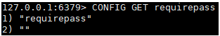
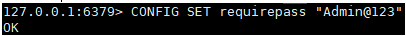
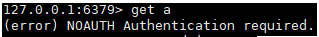
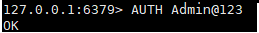

启动的时候, 就通过配置文件来启动;

配置文件对大小写不敏感

### 包含

### 网络

| bind 127.0.0.1     | 绑定ip             |
| ------------------ | ------------------ |
| protected-mode yes | 保护模式, 一般开启 |
| port 6379          | 端口               |

### 通用配置

| daemonize yes                    | 以守护进程方式运行, 默认是no          |
| -------------------------------- | ------------------------------------- |
| pidfile  /var/run/redis_6379.pid | 如果以后台方式运行, 就需要指定pid文件 |

### 日志

| loglevel notice      | 日志级别, notice(生产环境适用) |
| -------------------- | ------------------------------ |
| logfile ""           | 日志文件名, 空表示输出到控制台 |
| databases 16         | 数据库数量, 默认是16           |
| always-show-logo yes | 是否总是显示logo               |

### 快照

持久化, 在规定时间内, 执行了多少次操作, 则会持久化到文件(.rdb .aof)

redis是内存数据库, 如果没有持久化, 那么数据断电即失;

| save 900 1    | 如果900秒内, 至少有1个key进行了修改操作, 就进行持久化操作   |
| ------------- | ----------------------------------------------------------- |
| save 300 10   | 如果300秒内, 至少有10个key进行了修改操作, 就进行持久化操作  |
| save 60 10000 | 如果60秒内, 至少有1000个key进行了修改操作, 就进行持久化操作 |

 

| stop-writes-on-bgsave-error  yes | 持久化如果出错, 是否还需要继续工作 |
| -------------------------------- | ---------------------------------- |
| rdbcompression yes               | 是否压缩rdb文件, 需要消耗cpu资源   |
| rdbchecksum yes                  | 保存rdb文件的时候, 是否进行校验    |
| dir ./                           | rdb文件保存目录                    |

### REPLICATION 复制, 主从复制再说

 

### SECURITY 安全

| requirepass Admin@123 | 设置密码 |
| --------------------- | -------- |
|                       |          |

查看密码

设置密码

连接redis server后验证密码

### CLIENTS 限制

| maxclients 10000 | 设置连接redis的最大客户端数 |
| ---------------- | --------------------------- |

### MEMORY MANAGEMENT 内存管理

| maxmemory <bytes>            | 最大内存容量                                                 |
| ---------------------------- | ------------------------------------------------------------ |
| maxmemory-policy  noeviction | 内存达到上限后的处理策略 volatile-lru            只对设置了过期时间的key,使用lru allkeys-lru            使用lru算法删除key volatile-lfu            只对设置了过期时间的key,使用lfu allkeys-lfu            使用lfu算法删除key volatile-random            随机删除设置了过期时间的key allkeys-random            随机删除任何key volatile-ttl            删除最接近过期时间的key noeviction            不删除任何东西, 只返回错误 |

 

### APPEND ONLY MODE AOF配置

| appendonly no                    | 默认不开启oaf模式, 默认使用rdb方式持久化  在大部分所有的情况下, rdb完全够用 |
| -------------------------------- | ------------------------------------------------------------ |
| appendfilename  "appendonly.aof" | aof持久化文件名                                              |
| appendfsync everysec             | 每秒执行一次sycn, 可能会丢失1秒数据                          |
| # appendfsync always             | 每次修改都同步                                               |
| # appendfsync no                 | 不执行同步, 这个时候操作系统自己同步数据  速度最快, 一般不用 |

