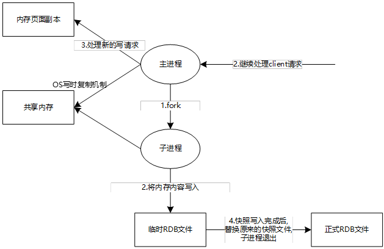

# RDB (Redis DataBase)

在指定的时间间隔内, 将内存中的数据写入磁盘, 也就是Snapshot快照, 它恢复时是将快照文件直接读到内存里;

 

Redis会单独创建(fork)一个子进程来进行持久化, 会先将数据写入到一个临时文件中, 待持久化过程都结束了, 再用这个临时文件替换上次持久化好的文件;

整个过程中, 主进程不会进行任何io操作; 这就确保了极高的性能;

如果需要进行大规模数据的回复, 且对于数据恢复的完整性不是非常敏感, 那么RDB方式要比AOF方式更加的高效;

RDB的缺点是最后一次持久化后的数据可能丢失; 

redis默认提供的就是RDB, 一般情况不需要修改这个配置;

 

**rdb文件是 dump.rdb**

rdb的配置在redis.conf的SNAPSHOTTING章节中;

| dbfilename dump.rdb                    | rdb文件名                                 |
| -------------------------------------- | ----------------------------------------- |
| save 900 1  save 300 10  save 60 10000 | 默认的rdb save规则                        |
| dir ./                                 | dump.rdb的保存路径, 默认配置会保存到 / 下 |

### 触发机制

1. save规则满足的情况下, 会自动触发rdb规则

2. 执行 flushall命令, 也会触发rdb规则

3. 退出redis, 也会产生rdb文件

### 如何恢复rdb文件

只需要将rdb文件放到redis配置的rdb路径下, redis启动的时候会自动读取这个路径下的dump.rdb;

## 优点

- 适合大规模的数据恢复; 

- 如果对数据完整性要求不高, 可以使用rdb;

## 缺点

- 需要一定的时间间隔进行操作; 如果在间隔中发生宕机, 这个间隔内的数据会丢失;

- fork进程的时候, 会占用一定的内存空间;

**有时候在生产环境会对dump.rdb文件定期备份**

# AOF (Append Only File)

以日志的形式来记录每个写操作, 将Redis执行过程的所有指令记录下来(读操作不记录);

只允许追加文件, 不可以改写文件, reid启动之初会读取该文件重新构建数据;

也就是说, redis重启的话, 会根据日志文件内容, 将写指令从前到后执行一次, 以完成数据的恢复工作;

 

Aof保存的是

AOF的配置在redis.conf的APPEND ONLY MODE章节, 默认是不开启的, 需要手动进行配置;

| appendonly  yes                  | 开启aof, 默认是no |
| -------------------------------- | ----------------- |
| appendfilename  "appendonly.aof" | aof文件名         |
| appendfsync everysec             | aof文件生成规则   |

如果这个aof文件有错误, 这时候 redis是启动不起来的, 可以使用 redis-check-aof --fix aofFile命令来修复;

 

**优点:**

- 每一次修改都同步, 文件的完整性会更好;

- 每秒都同步一次, 故障会丢失1秒的数据;

- 从不同步, 效率最高;

**缺点:**

- 相对于数据文件来说猫, aof远远大于rdb, 修复速度也比rdb慢;

- Aof运行效率也要比rdb慢, 所以我们redis默认使用rdb方式;

 

**重写规则说明**

- no-appendfsync-on-rewrite no

- auto-aof-rewrite-percentage 100

- auto-aof-rewrite-min-size 64mb

- 如果aof文件大于64m, 会fork一个新的进程来将文件进行重写;

 

 

# 扩展

1. RDB持久化方式能够在指定的时间间隔内对数据进行快照存储

2. AOF持久化方式记录每次对服务器写的操作, 当服务器重启的时候会重新执行这些命令来恢复原始的数据, AOF命令以Redis协议追加保存每次写的操作到文件末尾, Reid还能对AOF文件进行后台重写, 是的AOF文件的体积不至于过大

3. 只做缓存, 如果希望数据只在服务器运行的时候存在, 可以不使用任何持久化

4. 同时开启两种持久化方式:

   - 在这种情况下, 当redis重启的时候会优先载入AOF文件来恢复原始的数据, 因为在通常情况下AOF文件保存的数据集要比RDB文件保存的数据集要完整

   - RDB的数据不实时, 同时使用两者时服务器重启也只会找AOF文件, 那要不要只使用AOF呢; 作者建议不要, 因为RDB更适合用于备份数据库(AOF在不断变化, 不好备份), 快速重启, 而且不会有AOF可能潜在的Bug, 留着作为一个预防万一的手段

5. 性能建议

   - 因为RDB文件只用作后备用途, 建议只在Slave上持久化RDB文件, 而且只要15分钟备份一次就够了, 只保留save 900 1这条规则

   - 如果Enable AOF, 好处是在罪恶略的情况下也只会丢失不超过2秒的数据, 启动脚本较简单, 只load自己的AOF文件就可以了, 代价一是带来的持续的IO, 而是AOF rewriter的最后过程中产生的新数据写到新文件造成的阻塞几乎是不可避免的
   
     只要硬盘许可, 应该尽量减少AOF rewrite的频率, AOF重写的基础大小默认值64M太小了, 可以设置到5G以上, 默认超过原始大小的100%大小重写可以改到的数值
   
   - 如果不Enable AOF, 仅靠 Master-Slave     Replication实现高可用性可以, 能省掉一大笔IO, 也减少了rewrite时带来的系统波动;
   
     代价是如果Master/Slave同时倒掉, 会丢失十几分钟的数据, 启动脚本也要比较两个Master/Slave中的RDB文件, 载入较新的那个, 微博就是这种架构

 