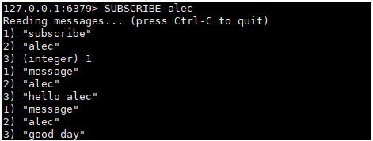
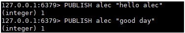

Redis发布订阅(pub/sub)是一种消息通信模式, 发送者(pub)发送消息, 订阅者(sub)接收消息;

Redis客户端可以订阅任意数量的频道;

 

# 命令

| PSUBSCRIBE pattern  [pattern ...]            | 订阅一个或多个符合给定模式的频道   |
| -------------------------------------------- | ---------------------------------- |
| PUBSUB subcommand  [argument [argument ...]] | 查看订阅与发布系统状态             |
| **PUBLISH channel message**                  | **将信息发送到指定的频道**         |
| PUNSUBSCRIBE [pattern  [pattern ...]]        | 退订所有给定模式的频道             |
| **SUBSCRIBE channel [channel ...]**          | **订阅给定的一个或多个频道的信息** |
| **UNSUBSCRIBE [channel [channel ...]]**      | **退订给定的频道**                 |

 

# 测试

**终端1: 订阅一个频道, 接收数据**

**终端2: 发布信息到频道**

# 说明

Redis是使用C实现的, 通过分析Redis源码里的pubsub.c文件, 了解发布和订阅的底层实现, 藉此加深对Redis的理解；

Redis通过PUBLISH, SUBCRIBE和PSUBCRIBE等命令实现发布和订阅功能;

 

通过SUBSCRIBE命令订阅某频道后, redis-server里维护一个字典, 字典的键就是一个个channel, 而字典的值则是一个链表, 链表中保存了所有订阅这个channel的客户端;SUBSCRIBE命令的关键, 就是讲客户端添加到给定channel的订阅链表中;

 

通过PUBLISH命令向订阅者发送消息, redis-server会使用给定的频道作为键, 在它所维护的channel字典中查找记录了订阅这个频道的所有客户端链表, 遍历链表, 将消息发送给所有订阅者;

 

Pub/Sub从字面上理解就是发布(Publish)与订阅(Subscribe), 在redis中, 你可以设定对某一个key值进行消息发布及消息订阅, 当一个key值上进行了消息发布后, 所有订阅它的客户端都会受到相应的消息; 

**这一功能最明显的用法就是用作实时消息系统, 比如普通的即时聊天, 群聊等功能**;

 