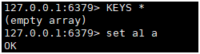
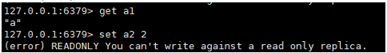
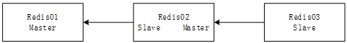

### 概念

**主从复制**, 是指将一台Redis服务器的数据吗, 复制到其他的Redis服务器; 前者称为主节点(master/leader), 后者称为从节点(slave/follower); 数据的复制是单向的, 只能有主节点到从节点; Master以写为主, Slave以读为主;

 

默认情况下, 每台Redis服务器都是主节点; 且一个主节点可以有多个从节点(或没有从节点), 但一个从节点只能有一个主节点;

 

主从复制的作用主要包括:

1. 数据冗余: 主从复制实现了数据的热备份, 是持久化之外的一种数据冗余方式;

2. 故障恢复: 当主节点出现问题时, 可以由从节点提供服务, 实现快速的故障恢复; 实际上是一种服务的冗余;

3. 负载均衡: 在主从复制的基础上, 配合读写分离, 可以由主节点提供写服务, 由从节点提供读服务(即写Redis数据时应用连接主节点, 读Redis数据时应用连接从节点), 分担服务器负载; 尤其是在写少读多的场景下, 通过多个从节点分担读负载, 可以大大提高redis服务器的并发量;

4. 高可用基石: 除了上述作用以外, 主从复制还是哨兵和集群能够实施的基础;

 

一般来说, 要将Redis运用于工程项目中, 只使用一台Redis是万万不能的, 原因有下:

1. 从结构上, 单个Redis服务器会发生单节点故障, 并且一台服务器需要处理所有的负载请求, 压力较大;

2. 从容量上, 单个Redis服务器内存容量有限, 就算一台Redis服务器内存容量为256G, 也不能将所有内存用作Redis存储内存, 一般来说, 单台Redis最大使用内存不应超过20G;

 

电商网站上的商品, 一般都是一次上传, 无数次浏览的, 说专业点也就是"多读少写";

 

主从复制, 读写分离; 80%的情况下都是在进行读操作; 为了减轻服务的压力, 架构中经常使用"一主两从";

### 环境配置

只配置从库, 不用配置主库; 因为redis默认就是主库;

**查看主从复制信息**

```properties
# 查看当前redis的配置
127.0.0.1:6379> info replication
# Replication
role:master # 角色master
connected_slaves:0 # 没有从
master_replid:3b1345d2baf4db9c45a9c925dda6271fe9b868bb
master_replid2:0000000000000000000000000000000000000000
master_repl_offset:0
second_repl_offset:-1
repl_backlog_active:0
repl_backlog_size:1048576
repl_backlog_first_byte_offset:0
repl_backlog_histlen:0
```

**域名解析**

```bash
cat <<EOF >> /etc/hosts
192.168.150.132 redis01.alec.com
192.168.150.133 redis02.alec.com
192.168.150.134 redis03.alec.com
EOF
```

**修改配置文件**

```
bind 0.0.0.0
```

### 配置主从(一主两从)

一般情况下, 不用配置主节点(redis01), 只配置从节点(redis02, redis03);

**redis02/redis03**

```bash
127.0.0.1:6379> SLAVEOF 192.168.150.132 6379
OK
127.0.0.1:6379> INFO replication
# Replication
role:slave
master_host:192.168.150.132
master_port:6379
master_link_status:up
```

**redis01**

```bash
127.0.0.1:6379> INFO replication
# Replication
role:master
connected_slaves:2
slave0:ip=192.168.150.133,port=6379,state=online,offset=56,lag=1
slave1:ip=192.168.150.134,port=6379,state=online,offset=252,lag=1
```

**配置文件**

```properties
# redis01
requirepass Admin@123    # 验证密码
replica-read-only yes    # 从节点只读

# redis02/redis03
replicaof 192.168.150.132 6379    # 主节点信息
masterauth Admin@123    #主节点密码
```

### 细节

主机可以写, 从机不能写, 不能读; 主机所有的信息和数据, 都会自动被从机保存;

**redis01(主机)**



**redis02(从机)**



### 测试

主节点宕机, 从机依旧能够被客户端连接, 但是不能执行写操作; 

从节点宕机, 在故障恢复后, 从节点能够自动从主节点获取故障期间的数据;

 

### 复制原理

Slave启动成功连接到master后会发送一个sync命令;

Master接到命令, 启动后台的存盘进程, 同时手机所有接收到的用于修改数据集命令, 在后台进程执行完毕后, master将传送整个数据文件到Slace, 并完成一次完全同步;

**全量复制:** Slave服务在接收到数据库文件后, 将其存盘并加载到内存中;

**增量复制:** Master继续将新的所有收集到的命令依次传给Slave, 完成数据同步; 但是只要Slave是重新连接到Master, 就会自动执行一次全量复制;


### 手动切换主从(**SlAVEOF** **no one**)

**Reids01**

```
# 关闭主节点
127.0.0.1:6379> SHUTDOWN
```

**Redis02**

```
# 使从节点升为主
127.0.0.1:6379> SLAVEOF no one
OK
127.0.0.1:6379> INFO replication
# Replication
role:master
connected_slaves:0
```

**Redis03**

```
# 更新从库主节点
127.0.0.1:6379> SLAVEOF 192.168.150.133 6379
OK
127.0.0.1:6379> INFO replication
# Replication
role:slave
master_host:192.168.150.133
master_port:6379
master_link_status:up
```

**Redis02**

```
127.0.0.1:6379> INFO replication
# Replication
role:master
connected_slaves:1
slave0:ip=192.168.150.134,port=6379,state=online,offset=1736,lag=0
```


### 链式主从



**在Redis01 宕机后, 必须手动把Redis02升为主节点, 才能正常写入数据;**

**Redis02**

```
# 设置redis01为redis02的主库
127.0.0.1:6379> SLAVEOF 192.168.150.132 6379
OK
```

**Redis03**

```
# 设置redis02为redis03的主库
127.0.0.1:6379> SLAVEOF 192.168.150.133 6379
OK
127.0.0.1:6379> INFO replication
# Replication
role:slave
master_host:192.168.150.133
master_port:6379
master_link_status:up
```

**Redis02**

```
127.0.0.1:6379> INFO replication
# Replication
role:slave
master_host:192.168.150.132
master_port:6379
master_link_status:up
…
slave_read_only:1
connected_slaves:1
slave0:ip=192.168.150.134,port=6379,state=online,offset=14,lag=1
```

**Redis01**

```
127.0.0.1:6379> INFO replication
# Replication
role:master
connected_slaves:1
slave0:ip=192.168.150.133,port=6379,state=online,offset=462,lag=1
```

