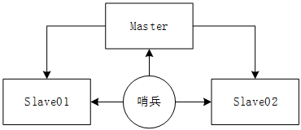

### 原理

主从切换技术的方法是: 当主机服务器宕机后, 需要手动把一塔服务器切换为主服务器, 这就需需要人工干越, 费时费力, 还会造成一段时间内服务不可用, 这不是一种推荐的方式, 能多的时候, 我们优先考虑哨兵模式; Reids从2.8版本开始正式支持Sentinel(哨兵)架构来解决这个问题;

哨兵模式是一种特殊的模式, 首先Redis提供了哨兵的命令, 哨兵是一个独立的进程, 作为进程, 它会独立运行; 其原理是哨兵通过发送命令, 等待Redis服务器响应, 从而监控运行的多个Redis实例;



这里的哨兵有两个作用:

- 让Redis服务器返回监控其运行状态, 包括主服务器和从服务器;
- 当哨兵检测到Master宕机, 会自动将Slave切换成Master, 然后通过**发布订阅模式**通知其他从服务器, 让他们切换主节点;

然而一个哨兵对Redis服务器进行监控, 可能会出现问题, 因此可以使用多个哨兵进行监控, 各个哨兵之间还会进行监控, 这样就形成了多少兵模式;


假设Master服务器宕机, 哨兵01先检测到这个结果, 系统并不会马上进行failover过程, 仅仅是哨兵01主观的认为Master服务器不可用, 这个现象称为**主观下线**; 

当其他哨兵也检测到Master服务器不可用, 并且数量达到一定值时, 大么哨兵之间就会进行一次投票, 投票的结果是由一个哨兵发起的, 进行failover故障转移操作;

切换成功后, 就会通知发布定于模式, 让各个哨兵把自己监控的服务器实现切换主机, 这个过程称为**客观下线**;

### 配置哨兵

**Redis01/Redis02/Redis03**

```bash
cd redis-6.0.8
cp -v sentinel.conf /etc/redis/
echo 'redis-sentinel /etc/redis/sentinel.conf' >> /etc/rc.d/rc.local

vim /etc/redis/sentinel.conf
# 哨兵默认运行端口
port 26379
# 后台运行
daemonize yes
# 让哨兵监控master节点, 当master宕机后 , 至少有2个哨兵同意才考虑客观下线
# 无论2的位置配置的是多少, 故障转移都得由大多数哨兵投票后才能故障转移
# 新的主节点是自动选举的, 当新的主节点产生后, 这个配置也会被重写
sentinel monitor myreids 192.168.150.132 6379 2
```

### 启动哨兵

**Redis01/Redis02/Redis03**

```
redis-sentinel /etc/redis/sentinel.conf
```

**查看哨兵状态**

```
[root@redis01 ~]# redis-cli -p 26379
127.0.0.1:26379> INFO sentinel
# Sentinel
sentinel_masters:1
sentinel_tilt:0
sentinel_running_scripts:0
sentinel_scripts_queue_length:0
sentinel_simulate_failure_flags:0
master0:name=myreids,status=ok,address=192.168.150.132:6379,slaves=2,sentinels=1
```

SHUTDOWN 主节点, sentinel日志最后会打印

```
2548:X 31 Oct 2020 08:06:59.437 # +switch-master myreids 192.168.150.132 6379 192.168.150.134 6379
2548:X 31 Oct 2020 08:06:59.437 * +slave slave 192.168.150.133:6379 192.168.150.133 6379 @ myreids 192.168.150.134 6379
2548:X 31 Oct 2020 08:06:59.437 * +slave slave 192.168.150.132:6379 192.168.150.132 6379 @ myreids 192.168.150.134 6379
2548:X 31 Oct 2020 08:07:29.447 # +sdown slave 192.168.150.132:6379 192.168.150.132 6379 @ myreids 192.168.150.134 6379
```

从日志可以看到**192.168.150.134(redis03)**被升为主节点

**Redis03**

```
127.0.0.1:6379> INFO replication
# Replication
role:master
connected_slaves:1
slave0:ip=192.168.150.133,port=6379,state=online,offset=22698,lag=1
```

**Redis01**

```
[root@redis01 ~]# redis-cli -p 26379
127.0.0.1:26379> INFO sentinel
# Sentinel
sentinel_masters:1
sentinel_tilt:0
sentinel_running_scripts:0
sentinel_scripts_queue_length:0
sentinel_simulate_failure_flags:0
master0:name=myreids,status=ok,address=192.168.150.134:6379,slaves=2,sentinels=1
```

再次启动redis01, 以从节点身份加入集群

**Redis01**

```
127.0.0.1:6379> INFO replication
# Replication
role:slave
master_host:192.168.150.134
master_port:6379
master_link_status:up
```

#### 优点

1. 哨兵集群, 基于主从复制模式, 所有的主从配置优点, 哨兵都有
2. 主从可以切换, 故障可以转移, 系统的可用性更好;
3. 哨兵模式就是主从模式的升级, 手动升级到自动, 更加健壮;

#### 缺点

1. Reids不饶你故意在线扩容, 集群容量一点到达上限, 在线扩容十分麻烦;
2. 实现哨兵模式的其实很麻烦, 里面很多选择;


### 哨兵模式全部配置

```
# Example sentinel.conf
# 哨兵sentinel实例运行的端口 默认26379
port 26379
# 哨兵sentinel的工作目录
dir /tmp
# 哨兵sentinel监控的redis主节点的 ip port
# master-name 可以自己命名的主节点名字 只能由字母A-z、数字0-9 、这三个字符".-_"组成。
# quorum 配置多少个sentinel哨兵统一认为master主节点失联 那么这时客观上认为主节点失联了
# sentinel monitor <master-name> <ip> <redis-port> <quorum>
sentinel monitor mymaster 127.0.0.1 6379 2
# 当在Redis实例中开启了requirepass foobared 授权密码 这样所有连接Redis实例的客户端都要提供
密码
# 设置哨兵sentinel 连接主从的密码 注意必须为主从设置一样的验证密码
# sentinel auth-pass <master-name> <password>
sentinel auth-pass mymaster MySUPER--secret-0123passw0rd
# 指定多少毫秒之后 主节点没有应答哨兵sentinel 此时 哨兵主观上认为主节点下线 默认30秒
# sentinel down-after-milliseconds <master-name> <milliseconds>
sentinel down-after-milliseconds mymaster 30000
# 这个配置项指定了在发生failover主备切换时最多可以有多少个slave同时对新的master进行 同步，
这个数字越小，完成failover所需的时间就越长，
但是如果这个数字越大，就意味着越 多的slave因为replication而不可用。
可以通过将这个值设为 1 来保证每次只有一个slave 处于不能处理命令请求的状态。
# sentinel parallel-syncs <master-name> <numslaves>
sentinel parallel-syncs mymaster 1
# 故障转移的超时时间 failover-timeout 可以用在以下这些方面：
#1. 同一个sentinel对同一个master两次failover之间的间隔时间。
#2. 当一个slave从一个错误的master那里同步数据开始计算时间。直到slave被纠正为向正确的master那
里同步数据时。
#3.当想要取消一个正在进行的failover所需要的时间。
#4.当进行failover时，配置所有slaves指向新的master所需的最大时间。不过，即使过了这个超时，
slaves依然会被正确配置为指向master，但是就不按parallel-syncs所配置的规则来了
# 默认三分钟
# sentinel failover-timeout <master-name> <milliseconds>
sentinel failover-timeout mymaster 180000
# SCRIPTS EXECUTION
#配置当某一事件发生时所需要执行的脚本，可以通过脚本来通知管理员，例如当系统运行不正常时发邮件通知
相关人员。
#对于脚本的运行结果有以下规则：
#若脚本执行后返回1，那么该脚本稍后将会被再次执行，重复次数目前默认为10
#若脚本执行后返回2，或者比2更高的一个返回值，脚本将不会重复执行。
#如果脚本在执行过程中由于收到系统中断信号被终止了，则同返回值为1时的行为相同。
#一个脚本的最大执行时间为60s，如果超过这个时间，脚本将会被一个SIGKILL信号终止，之后重新执行。
#通知型脚本:当sentinel有任何警告级别的事件发生时（比如说redis实例的主观失效和客观失效等等），
将会去调用这个脚本，这时这个脚本应该通过邮件，SMS等方式去通知系统管理员关于系统不正常运行的信
息。调用该脚本时，将传给脚本两个参数，一个是事件的类型，一个是事件的描述。如果sentinel.conf配
置文件中配置了这个脚本路径，那么必须保证这个脚本存在于这个路径，并且是可执行的，否则sentinel无
法正常启动成功。
#通知脚本
# shell编程
# sentinel notification-script <master-name> <script-path>
sentinel notification-script mymaster /var/redis/notify.sh
# 客户端重新配置主节点参数脚本
# 当一个master由于failover而发生改变时，这个脚本将会被调用，通知相关的客户端关于master地址已
经发生改变的信息。
# 以下参数将会在调用脚本时传给脚本:
# <master-name> <role> <state> <from-ip> <from-port> <to-ip> <to-port>
# 目前<state>总是“failover”,
# <role>是“leader”或者“observer”中的一个。
# 参数 from-ip, from-port, to-ip, to-port是用来和旧的master和新的master(即旧的slave)通
信的
# 这个脚本应该是通用的，能被多次调用，不是针对性的。
# sentinel client-reconfig-script <master-name> <script-path>
sentinel client-reconfig-script mymaster /var/redis/reconfig.sh # 一般都是由运维来配
置！
```

