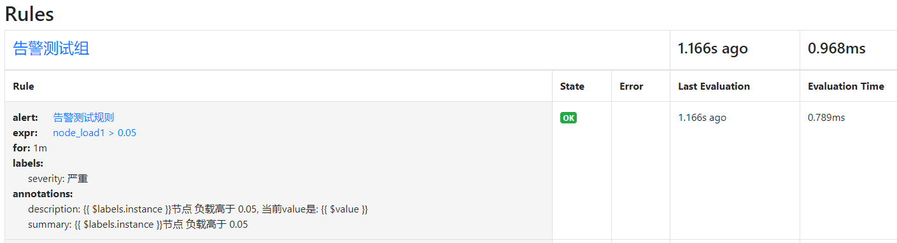
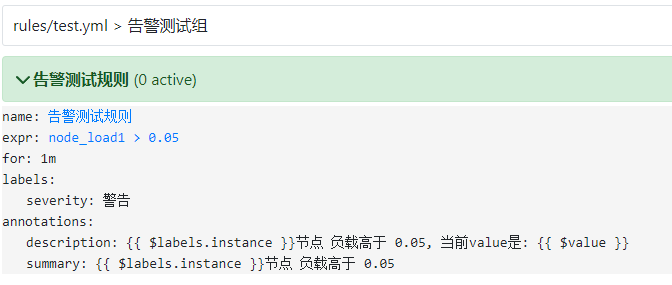
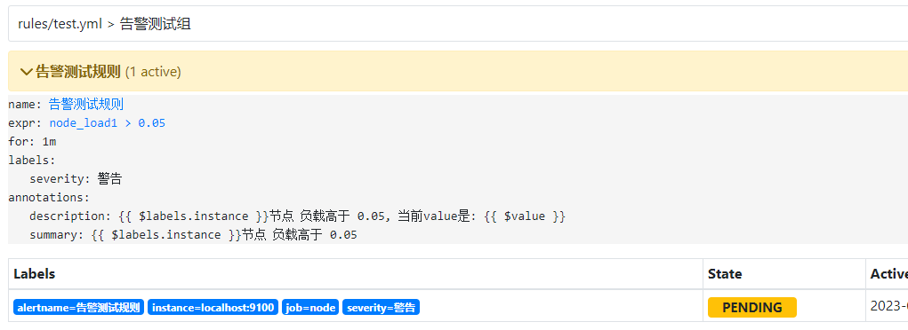
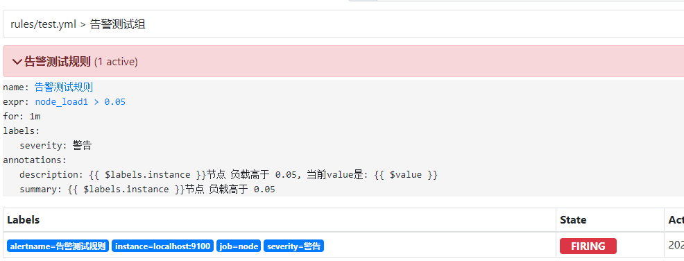
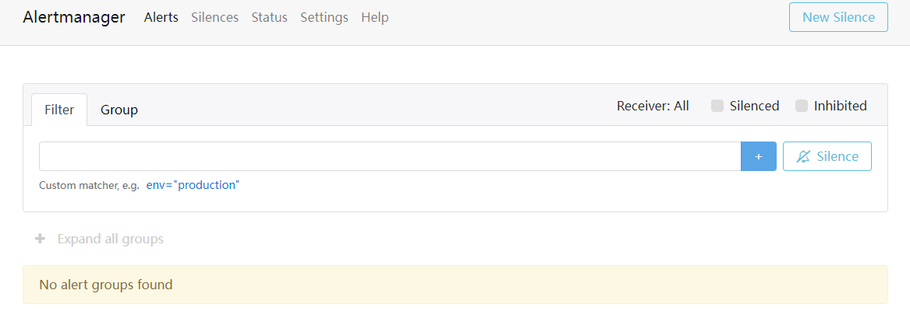
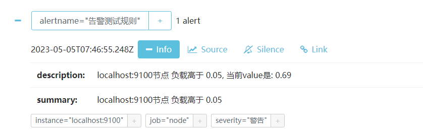
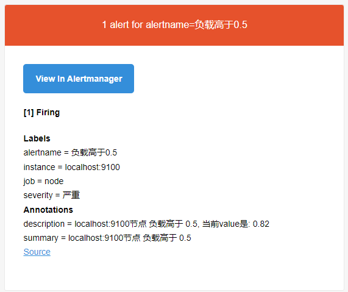
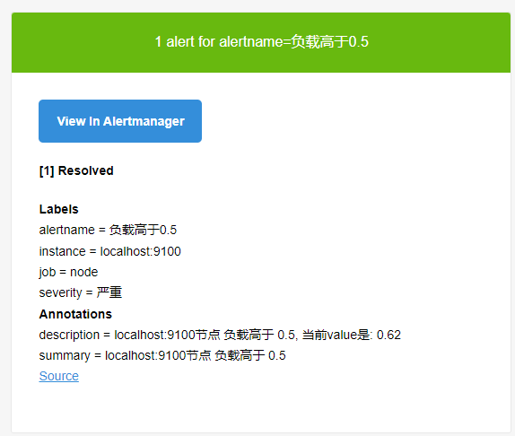
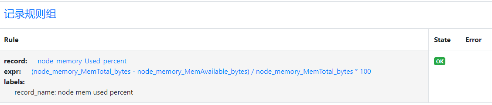
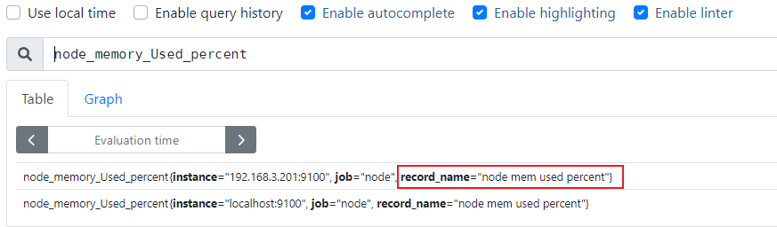

[toc]

## Prometheus

### 1. 基本原理

**时序数据库(TSDB)**

- Time Serier DataBase
- 用于保存时间序列(按时间顺序变化)的数据
- 每条记录都有完整的时间戳, 基于时间的操作都比较方便

**优点**

- 时间作为主轴, 数据按顺序到达
- 大多数操作是插入新数据, 偶尔查询, 更新数据比较少
- 时间序列数据累计速度非常快, 更高的容乃率, 更快的大规模查询以及更好的数据压缩
- TSDB通常还包括一些共同的对时间序列数据分析的功能和操作: 数据保留策略, 灵活的时间聚合等

**工作过程**

- 数据来源是一些官方的exporter, 自定义sdk或接口(http://ip:port/metrics)
- Service通过http的pull**(拉)**方式采集监控数据, 并在本地存储到tsdb中
- 不能直接网络胡同的原数据可以通过push gateway组件代理, 以实现数据收集
- Tsdb有自带的查询语言promql, 可以查询监控数据
- 报警方式是通过promql写规则, 与设置的阈值进行匹配, 超过阈值报警, 这个组件也是独立的 alertmanager
- Server 同时提供了简单的 ui , 可以查看配置拆线呢数据, 当然通常的展示借助第三方插件比如 grafana

### 2. 组件介绍

**工作原理**


### 3. 安装部署

#### Prometheus

下载地址: https://prometheus.io/download/

**安装**

```shell
wget https://github.com/prometheus/prometheus/releases/download/v2.28.1/prometheus-2.28.1.linux-amd64.tar.gz
tar -xf prometheus-2.28.1.linux-amd64.tar.gz -C /usr/local/
cd /usr/local/prometheus-2.28.1.linux-amd64/
```

**配置文件** prometheus.yml

```yaml
# my global config
global:
  # 收集数据时间间隔, 规则发现时间间隔, 收集数据超时时间 默认分别为1m 1m 10s
  scrape_interval:     15s # Set the scrape interval to every 15 seconds. Default is every 1 minute.
  evaluation_interval: 15s # Evaluate rules every 15 seconds. The default is every 1 minute.
  scrape_timeout: 10s      # scrape_timeout is set to the global default (10s).

# Alertmanager configuration
# 关联报警配置, 定制alertmanager组件的ip和端口
alerting:
  alertmanagers:
  - static_configs:
    - targets:
      - 127.0.0.1:9093

# Load rules once and periodically evaluate them according to the global 'evaluation_interval'.
# 规则配置文件的地址, 支持正则匹配
rule_files:
  - "./rules/rule_*.yml"
  # - "first_rules.yml"
  # - "second_rules.yml"

# prometheus支持将数据远程写入到其他的时序数据库中, 比如influxdb, 远程写入相关配置如下:
# remote_write:
# - url: http://remote1/push
#   write_relabel_configs:
#   - source_labels: [_name__]
#     regex: expensive.*
#     action: drop
# - url: http://remote2/push
# 同时还支持远程读取, 可以从其他的时序数据库中读取数据, 配置如下:
# - url: http://remote1/read
#   read_recent: true
# - url: http://remote2/read
#   read_recent: false
#   required_matchers:
#     job: special

# 收集数据配置列表, 通过job_name进行分类, 每个job_name收集不同的类型
# A scrape configuration containing exactly one endpoint to scrape:
# Here it's Prometheus itself.
# 这个是prometheus自己的例子
scrape_configs:
  # The job name is added as a label `job=<job_name>` to any timeseries scraped from this config.
  - job_name: 'prometheus'  # 必须参数, 这个地址专区的所有数据会自动加上`job=prometheus`的标签

    # metrics_path defaults to '/metrics' # 抓取监控目标的路径, 默认是 /metrics 可以根据自己业务的需要进行修改
    # scheme defaults to 'http'.

    static_configs: # 这个是通过静态文件的配置方法: 这种方法直接指定要抓取目标的ip和端口
    - targets: ['localhost:9090']
  # 这个job是指定prometheus的gateway地址, 指定之后prometheus会定期从gateway抓取数据
  - job_name: gate_way
    static_configs:
    - targets: ['127.0.0.1:9001']
      labels: # 打上标签, instance会呗指定为 'gateway'
        instance: gateway
  # 这个job是监控主机的, 这个例子中用到了file_sd_configs的功能, 就是通过配置文件的方法自动发现配置, 
  # 之后有新添加的主机, 直接维护下面files指定的文件就可以了, 在files里新增主机配置, prometheus会自动的发现并应用,
  # 这样的好处是防止配置文件冗长, files里文件格式为:
  # [
  #     {
  #         "targets": ["127.0.0.1:9100"],
  #         "labels": {
  #             "instance": "test"
  #         }
  #     },
  #     {
  #         "targets":["xxx.xxx.xxx.xxx:9100"],
  #         "labels": {
  #             "instance": "test1"
  #         }
  #     }
  # ]
  # 推荐这样的方法, 我们在instance里面可以加上主机的属性来区分不同的主机
  - job_name: node_export
    file_sd_configs:
    # refresh_interval: 1m  # 刷新发现新文件的时间间隔
    - files:
      - /data/prometheus-2.12.0.linux-amd64/nodediscovery.json
  # # 通过配置中心监控
  # - job_name: service-y
  #   consul_sd_configs:  # consul 服务发现 配置列表
  #   - server: 'localhost:1234' # consul API 地址
  #     token: mysecret
  #     services: ["nginx", "cache", "mysql"] # 被检索目标的服务列表, 如果不定义, 那么所有服务都会被收集
  #     tls_config:
  #       ca_file: valid_ca_file
  #       cert_file: valid_cert_file
  #       key_file: valid_key_file
  #       insecure_skip_verify: false
  # # 黑盒监控
  # - job_name: "black_box"
  #   metrics_path: /probe
  #   params:
  #     module: [http_2xx]
  #     static_configs:
  #       - targets:
  #         - https://shimo.im
  #         - https://shimodev.com
  #     relabel_configs:
  #       - source_labels: [__address__]
  #         target_label: __param_target
  #       - source_labels: [__param_target]
  #         target_label: instance
  #       - target_label: __address__
  #         replacement: 127.0.0.1:9115
```

**启动**

```shell
nohup ./prometheus --storage.tsdb.path=./data --storage.tsdb.retention.time=168h --web.enable-lifecycle --storage.tsdb.no-lockfile &
```
**启动参数**

| --config.file=                    | 指定配置文件                                                 |
| --------------------------------- | ------------------------------------------------------------ |
| --storage.tsdb.path=/prometheus   | 指定tsdb路径 /ssd                                            |
| --storage.tsdb.retention.time=24h | 指定数据存储时间                                             |
| --web.enable-lifecycle            | 提供类似nginx的reload功能<br>使用 curl -X POST http://localhost:9090/-/reload 重载配置 |
| --storage.tsdb.no-lockfile        | 如果用k8s的deployment管理要开启                              |

**访问** http://192.168.101.133:9090/


##### 1) node_exporter

**安装**

```shell
wget https://github.com/prometheus/node_exporter/releases/download/v1.2.0/node_exporter-1.2.0.linux-amd64.tar.gz
tar -xf node_exporter-1.2.0.linux-amd64.tar.gz -C /usr/local
cd /usr/local/node_exporter-1.2.0.linux-amd64/
```

**启动**

```
nohup ./node_exporter &
```

**把node_exporter加到prometheus**

```shell
cd /usr/local/prometheus-2.28.1.linux-amd64/

vim nodediscovery.json
[
    {
        "targets": ["192.168.101.133:9100"],
        "labels": {
            "instance": "jenkins"
        }
    }
]

vim prometheus.yml
  # 追加
  - job_name: "jenkins"
    file_sd_configs:
    - files:
      - /usr/local/prometheus-2.28.1.linux-amd64/nodediscovery.json

# 重启prometheus
kill `ps -ef | grep prometheus | grep -v grep | awk '{print $2}'`
nohup ./prometheus --storage.tsdb.path=./data --storage.tsdb.retention.time=168h --web.enable-lifecycle --storage.tsdb.no-lockfile &
```


#### pushgateway

下载地址: https://prometheus.io/download/

当需要组件主动把数据推送到gateway时, 需要使用pushgateway

- 因为Prometheus在配置pushgateway的时候, 也会指定job和instance, 但是它不能真正表达收集数据的含义;

  所以在Prometheus中配置pushgateway的时候, 需要加**honor_labels: true**, 从而避免收集数据本身的job和instance被覆盖

- 可以通过 -persistence.file 和 -persistence.interval 参数将数据持久化下来
- 万一gateway挂了, 那么后端所有的资源都无法采集, 可以用lvs给gateway做双活, 避免单节点故障
- 拉取状态up只针对gateway有效, 无法精确到后端节点

**安装**

```shell
wget https://github.com/prometheus/pushgateway/releases/download/v1.4.1/pushgateway-1.4.1.linux-amd64.tar.gz
```

**启动**

```shell
nohup ./pushgateway &
```


### 4. 数据类型

#### 数据格式

metrics_name{label}@时间戳 => 监控值

```
<-------------------metric-------------------><-timestamp-><-value->
http_request_total{status="200", method="GET"}@1434417560938 => 94355
http_request_total{status="200", method="GET"}@1434417561287 => 94334
http_request_total{status="200", method="GET"}@1434417560938 => 38473
```

#### 数据类型

- counter(计数器类型)
  - Counter类型的指标的工作方式和计数器一样，只增不减（除非系统发生了重置）
  - Counter一般用于累计值，例如记录请求次数、任务完成数、错误发生次数
  - 通常来讲，许多指标counter本身并没有什么意义，有意义的是counter随时间的变化率
- gauge(仪表盘类型)
  - Gauge是可增可减的指标类，可以用于反应当前应用的状态
  - 比如机器内存，磁盘可用空间大小等等
  - node_memory_MemAvailable_bytes
  - node_filesystem_avail_bytes
- histogram(直方图类型) *客户端计算*
  - Histogram 由 < basename>_bucket, < basename>_sum，_count 组成(一个指标有这三个值, 就是直方图类型)
  - 主要用于表示一段时间范围内对数据进行采样（通常是请求持续时间或响应大小），并能够对其指定区间以及总数进行统计，通常它采集的数据展示为直方图
  - 事件发生的总次数，basename_count
  - 所有事件产生值的大小的总和，basename_sum
  - 事件产生的值分布在bucket中的次数
  - histogram可以计算分位数
    - histogram_quantile()函数可以将histgram指标的分位数统计出来
    - histogram_quantile(0.99,  sum(irate(grpc_server_handling_seconds_bucket{}[1m])) by (grpc_method,le))
- summary(摘要类型)
  - Summary类型和Histogram类型相似，由< basename>{quantile=“< φ>”}，< basename>_sum，< basename>_count组成
  - 主要用于表示一段时间内数据采样结果（通常时请求持续时间或响应大小），它直接存储了分位数据，而不是根据统计区间计算出来的

> histogram和summary区别

- Histogram指标直接反应了在不同区间内样本的个数，区间通过标签len进行定义

  同时对于Histogram的指标，我们还可以通过histogram_quantile()函数计算出其值的分位数

- 而Sumamry的分位数则是直接在客户端计算完成

- 因此对于分位数的计算而言，Summary在通过PromQL进行查询时有更好的性能表现，而Histogram则会消耗更多的资源。

  反之对于客户端而言Histogram消耗的资源更少

  在选择这两种方式时用户应该按照自己的实际场景进行选择

### 5. PromQL

- PromQL (Prometheus Query Language) 是 Prometheus 自己开发的数据查询 DSL 语言，语言表现力非常丰富，内置函数很多，在日常数据可视化以及rule 告警中都会使用到它

- 我们把每个查询对象的名字叫做metrics，类似于mysql中的表名

#### 基本查询

直接输入目标名, 查询


#### 查询结果

查询结果可以分为三类

- 瞬时数据 (Instant vector): 包含一组时序，每个时序只有一个点，例如：prometheus_http_requests_total

- 区间数据 (Range vector): 包含一组时序，每个时序有多个点，例如：prometheus_http_requests_total [5m]

- 纯量数据 (Scalar): 纯量只有一个数字，没有时序，例如：count(prometheus_http_requests_total)

#### 通过Label查询

使用label 可以对简单查询的结果进行过滤

- prometheus_http_requests_total{code="200"}

  

- And 逻辑直接,分割：prometheus_http_requests_total{code="200",job="prometheus"}

- 还支持正则匹配：用 =~、!~ 表示正则：prometheus_http_requests_total{code =~ "2.*|3.*",handler !~ "/alert.*" ,job="prometheus"}

  - =~ 表示显示匹配到的内容
  - !~ 表示不显示匹配到的内容

  

- 后面可以加时间范围：通过[time]来实现：prometheus_http_requests_total{code =~ "2.*|3.*",handler=~ "/alert.*" ,job="prometheus"}[5m]

#### 算数运算

 - 加减乘除等：+，-，*，/，%，^
 - 比较运算：==，!=，>，<，>=，<=
 - 逻辑运算and，or, unless(排除)
 - 聚合运算：sum，min，max，avg，stddev(标准差)，stdvar(标准差异)，count，count_values(统计value出现的次数), topk等
 - 内置函数：rate(增长率)，irate(瞬时增长率, 更灵敏)，abs，ceil(向上取整), floor(向下取整), increse(增长率)，sort，sort_desc, offset(前多少时间), pridect_linear(通过一段时间的指标, 预测一段时间后的值), absent(如果样本数据为空则返回1, 不为空则返回no_data, 判断数据是否正常采集), delta(差值) 等等

```
irate 取最后两个值做计算, 不适合做大区间数据的分析, 不适合做告警规则
```


> 常用查询举例

```
# 五分钟的cpu平均使用率
100 - (avg(irate(node_cpu_seconds_total{mode="idle"}[5m])) * 100)

#可用内存百分比
(node_memory_MemAvailable_bytes / (node_memory_MemTotal_bytes))* 100

#磁盘一分钟读的速率
irate(node_disk_reads_completed_total{instance=~"$node"}[1m])

#网络流量
irate(node_network_receive_bytes_total{device!~‘tap.*|veth.*|br.*|docker.*|virbr*|lo*’}[5m])*8
```

### 6.exporter

- node_exporter 主机监控

- Redis/memcache/mongo/mysql/kafka/rabbitmq等db及缓存监控

- Blackbox_export 一些http/tcp/ping/dns监控等等

- haproxy_exporter

- consul_exporter 支持外接配置中心

- graphite_exporter 第三方数据源

#### Node_exporter 监控主机

**textfile收集器**

可以做自定义指标, 用来做一些脚本或计划任务无法抓取的指标, 或者为主机提供上下文静态指标

textfile的监控指标存储在 .prom 文件中

```shell
cd /usr/local/node_exporter-1.2.0.linux-amd64
mkdir textfile_collector
cd textfile_collector

vim metadata.prom
metadata{role="jenkins_server", datacenter="BJ"} 1

# 重启node_exporter, 增加--collector.textfile.directory选项, 指向textfile_collector目录
```

可以在 Graph 中找到 metadata 监控项


**systemd收集器**

使用 --collector.systemd 选项, 启用systemd收集器, 用来记录systemd管理的服务数

可以使用 --collector.systemd.unit-include 添加白名单, 让需要关注的服务被监控到(待验证)

可以使用 --collector.systemd.unit-exclude 添加黑名单, 把不想监控的指标加进去(待验证)

**启动node_exporter**

对于默认的一些指标比如 --collector.nvme 如果不想收集, 可以在启动参数中添加 --no-collector.nvme 的方式disable掉

```shell
nohup ./node_exporter \
--collector.textfile.directory="./textfile_collector" \
--collector.systemd \
--collector.systemd.unit-include=".+(docker|sshd|ntpd).service" \
--no-collector.nvme \
&
```


**把node_exporter添加到Prometheus**

#### Exporter 监控传统服务

通过 Expoter 监控没有 /metrics 接口的服务, 比如 mysql, redis 等

传统服务(mysql) <-- Exporter(提供/metrics接口) <--Endpoint <--Service <-- ServiceMonitor <-- Prometheus

#### Blackbox_exporter 监控URL

kube-prometheus 已经包含 blackbox exporter 请求 http://...:19115 即可

白盒监控: 监控服务内部指标, kafka的topic, redis的key, CPU, Mem等

黑盒监控: 站在用户角度看到的东西; 网站响应时间之类的;

1. 创建configMap, 导入blackbox exporter需要的配置文件 blackbox.yml

2. 创建blackbox exporter 的 Deployment

   ```yaml
   MetaData:
     namespace: monitoring
     name: blackbox-exporter
   Volume:
     config:
     	configMap: blackbox-exporter
   Container:
     image: prom/blackbox-exporter:master
     args: --config.file=/mnt/blackbox.yml
     Service:
       type: ClusterIP
       port: 9115
       targetPort: 9115
   ```

3. 测试

   ```shell
   curl "http://localhost:9115/probe?target=baidu.com&module=http_2xx"
   # 支持的module 详见配置文件
   ```

4. 通过探针添加 监控项

   ```yaml
   kind: Probe
   apiVersion: monitoring.coreos.com/v1
   metadata:
     name: test-website
     namespace: monitoring
   spec:
     interval: 60s
     module: http_2xx
     prober:
       url: blackbox-exporter.monitoring.svc.cluster.local:19115
     targets:
       staticConfig:
         static:
         - http://www.baidu.com
         - https://www.jd.com
   ```

5. 修改监控项

   ```shell
   kubectl edit probe -n monitoring test-website
   ```

### 7. 自动发现

#### k8s集群自动发现

通过 `kubernetes_sd_config` 可以从Kubernetes的REST API检索抓取目标, 并和集群状态同步;


### 9. Label

Label能够让我们知道监控项目的来源端口方法等等，同时label也为prometheus提供了丰富的聚合和查询等功能

#### label 用法

 - Keep 只保留符合匹配的标签
 - Drop 丢到符合匹配的标签
 - 函数用法label_replace() label_join()


## AlertManager

### 1. 告警规则

```yaml
groups:
- name: 告警测试组
  rules:
  - alert: 告警测试规则
    expr: node_load1 > 0.05
    for: 1m
    labels:
      severity: 警告
      alert_type: test
    annotations:
      summary: "{{ $labels.instance }}节点 负载高于 0.05"
      description: "{{ $labels.instance }}节点 负载高于 0.05, 当前value是: {{ $value }}"
```

在告警规则文件中，我们可以将一组相关的规则设置定义在一个group下。在每一个group中我们可以定义多个告警规则(rule)。一条告警规则主要由以下几部分组成：

- alert：告警规则的名称。
- expr：基于PromQL表达式告警触发条件，用于计算是否有时间序列满足该条件。
- for：评估等待时间，可选参数。用于表示只有当触发条件持续一段时间后才发送告警。在等待期间新产生告警的状态为pending。
- labels：自定义标签，允许用户指定要附加到告警上的一组附加标签。
- annotations：用于指定一组附加信息，比如用于描述告警详细信息的文字等，annotations的内容在告警产生时会一同作为参数发送到Alertmanager。

将规则添加到 prometheus.yml中后, 执行 `curl -X POST http://localhost:9090/-/reload` 重载配置

```yaml
rule_files:
  - "./rules/test.yml"
```

访问 http://ip:9090/rules, 可以看到规则已经添加成功



正常状态下, http://ip:9090/alerts是绿色的



使用 `cat /dev/zero>/dev/null` 手动拉高CPU负载

再 `for` 配置的时间以内, alert会被置为 PENDING状态



超过 for 配置的时间后, alert会被置为 FIRING



FIREING状态后, prometheus 会向 alertmanager 发送告警信息

### 2. 部署alertmanager

```
tar -xf alertmanager-0.25.0.linux-amd64.tar.gz
cd alertmanager-0.25.0.linux-amd64

./alertmanager
```

修改prometheus.yml 中alerting配置, 重启prometheus

```
alerting:
  alertmanagers:
    - static_configs:
        - targets:
           - localhost:9093
```

访问alertmanager: http://ip:9093



再次尝试拉高CPU负载: cat /dev/zero>/dev/null, 可以在alertmanager看到告警信息



### 3. alertmanager配置

- 全局配置（global）：用于定义一些全局的公共参数，如全局的SMTP配置，Slack配置等内容；
- 模板（templates）：用于定义告警通知时的模板，如HTML模板，邮件模板等；
- 告警路由（route）：根据标签匹配，确定当前告警应该如何处理；
- 接收人（receivers）：接收人是一个抽象的概念，它可以是一个邮箱也可以是微信，Slack或者Webhook等，接收人一般配合告警路由使用；
- 抑制规则（inhibit_rules）：合理设置抑制规则可以减少垃圾告警的产生

完整的 alertmanager.yml 配置如下:

```yaml
global:
  [ resolve_timeout: <duration> | default = 5m ] # 定义当Alertmanager持续多长时间未接收到告警后标记告警状态为resolved（已解决）,该参数的定义可能会影响到告警恢复通知的接收时间
  [ smtp_from: <tmpl_string> ] 
  [ smtp_smarthost: <string> ] 
  [ smtp_hello: <string> | default = "localhost" ]
  [ smtp_auth_username: <string> ]
  [ smtp_auth_password: <secret> ]
  [ smtp_auth_identity: <string> ]
  [ smtp_auth_secret: <secret> ]
  [ smtp_require_tls: <bool> | default = true ]
  [ slack_api_url: <secret> ]
  [ victorops_api_key: <secret> ]
  [ victorops_api_url: <string> | default = "https://alert.victorops.com/integrations/generic/20131114/alert/" ]
  [ pagerduty_url: <string> | default = "https://events.pagerduty.com/v2/enqueue" ]
  [ opsgenie_api_key: <secret> ]
  [ opsgenie_api_url: <string> | default = "https://api.opsgenie.com/" ]
  [ hipchat_api_url: <string> | default = "https://api.hipchat.com/" ]
  [ hipchat_auth_token: <secret> ]
  [ wechat_api_url: <string> | default = "https://qyapi.weixin.qq.com/cgi-bin/" ]
  [ wechat_api_secret: <secret> ]
  [ wechat_api_corp_id: <string> ]
  [ http_config: <http_config> ]

templates:
  [ - <filepath> ... ]

route: <route>

receivers:
  - <receiver> ...

inhibit_rules:
  [ - <inhibit_rule> ... ]
```

#### route

route中主要定义了告警的路由匹配规则，以及Alertmanager需要将匹配到的告警发送给哪一个receiver

```yaml
route:
  group_by: ['alertname']
  receiver: 'web.hook'
receivers:
- name: 'web.hook'
  webhook_configs:
  - url: 'http://127.0.0.1:5001/'
```

完整的route配置如下:

```yaml
route:
    [ receiver: <string> ]
    [ group_by: '[' <labelname>, ... ']' ]
    [ continue: <boolean> | default = false ]

    match:
      [ <labelname>: <labelvalue>, ... ]

    match_re:
      [ <labelname>: <regex>, ... ]

    [ group_wait: <duration> | default = 30s ]
    [ group_interval: <duration> | default = 5m ]
    [ repeat_interval: <duration> | default = 4h ]

    routes:
      [ - <route> ... ]
```

- **路由匹配规则**

  每一个告警都会从配置文件中顶级的route进入路由树，需要注意的是顶级的route必须匹配所有告警(即不能有任何的匹配设置match和match_re)，每一个路由都可以定义自己的接受人以及匹配规则。

  默认情况下，告警进入到顶级route后会遍历所有的子节点，直到找到最深的匹配route，并将告警发送到该route定义的receiver中。但如果route中设置**continue**的值为false，那么告警在匹配到第一个子节点之后就直接停止。如果**continue**为true，报警则会继续进行后续子节点的匹配。如果当前告警匹配不到任何的子节点，那该告警将会基于当前路由节点的接收器配置方式进行处理。

  其中告警的匹配有两种方式可以选择。一种方式基于字符串验证，通过设置**match**规则判断当前告警中是否存在标签labelname并且其值等于labelvalue。第二种方式则基于正则表达式，通过设置**match_re**验证当前告警标签的值是否满足正则表达式的内容。

  如果警报已经成功发送通知, 如果想设置发送告警通知之前要等待时间，则可以通过**repeat_interval**参数进行设置。

- **告警分组**

  基于告警中包含的标签，如果满足**group_by**中定义标签名称，那么这些告警将会合并为一个通知发送给接收器。

  有的时候为了能够一次性收集和发送更多的相关信息时，可以通过**group_wait**参数设置等待时间，如果在等待时间内当前group接收到了新的告警，这些告警将会合并为一个通知向receiver发送。

  而**group_interval**配置，则用于定义相同的Group之间发送告警通知的时间间隔。

  例如，当使用Prometheus监控多个集群以及部署在集群中的应用和数据库服务，并且定义以下的告警处理路由规则来对集群中的异常进行通知。

  ```yaml
  route:
    receiver: 'default-receiver'
    group_wait: 30s
    group_interval: 5m
    repeat_interval: 4h
    group_by: [cluster, alertname]
    routes:
    - receiver: 'database-pager'
      group_wait: 10s
      match_re:
        service: mysql|cassandra
    - receiver: 'frontend-pager'
      group_by: [product, environment]
      match:
        team: frontend
  ```

  默认情况下所有的告警都会发送给集群管理员default-receiver，因此在Alertmanager的配置文件的根路由中，对告警信息按照集群以及告警的名称对告警进行分组。

  如果告警时来源于数据库服务如MySQL或者Cassandra，此时则需要将告警发送给相应的数据库管理员(database-pager)。这里定义了一个单独子路由，如果告警中包含service标签，并且service为MySQL或者Cassandra,则向database-pager发送告警通知，由于这里没有定义group_by等属性，这些属性的配置信息将从上级路由继承，database-pager将会接收到按cluster和alertname进行分组的告警通知。

  而某些告警规则来源可能来源于开发团队的定义，这些告警中通过添加标签team来标示这些告警的创建者。在Alertmanager配置文件的告警路由下，定义单独子路由用于处理这一类的告警通知，如果匹配到告警中包含标签team，并且team的值为frontend，Alertmanager将会按照标签product和environment对告警进行分组。此时如果应用出现异常，开发团队就能清楚的知道哪一个环境(environment)中的哪一个应用程序出现了问题，可以快速对应用进行问题定位。

#### receiver

##### STMP邮件

编辑alertmanager.yml

```yaml
global:
  smtp_smarthost: smtp.office365.com:587
  smtp_from: aaa@outlook.com
  smtp_auth_username: aaa@outlook.com
  smtp_auth_identity: aaa@outlook.com
  smtp_auth_password: ******
route:
  group_by: ['alertname']
  receiver: 'default-receiver'
receivers:
- name: default-receiver
  email_configs:
  - to: aaa@163.com
    send_resolved: true
```

拉高负载测试告警邮件



恢复邮件



##### Webhook


### 4. 告警抑制

```yaml
inhibit_rules:
  [ - <inhibit_rule> ... ]

# 每一条抑制规则如下
target_match:
  [ <labelname>: <labelvalue>, ... ]
target_match_re:
  [ <labelname>: <regex>, ... ]

source_match:
  [ <labelname>: <labelvalue>, ... ]
source_match_re:
  [ <labelname>: <regex>, ... ]

[ equal: '[' <labelname>, ... ']' ]
```

当已经发送的告警通知匹配到target_match和target_match_re规则，当有新的告警规则如果满足source_match或者定义的匹配规则，并且已发送的告警与新产生的告警中equal定义的标签完全相同，则启动抑制机制，新的告警不会发送。

**调整 alert rule, 让alertmanager每隔2m发送一次告警邮件**

```yaml
route:
  group_by: ['alertname']
  receiver: 'default-receiver'
  repeat_interval: 2m # 重复报告间隔
```

**创建两条告警规则**

```yaml
groups:
- name: 告警测试组
  rules:
  - alert: 告警测试规则
    expr: node_load1 > 0.05
    for: 1m
    labels:
      severity: 警告
      alert_type: test
    annotations:
      summary: "{{ $labels.instance }}节点 负载高于 0.05"
      description: "{{ $labels.instance }}节点 负载高于 0.05, 当前value是: {{ $value }}"
  - alert: 负载高于0.5
    expr: node_load1 > 0.5
    for: 1m
    labels:
      severity: 严重
      alert_type: test
    annotations:
      summary: "{{ $labels.instance }}节点 负载高于 0.5"
      description: "{{ $labels.instance }}节点 负载高于 0.5, 当前value是: {{ $value }}"
```

**创建告警抑制规则**

```yaml
inhibit_rules:
- source_match:
    alert_type: "test"
  target_match:
    alert_type: "test"
    severity: "警告"
  equal:
  - instance
```

- 当以发送的 alert 和 source_match 匹配

- 新产生的 alert 和 target_match 匹配
- 当 两个 alert 的 instance label 标签相同时, 新的alert会被抑制

**测试**

拉高 prometheus-server 的CPU负载


### 5. 记录规则

通过PromQL可以实时对Prometheus中采集到的样本数据进行查询，聚合以及其它各种运算操作。而在某些PromQL较为复杂且计算量较大时，直接使用PromQL可能会导致Prometheus响应超时的情况。

这时需要一种能够类似于后台批处理的机制能够在后台完成这些复杂运算的计算，对于使用者而言只需要查询这些运算结果即可。

Prometheus通过Recoding Rule规则支持这种后台计算的方式，可以实现对复杂查询的性能优化，提高查询效率。

#### 定义Recoding rules

```yaml
groups:
- name: 记录规则组
  rules:
  - record: node_memory_Used_percent
    expr: (node_memory_MemTotal_bytes - node_memory_MemAvailable_bytes)/node_memory_MemTotal_bytes*100
    labels:
      record_name: "node mem used percent"
```

将rule加到prometheus.yml中, 重载prometheus配置

```yaml
rule_files:
  - "./rules/alert_rule.yml"
  - "./rules/recording_rule.yml"
```

在 http://ip:9090/rules 中可以看到 创建的记录规则



点击 record, 可以看到自定义的label




## 服务发现

### 1. 基于文件的服务发现

定义一个监控目标的文件

> target.json

```json
[
  {
    "targets": [ "localhost:8080"],
    "labels": {
      "env": "localhost",
      "job": "cadvisor"
    }
  },
  {
    "targets": [ "localhost:9104" ],
    "labels": {
      "env": "prod",
      "job": "mysqld"
    }
  },
  {
    "targets": [ "localhost:9100"],
    "labels": {
      "env": "prod",
      "job": "node"
    }
  }
]
```

- job 标签可以覆盖掉 prometheus.yml 中的 job_name 标签

> prometheus.yml

```yaml
scrape_configs:
- job_name: "file_ds"
  file_sd_configs:
  - refresh_interval: 1m # prometheus 默认每5分钟重读一次文件内容, 使用refresh_interval可以自定义扫描时间
    files:
    - targets.json
```

