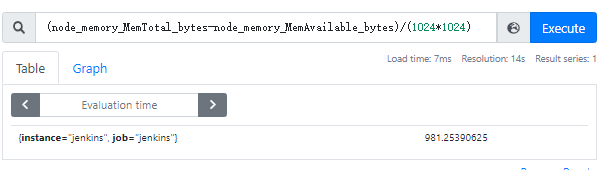
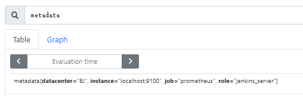

[toc]

# Prometheus基础

## 基本原理

### 时序数据库(TSDB)

- Time Serier DataBase
- 用于保存时间序列(按时间顺序变化)的数据
- 每条记录都有完整的时间戳, 基于时间的操作都比较方便

**优点**

- 时间作为主轴, 数据按顺序到达
- 大多数操作是插入新数据, 偶尔查询, 更新数据比较少
- 时间序列数据累计速度非常快, 更高的容乃率, 更快的大规模查询以及更好的数据压缩
- TSDB通常还包括一些共同的对时间序列数据分析的功能和操作: 数据保留策略, 灵活的时间聚合等

**工作过程**

- 数据来源是一些官方的exporter, 自定义sdk或接口
- Service通过http的pull方式采集监控数据, 并在本地存储到tsdb中
- 不能直接网络胡同的原数据可以通过push gateway组件代理, 以实现数据收集
- Tsdb有自带的查询语言promql, 可以查询监控数据
- 报警方式是通过promql写规则, 与设置的阈值进行匹配, 超过阈值报警, 这个组件也是独立的 alertmanager
- Server 同时提供了简单的 ui , 可以查看配置拆线呢数据, 当然通常的展示借助第三方插件比如 grafana

## 组件介绍

### 工作原理


### 安装部署

#### Prometheus

下载地址: https://prometheus.io/download/


**安装**

```shell
wget https://github.com/prometheus/prometheus/releases/download/v2.28.1/prometheus-2.28.1.linux-amd64.tar.gz
tar -xf prometheus-2.28.1.linux-amd64.tar.gz -C /usr/local/
cd /usr/local/prometheus-2.28.1.linux-amd64/
```

**配置文件** prometheus.yml

```yaml
# my global config
global:
  # 收集数据时间间隔, 规则发现时间间隔, 收集数据超时时间 默认分别为1m 1m 10s
  scrape_interval:     15s # Set the scrape interval to every 15 seconds. Default is every 1 minute.
  evaluation_interval: 15s # Evaluate rules every 15 seconds. The default is every 1 minute.
  scrape_timeout: 10s      # scrape_timeout is set to the global default (10s).

# Alertmanager configuration
# 关联报警配置, 定制alertmanager组件的ip和端口
alerting:
  alertmanagers:
  - static_configs:
    - targets:
      - 127.0.0.1:9093

# Load rules once and periodically evaluate them according to the global 'evaluation_interval'.
# 规则配置文件的地址, 支持正则匹配
rule_files:
  - "./rules/rule_*.yml"
  # - "first_rules.yml"
  # - "second_rules.yml"

# prometheus支持将数据远程写入到其他的时序数据库中, 比如influxdb, 远程写入相关配置如下:
# remote_write:
# - url: http://remote1/push
#   write_relabel_configs:
#   - source_labels: [_name__]
#     regex: expensive.*
#     action: drop
# - url: http://remote2/push
# 同时还支持远程读取, 可以从其他的时序数据库中读取数据, 配置如下:
# - url: http://remote1/read
#   read_recent: true
# - url: http://remote2/read
#   read_recent: false
#   required_matchers:
#     job: special

# 收集数据配置列表, 通过job_name进行分类, 每个job_name收集不同的类型
# A scrape configuration containing exactly one endpoint to scrape:
# Here it's Prometheus itself.
# 这个是prometheus自己的例子
scrape_configs:
  # The job name is added as a label `job=<job_name>` to any timeseries scraped from this config.
  - job_name: 'prometheus'  # 必须参数, 这个地址专区的所有数据会自动加上`job=prometheus`的标签

    # metrics_path defaults to '/metrics' # 抓取监控目标的路径, 默认是 /metrics 可以根据自己业务的需要进行修改
    # scheme defaults to 'http'.

    static_configs: # 这个是通过静态文件的配置方法: 这种方法直接指定要抓取目标的ip和端口
    - targets: ['localhost:9090']
  # 这个job是指定prometheus的gateway地址, 指定之后prometheus会定期从gateway抓取数据
  - job_name: gate_way
    static_configs:
    - targets: ['127.0.0.1:9001']
      labels: # 打上标签, instance会呗指定为 'gateway'
        instance: gateway
  # 这个job是监控主机的, 这个例子中用到了file_sd_configs的功能, 就是通过配置文件的方法自动发现配置, 
  # 之后有新添加的主机, 直接维护下面files指定的文件就可以了, 在files里新增主机配置, prometheus会自动的发现并应用,
  # 这样的好处是防止配置文件冗长, files里文件格式为:
  # [
  #     {
  #         "targets": ["127.0.0.1:9100"],
  #         "labels": {
  #             "instance": "test"
  #         }
  #     },
  #     {
  #         "targets":["xxx.xxx.xxx.xxx:9100"],
  #         "labels": {
  #             "instance": "test1"
  #         }
  #     }
  # ]
  # 推荐这样的方法, 我们在instance里面可以加上主机的属性来区分不同的主机
  - job_name: node_export
    file_sd_configs:
    # refresh_interval: 1m  # 刷新发现新文件的时间间隔
    - files:
      - /data/prometheus-2.12.0.linux-amd64/nodediscovery.json
  # # 通过配置中心监控
  # - job_name: service-y
  #   consul_sd_configs:  # consul 服务发现 配置列表
  #   - server: 'localhost:1234' # consul API 地址
  #     token: mysecret
  #     services: ["nginx", "cache", "mysql"] # 被检索目标的服务列表, 如果不定义, 那么所有服务都会被收集
  #     tls_config:
  #       ca_file: valid_ca_file
  #       cert_file: valid_cert_file
  #       key_file: valid_key_file
  #       insecure_skip_verify: false
  # # 黑盒监控
  # - job_name: "black_box"
  #   metrics_path: /probe
  #   params:
  #     module: [http_2xx]
  #     static_configs:
  #       - targets:
  #         - https://shimo.im
  #         - https://shimodev.com
  #     relabel_configs:
  #       - source_labels: [__address__]
  #         target_label: __param_target
  #       - source_labels: [__param_target]
  #         target_label: instance
  #       - target_label: __address__
  #         replacement: 127.0.0.1:9115
```

**启动**

```shell
nohup ./prometheus --storage.tsdb.path=./data --storage.tsdb.retention.time=168h --web.enable-lifecycle --storage.tsdb.no-lockfile &
```
**启动参数**

| --config.file=                    | 指定配置文件                    |
| --------------------------------- | ------------------------------- |
| --storage.tsdb.path=/prometheus   | 指定tsdb路径 /ssd               |
| --storage.tsdb.retention.time=24h | 指定数据存储时间                |
| --web.enable-lifecycle            | 提供类似nginx的reload功能       |
| --storage.tsdb.no-lockfile        | 如果用k8s的deployment管理要开启 |

**访问** http://192.168.101.133:9090/


#### exporter

•node_exporter 主机监控

•Redis/memcache/mongo/mysql/kafka/rabbitmq等db及缓存监控

•Blackbox_export 一些http/tcp/ping/dns监控等等

•haproxy_exporter

•consul_exporter 支持外接配置中心

•graphite_exporter 第三方数据源

##### node_exporter

**安装**

```shell
wget https://github.com/prometheus/node_exporter/releases/download/v1.2.0/node_exporter-1.2.0.linux-amd64.tar.gz
tar -xf node_exporter-1.2.0.linux-amd64.tar.gz -C /usr/local
cd /usr/local/node_exporter-1.2.0.linux-amd64/
```

**启动**

```
nohup ./node_exporter &
```

**把node_exporter加到prometheus**

```shell
cd /usr/local/prometheus-2.28.1.linux-amd64/

vim nodediscovery.json
[
    {
        "targets": ["192.168.101.133:9100"],
        "labels": {
            "instance": "jenkins"
        }
    }
]

vim prometheus.yml
  # 追加
  - job_name: "jenkins"
    file_sd_configs:
    - files:
      - /usr/local/prometheus-2.28.1.linux-amd64/nodediscovery.json

# 重启prometheus
kill `ps -ef | grep prometheus | grep -v grep | awk '{print $2}'`
nohup ./prometheus --storage.tsdb.path=./data --storage.tsdb.retention.time=168h --web.enable-lifecycle --storage.tsdb.no-lockfile &
```


#### pushgateway

下载地址: https://prometheus.io/download/

当需要组件主动把数据推送到gateway时, 需要使用pushgateway

- 因为Prometheus在配置pushgateway的时候, 也会指定job和instance, 但是它不能真正表达收集数据的含义;

  所以在Prometheus中配置pushgateway的时候, 需要加**honor_labels: true**, 从而避免收集数据本身的job和instance被覆盖

- 可以通过 -persistence.file 和 -persistence.interval 参数将数据持久化下来
- 万一gateway挂了, 那么后端所有的资源都无法采集, 可以用lvs给gateway做双活, 避免单节点故障
- 拉取状态up只针对gateway有效, 无法精确到后端节点

**安装**

```shell
wget https://github.com/prometheus/pushgateway/releases/download/v1.4.1/pushgateway-1.4.1.linux-amd64.tar.gz
```

**启动**

```shell
nohup ./pushgateway &
```


#### alertmanager

下载地址: https://prometheus.io/download/

- 分组, 太多的报警信息来到时, 可以分组发送
- 抑制, 如果一个报警规则触发后, 后面相同的出发就会被抑制
- 静音, 直接将个别报警进行屏蔽
- 高可用, 可以组成alertmanager集群

**安装**

```shell
wget https://github.com/prometheus/alertmanager/releases/download/v0.22.2/alertmanager-0.22.2.linux-amd64.tar.gz
tar -xf alertmanager-0.22.2.linux-amd64.tar.gz -C /usr/local/
cd /usr/local/alertmanager-0.22.2.linux-amd64/
```

**启动**

```shell
no./alertmanager --config.file="alertmanager.yml &
```

**访问**: http://192.168.101.133:9093/


## 数据类型

### 数据格式

metrics_name{label}@时间戳 => 监控值

```
<-------------------metric-------------------><-timestamp-><-value->
http_request_total{status="200", method="GET"}@1434417560938 => 94355
http_request_total{status="200", method="GET"}@1434417561287 => 94334
http_request_total{status="200", method="GET"}@1434417560938 => 38473
```

### 数据类型

- counter(计数器类型)
  - Counter类型的指标的工作方式和计数器一样，只增不减（除非系统发生了重置）
  - Counter一般用于累计值，例如记录请求次数、任务完成数、错误发生次数
  - 通常来讲，许多指标counter本身并没有什么意义，有意义的是counter随时间的变化率
- gauge(仪表盘类型)
  - Gauge是可增可减的指标类，可以用于反应当前应用的状态
  - 比如机器内存，磁盘可用空间大小等等
  - node_memory_MemAvailable_bytes
  - node_filesystem_avail_bytes
- histogram(直方图类型) *客户端计算*
  - Histogram 由 < basename>_bucket, < basename>_sum，_count 组成(一个指标有这三个值, 就是直方图类型)
  - 主要用于表示一段时间范围内对数据进行采样（通常是请求持续时间或响应大小），并能够对其指定区间以及总数进行统计，通常它采集的数据展示为直方图
  - 事件发生的总次数，basename_count
  - 所有事件产生值的大小的总和，basename_sum
  - 事件产生的值分布在bucket中的次数
  - histogram可以计算分位数
    - histogram_quantile()函数可以将histgram指标的分位数统计出来
    - histogram_quantile(0.99,  sum(irate(grpc_server_handling_seconds_bucket{}[1m])) by (grpc_method,le))
- summary(摘要类型)
  - Summary类型和Histogram类型相似，由< basename>{quantile=“< φ>”}，< basename>_sum，< basename>_count组成
  - 主要用于表示一段时间内数据采样结果（通常时请求持续时间或响应大小），它直接存储了分位数据，而不是根据统计区间计算出来的

> histogram和summary区别

- Histogram指标直接反应了在不同区间内样本的个数，区间通过标签len进行定义

  同时对于Histogram的指标，我们还可以通过histogram_quantile()函数计算出其值的分位数

- 而Sumamry的分位数则是直接在客户端计算完成

- 因此对于分位数的计算而言，Summary在通过PromQL进行查询时有更好的性能表现，而Histogram则会消耗更多的资源。

  反之对于客户端而言Histogram消耗的资源更少

  在选择这两种方式时用户应该按照自己的实际场景进行选择


## PromQL

- PromQL (Prometheus Query Language) 是 Prometheus 自己开发的数据查询 DSL 语言，语言表现力非常丰富，内置函数很多，在日常数据可视化以及rule 告警中都会使用到它

- 我们把每个查询对象的名字叫做metrics，类似于mysql中的表名

### 基本查询

直接输入目标名, 查询


#### 查询结果

查询结果可以分为三类

- 瞬时数据 (Instant vector): 包含一组时序，每个时序只有一个点，例如：prometheus_http_requests_total

- 区间数据 (Range vector): 包含一组时序，每个时序有多个点，例如：prometheus_http_requests_total [5m]

- 纯量数据 (Scalar): 纯量只有一个数字，没有时序，例如：count(prometheus_http_requests_total)

### 通过Label查询

使用label 可以对简单查询的结果进行过滤

- prometheus_http_requests_total{code="200"}

  

- And 逻辑直接,分割：prometheus_http_requests_total{code="200",job="prometheus"}

- 还支持正则匹配：用 =~、!~ 表示正则：prometheus_http_requests_total{code =~ "2.*|3.*",handler !~ "/alert.*" ,job="prometheus"}

  - =~ 表示显示匹配到的内容
  - !~ 表示不显示匹配到的内容

  

- 后面可以加时间范围：通过[time]来实现：prometheus_http_requests_total{code =~ "2.*|3.*",handler=~ "/alert.*" ,job="prometheus"}[5m]

### 算数运算

 - 加减乘除等：+，-，*，/，%，^
 - 比较运算：==，!=，>，<，>=，<=
 - 逻辑运算and，or, unless(排除)
 - 聚合运算：sum，min，max，avg，stddev(标准差)，stdvar(标准差异)，count，count_values(统计value出现的次数), topk等
 - 内置函数：rate(增长率)，irate(瞬时增长率, 更灵敏)，abs，ceil(向上取整), floor(向下取整), increse(增长率)，sort，sort_desc, offset(前多少时间), pridect_linear(通过一段时间的指标, 预测一段时间后的值), absent(如果样本数据为空则返回1, 不为空则返回no_data, 判断数据是否正常采集), delta(差值) 等等

```
irate 取最后两个值做计算, 不适合做大区间数据的分析, 不适合做告警规则
```




> 常用查询举例

```
# 五分钟的cpu平均使用率
100 - (avg(irate(node_cpu_seconds_total{mode="idle"}[5m])) * 100)

#可用内存百分比
(node_memory_MemAvailable_bytes / (node_memory_MemTotal_bytes))* 100

#磁盘一分钟读的速率
irate(node_disk_reads_completed_total{instance=~"$node"}[1m])

#网络流量
irate(node_network_receive_bytes_total{device!~‘tap.*|veth.*|br.*|docker.*|virbr*|lo*’}[5m])*8
```

## 监控指标

### Node_exporter 监控主机

**textfile收集器**

可以做自定义指标, 用来做一些脚本或计划任务无法抓取的指标, 或者为主机提供上下文静态指标

textfile的监控指标存储在 .prom 文件中

```shell
cd /usr/local/node_exporter-1.2.0.linux-amd64
mkdir textfile_collector
cd textfile_collector

vim metadata.prom
metadata{role="jenkins_server", datacenter="BJ"} 1

# 重启node_exporter, 增加--collector.textfile.directory选项, 指向textfile_collector目录
```

可以在 Graph 中找到 metadata 监控项



**systemd收集器**

使用 --collector.systemd 选项, 启用systemd收集器, 用来记录systemd管理的服务数

可以使用 --collector.systemd.unit-include 添加白名单, 让需要关注的服务被监控到(待验证)

可以使用 --collector.systemd.unit-exclude 添加黑名单, 把不想监控的指标加进去(待验证)

**启动node_exporter**

对于默认的一些指标比如 --collector.nvme 如果不想收集, 可以在启动参数中添加 --no-collector.nvme 的方式disable掉

```shell
nohup ./node_exporter \
--collector.textfile.directory="./textfile_collector" \
--collector.systemd \
--collector.systemd.unit-include=".+(docker|sshd|ntpd).service" \
--no-collector.nvme \
&
```


**把node_exporter添加到Prometheus**

### Exporter 监控传统服务

通过 Expoter 监控没有 /metrics 接口的服务, 比如 mysql, redis 等

传统服务(mysql) <-- Exporter(提供/metrics接口) <--Endpoint <--Service <-- ServiceMonitor <-- Prometheus


### Blackbox_exporter 监控URL

kube-prometheus 已经包含 blackbox exporter 请求 http://...:19115 即可

白盒监控: 监控服务内部指标, kafka的topic, redis的key, CPU, Mem等

黑盒监控: 站在用户角度看到的东西; 网站响应时间之类的;

1. 创建configMap, 导入blackbox exporter需要的配置文件 blackbox.yml

2. 创建blackbox exporter 的 Deployment

   ```yaml
   MetaData:
     namespace: monitoring
     name: blackbox-exporter
   Volume:
     config:
     	configMap: blackbox-exporter
   Container:
     image: prom/blackbox-exporter:master
     args: --config.file=/mnt/blackbox.yml
     Service:
       type: ClusterIP
       port: 9115
       targetPort: 9115
   ```

3. 测试

   ```shell
   curl "http://localhost:9115/probe?target=baidu.com&module=http_2xx"
   # 支持的module 详见配置文件
   ```

4. 通过探针添加 监控项

   ```yaml
   kind: Probe
   apiVersion: monitoring.coreos.com/v1
   metadata:
     name: test-website
     namespace: monitoring
   spec:
     interval: 60s
     module: http_2xx
     prober:
       url: blackbox-exporter.monitoring.svc.cluster.local:19115
     targets:
       staticConfig:
         static:
         - http://www.baidu.com
         - https://www.jd.com
   ```

5. 修改监控项

   ```shell
   kubectl edit probe -n monitoring test-website
   ```


## 自动发现

### k8s集群自动发现

通过 `kubernetes_sd_config` 可以从Kubernetes的REST API检索抓取目标, 并和集群状态同步;


## Rule

Rule 分为两类:

- recording rules 记录规则
- alerting rule 报警规则

在配置文件 prometheus.yml 中引入rule规则

```
rule_files:
  - "./rules/rule_*.yml"
```

### recording rules


### alerting rule


## Label

Label能够让我们知道监控项目的来源端口方法等等，同时label也为prometheus提供了丰富的聚合和查询等功能

### label 用法

 - Keep 只保留符合匹配的标签
 - Drop 丢到符合匹配的标签
 - 函数用法label_replace() label_join()


