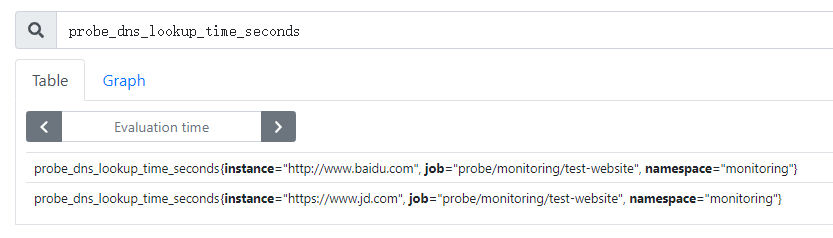
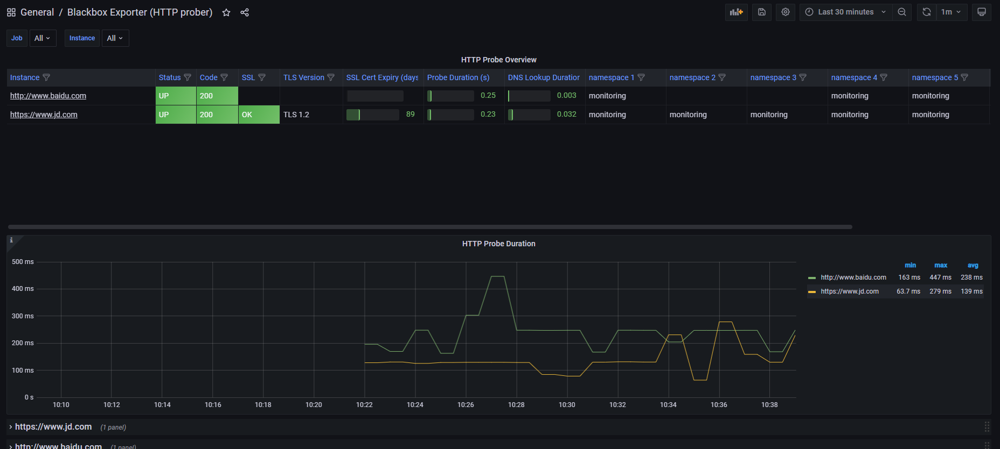
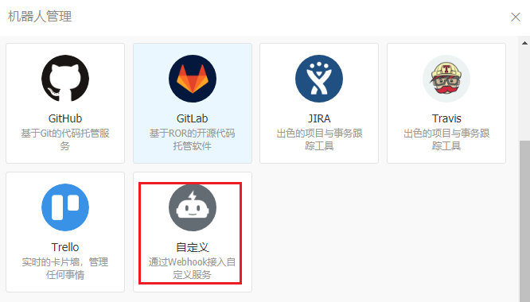

# 部署说明

使用 kube-prometheus 将 prometheus 直接部署到 k8s 集群中;

从三个维度监控k8s集群: 容器, 集群, 服务器

# kube-promethues部署

参考官方文档: https://prometheus-operator.dev/docs/prologue/quick-start/

**下载安装源码**

```
git clone https://github.com/prometheus-operator/kube-prometheus.git
```

 [kube-prometheus.zip](https://gitee.com/wangkun1214/my-note/raw/master/%E7%9B%91%E6%8E%A7/kube-prometheus.zip) 

**部署 kube-prometheus**

```shell
# Create the namespace and CRDs, and then wait for them to be availble before creating the remaining resources
cd kube-prometheus
kubectl create -f manifests/setup
until kubectl get servicemonitors --all-namespaces ; do date; sleep 1; echo ""; done
kubectl create -f manifests/
```

安装过程中, k8s.gcr.io/kube-state-metrics/kube-state-metrics:v2.1.0 会无法下载, 可以把下面的镜像文件导入到每个node节点的docker中

 [kube-state-metrics_v2.1.0.tar](https://gitee.com/wangkun1214/my-note/raw/master/%E7%9B%91%E6%8E%A7/kube-state-metrics_v2.1.0.tar) 

```shell
docker load -i kube-state-metrics_v2.1.0.tar
docker tag cbcfc76083de k8s.gcr.io/kube-state-metrics/kube-state-metrics:v2.1.0
```

通过 ingress 把 alermanager prometheus-k8s granfana 的端口暴露出来

## 黑盒监控

kube-prometheus 已经继承了 blackbox-exporter, 所以只需要配置监控项就可以了

**添加一个监控http_2xx的监控项**

```yaml
kind: Probe
apiVersion: monitoring.coreos.com/v1
metadata:
  # probe名
  name: test-website
  namespace: monitoring
spec:
  interval: 60s
  module: http_2xx
  prober:
    # blackbox-exporter 的 URL
    url: blackbox-exporter.monitoring.svc.cluster.local:19115
  targets:
    staticConfig:
      static:
      # 被监控的URL
      - http://www.baidu.com
      - https://www.jd.com
```

```shell
kubectl apply -f test-website.yaml
```

之后就可以用PromQL查到监控内容了



**导入grafana图表** 13659



## 应用监控

kube-prometheus 默认已经包含了 k8s 相关的许多监控指标, 比如 node节点指标, 容器指标; 只需要根据实际情况添加应用的监控指标到prometheus即可

### 监控reids

**创建redis**(kuboard)

```yaml
deployment:
  name: redis
  k8s.kuboard.cn/name: redis
  namespace: redis
container:
  name: redis
  image: redis:6.2.5
  ports:
  - name: redis
    containerPort: 6379
---
service:
  type: Cluster
  ports:
  - name: redis
    port: 6379
    protocol: TCP
    targetPort: 6379
```

**创建redis_expoter**(kuboard)

```yaml
deployment:
  name: redis-exporter
  namespace: monitoring
  k8s.kuboard.cn/name:  redis-exporter
container:
  name: redis-expoter
  image: oliver006/redis_exporter
  args: --redis.addr=redis://redis.redis.svc.cluster.local:6379
  poters:
  - name: redis-exporter
    containerPort: 9121
---
service:
type: Cluster
  ports:
  - name: redis-exporter
    port: 9121
    protocol: TCP
    targetPort: 9121
```

**创建serviceMonitor**

```yaml
apiVersion: monitoring.coreos.com/v1
kind: ServiceMonitor
metadata:
  labels:
    type: service-monitor
    app: redis
  name: redis-service-monitor
  namespace: monitoring
spec:
  endpoints:
  - interval: 30s
    port: redis-exporter
    scheme: http
  namespaceSelector:
    matchNames:
    - monitoring
  selector:
    matchLabels:
      k8s.kuboard.cn/name: redis-exporter
```

**Granfana 导入673号图**


### 监控JVM

#### 测试环境搭建

**安装jdk-1.8.0**

```shell
yum install -y java-1.8.0-openjdk java-1.8.0-openjdk-devel

# 有个JAVA_HOME就够用
echo 'export JAVA_HOME=/usr/lib/jvm/java-1.8.0' >> /etc/profile
source /etc/profile
```

**安装maven**

```shell
wget https://dlcdn.apache.org/maven/maven-3/3.8.2/binaries/apache-maven-3.8.2-bin.tar.gz

tar -xf apache-maven-3.8.2-bin.tar.gz -C /usr/local/

# 配置 阿里云mvn 仓库
vim /usr/local/apache-maven-3.8.2/conf/settings.xml
# 在mirrors标签里, 修改成阿里云的地址
<mirror>
    <id>aliyunmaven</id>
    <mirrorOf>*</mirrorOf>
    <name>阿里云公共仓库</name>
    <url>https://maven.aliyun.com/repository/public</url>
</mirror>

ln -s /usr/local/apache-maven-3.8.2/bin/mvn /usr/local/bin/

# 测试maven
mvn -version
```

**下载spring-boot demo**

```shell
# 公司项目都是 SofaBoot 3.2.2, 对应 spring-boot 2.1.0, 找个spring 2.x 的demo
cd demo

# 编译jar包
mvn clean && mvn package

# 运行编译好的jar包看看
java -jar target/demo-0.0.1-SNAPSHOT.jar

# 浏览器访问 http://IP:8080/index 可以看到返回 hello world
```

#### Micrometer

相当于exporter

参考文档: https://blog.csdn.net/aixiaoyang168/article/details/100866159

```shell
# 公司项目都是 SofaBoot 3.2.2, 对应 spring-boot 2.1.0
# 这里使用 spring-boot 2.x 版本的监控方案
# 修改pom.xml, 在<dependencies></dependencies>内增加micrometer模块
<dependency>
    <groupId>io.micrometer</groupId>
    <artifactId>micrometer-registry-prometheus</artifactId>
</dependency>
<dependency>
	<groupId>org.springframework.boot</groupId>
	<artifactId>spring-boot-starter-actuator</artifactId>
</dependency>
# spring-boot-starter-actuator 的作者封装了metric接口, 可以直接调用
```

```shell
# 修改 src/main/resources/application.yml 文件
spring:
  application:
    name: demo
management:
  endpoints:
    web:
      exposure:
        include: '*'
    shutdown:
      enable: false
  metrics:
    tages:
      application: "${spring.application.name}"
# 把 metric接口 暴露出来
```

```shell
# 重新编译jar包
mvn clean package
# 启动
java -jar target/demo-0.0.1-SNAPSHOT.jar

# 访问页面 http://192.168.101.143:8080/actuator/prometheus 就能得到prometheus的监控指标
```

**把demo中build的jar包, 部署到kubernetes**

```
---
apiVersion: apps/v1
kind: Deployment
metadata:
  labels:
    k8s.kuboard.cn/name: jvm-test
  name: jvm-test
  namespace: wangkun
spec:
  progressDeadlineSeconds: 600
  replicas: 1
  selector:
    matchLabels:
      k8s.kuboard.cn/name: jvm-test
  template:
    metadata:
      labels:
        k8s.kuboard.cn/name: jvm-test
    spec:
      containers:
        - image: 'harbor.coolcollege.cn/test-wk/demo:v1'
          imagePullPolicy: IfNotPresent
          name: jvm-test
          ports:
            - containerPort: 8080
              protocol: TCP
      nodeName: k8s-n9
      restartPolicy: Always
  replicas: 1
---
apiVersion: v1
kind: Service
metadata:
  annotations: {}
  labels:
    k8s.kuboard.cn/name: jvm-test
  name: jvm-test
  namespace: wangkun
spec:
  ports:
    - name: zxj6iz
      port: 8080
      protocol: TCP
      targetPort: 8080
  selector:
    k8s.kuboard.cn/name: jvm-test
  sessionAffinity: None
  type: ClusterIP
```

#### 配置ServiceMonitor

```yaml
apiVersion: monitoring.coreos.com/v1
kind: ServiceMonitor
metadata:
  labels:
    type: service-monitor
    app: jvm-service-monitor
  name: jvm-service-monitor
  namespace: monitoring
spec:
  endpoints:
  - interval: 30s
    # 只能指定java程序端口的name
    port: web
    scheme: http
    # spring-boot-starter-actuator 暴露的接口不是 /metric 需要替换下
    path: /actuator/prometheus
  namespaceSelector:
    matchNames:
    # java程序运行的名称空间
    - default
  selector:
    matchLabels:
    # 需要被监控的java程序的pod标签
      k8s.kuboard.cn/name: jvm-test
```

```shell
kubectl apply -f jvm.yaml -n monitoring
```

**导入 4701 grafana dashboard**

## 告警配置

### 告警规则

```yaml
groups:
- name: example(告警规则组名)
  rules:
  - alert: HighRequestLatency(告警规则名称)
    expr: job:request_latency_seconds:mean5m{job="myjob"} > 0.5(基于PromQL表达式的告警出发条件)
    for: 10m(可选参数, 等待时间, 表示只有告警触发一定时间后才发送告警; 在等待时间内产生的新告警为Pending状态)
    labels:	(自定义标签, kube-prometheus都是加上告警级别标签)
      severity: page
    annotations:(定义附加信息)
      summary: High request latency (告警主题: 告警的概括信息)
      description: description info (告警的详细信息)
```

#### 自定义告警规则

自定义一个告警规则, 用于测试

```yaml
apiVersion: monitoring.coreos.com/v1
kind: PrometheusRule
metadata:
  labels:
    prometheus: k8s
    role: alert-rules
  name: my-rules
  namespace: monitoring
spec:
  groups:
  - name: my-test-rules
    rules:
    - alert: CPU负载太低告警
      expr: node_load1 < 1
      labels:
        severity: warning
      annotations:
        summary: 节点CPU负载太低
        description: {{ $labels.instance }} 负载太低 {{ $value }}
```

```shell
kubectl apply -f my-rules.yaml
# 导入后, 就可以在 ConfigMap 的 prometheus-k8s-rulefiles-0 中找到自定义的 告警规则
```


#### 定义redis告警规则

```

```


### 邮件告警

在Secret中修改 alertmanager-main-generated, 添加邮箱配置

```yaml
"global":
  "resolve_timeout": "5m"
  smtp_from: wkmonitor@163.com
  smtp_smarthost: smtp.163.com:25
  smtp_hello: 163.com
  smtp_auth_username: wkmonitor@163.com
  smtp_auth_password: ******
  smtp_require_tls: false
#...
"receivers":
- "name": "Default"
  email_configs:
  - to: wkmonitor@163.com
    send_resolved: true
- "name": "Watchdog"
- "name": "Critical"
#...
```

### 钉钉告警

**钉钉 --> 设置 --> 机器人管理 --> 创建 webhook 机器人**



安全设置 选**加签**


**钉钉告警使用 timonwong/prometheus-webhook-dingtalk 工具** https://github.com/timonwong/prometheus-webhook-dingtalk

**创建告警配置文件 **config.yaml

```yaml
targets:
  webhook1:
    url: https://oapi.dingtalk.com/robot/send?access_token=******
    secret: SEC******
```

**创建钉钉告警Deployment**

```yaml
deployment:
  name: dingtalk-webhook
  namespace: monitoring
  lables:
    k8s.kuboard.cn/name: dingtalk-webhook
container:
  name: dingtalk-webhook
  image: timonwong/prometheus-webhook-dingtalk:v1.4.0
  port:
  - name: dingtalk
    containerPort: 8060
  # 配置文件挂载到 /etc/prometheus-webhook-dingtalk
service:
  type: ClusterIP
  port: 8060
  targetPort: 8060
```

**在 alertmanager-main-generated 中添加钉钉告警的配置**

```yaml
"receivers":
- "name": "Default"
  email_configs:
  - to: wkmonitor@163.com
    send_resolved: true
  webhook_configs:
  - url: 'http://dingtalk-webhook.monitoring.svc.cluster.local:8060/dingtalk/webhook1/send'
    send_resolved: true
- "name": "Watchdog"
- "name": "Critical"
```

## 告警模板

**在 alertmanager-main-generated 中添加 templates 配置**

```yaml
templates:
- '/etc/alertmanager/config/*.tmpl'
```

**在 alertmanager-main-generated 中添加 wechat.yaml**

```yaml
{{ define "dingtalk.default.message" }}
{{ if gt (len .Alerts.Firing) 0 -}}
Alerts Firing:
{{ range .Alerts }}
告警级别：{{ .Labels.severity }}
告警类型：{{ .Labels.alertname }}
故障主机: {{ .Labels.instance }}
告警内容: {{ .Annotations.message }}
触发时间: {{ .StartsAt.Format "2006-01-02 15:04:05" }}
{{- end }}
{{- end }}
{{ if gt (len .Alerts.Resolved) 0 -}}
Alerts Resolved:
{{ range .Alerts }}
告警级别：{{ .Labels.severity }}
告警类型：{{ .Labels.alertname }}
故障主机: {{ .Labels.instance }}
告警主题: {{ .Annotations.summary }}
触发时间: {{ .StartsAt.Format "2006-01-02 15:04:05" }}
恢复时间: {{ .EndsAt.Format "2006-01-02 15:04:05" }}
{{- end }}
{{- end }}
告警链接:
{{ template "__alertmanagerURL" . }}
{{- end }}
```


